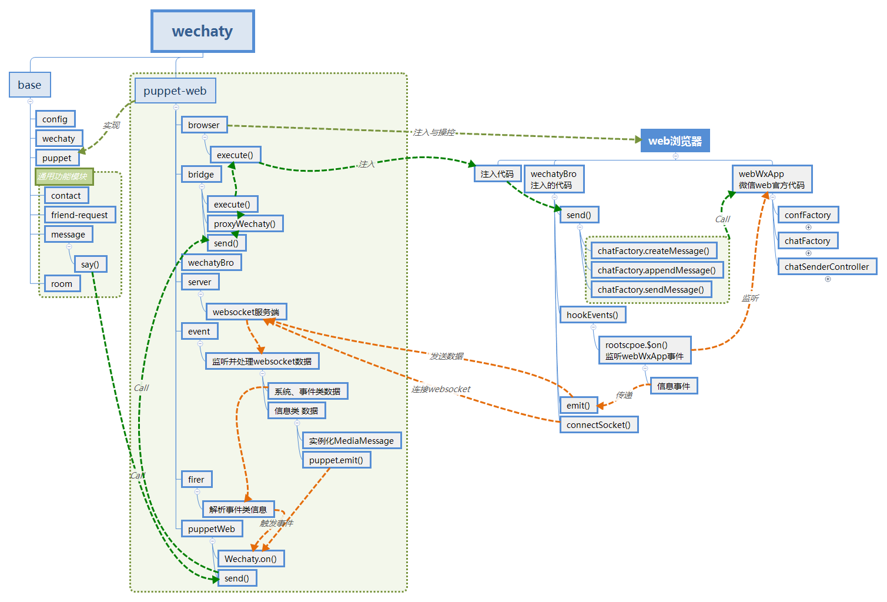

> 作者: [@binsee](https://github.com/binsee), 野路子的修炼者



一个菜鸟如何通过解析webWxApp与wechaty代码，来给wechaty增加新特性的回顾。

<!--more-->

## 简述

我对wechaty一开始是因为兴趣，而并非是项目需要，因此只是观望。直到看到美女[lijiarui](https://github.com/lijiarui)提出的issue[#710 Cannot send pdf file using MediaMessage](https://github.com/Chatie/wechaty/issues/710)，被赏金诱惑才尝试着手来解决这个问题(:joy:)，并陆续提交了一些pr来增强wechaty的功能(论激励的重要性:joy:)。

> Pull requests list:
> [#714 send any type file](https://github.com/Chatie/wechaty/pull/714)
> [#727 Add Message.forward() forward message](https://github.com/Chatie/wechaty/pull/727)
> [#744 emit RECALLED type msg(fix #8)](https://github.com/Chatie/wechaty/pull/744)
> [#771 Support for send 25Mb+ files](https://github.com/Chatie/wechaty/pull/771)

在这个过程过，为了实现这些功能，不得不尝试去阅读WebWxApp及wechaty的源码，来了解他们的功能结构，以及学习typesrcipt。
本文通过记录解决这几个问题的过程，来对WebWxApp和Wechaty的进行一些解读。

我接触wechaty时是在V0.8.x版本，此文提及的pr代码及对wechaty结构的理解适用于V0.8.x版本，最新的0.10.x版本的`puttet-web`进行了重构，一些地方会有不同，因此仅做参考。

作为一个菜鸟，对一些知识的理解认识不足或错误的地方，希望大佬们指正。

## 计划内容

- wechaty结构的简单分析
- 捕捉撤消信息事件
- 实现转发信息功能（在下篇文章中写）
- 完善发送文件功能（在下篇文章中写）

## WebWxApp与wechaty的大概框架结构

### WebWxApp

WebWxApp是基于angular开发，使用webpack打包的前端项目，可在Chatie的`webwx-app-tracker`项目查看其[格式化过的代码](https://github.com/Chatie/webwx-app-tracker/blob/master/formatted/webwxApp.js)。

WebWxApp内定义了一些功能模块，下面列举一些涉及主要功能的:

```javascript
angular.module("Controllers").controller("loginController", ...)
angular.module("Controllers").controller("contentChatController", ...)
angular.module("Controllers").controller("contentContactController", ...)
angular.module("Controllers").controller("chatSenderController", ...)
angular.module("Controllers").controller("emojiController", ...)
angular.module("Controllers").controller("createChatroomController", ...)
angular.module("Controllers").controller("transpondDialogController", ...)
angular.module("Services").factory("appFactory", ...)
angular.module("Services").factory("chatFactory", ...)
angular.module("Services").factory("chatroomFactory", ...)
angular.module("Services").factory("accountFactory", ...)
angular.module("Services").factory("confFactory", ...)
angular.module("Services").factory("contactFactory", ...)
angular.module("Services").factory("loginFactory", ...)
angular.module("Services").factory("utilFactory", ...)
angular.module("Services").factory("emojiFactory", ...)
angular.module("Services").factory("mmHttp", ...)
```

我对angular并没有什么研究，有兴趣的朋友可以自行阅读相关源码。

在wechaty中，我们要实现、完善一些功能，需要参考webwxapp中相关代码的逻辑结构和流程。

需要说明的是，webwxapp中并没有对所有事件、信息进行同样的处理，某些特性是wechaty默认捕捉不到的。比如`撤回信息的 RECALLED类型信息`，因此我们就必须要阅读webwxapp的源码，梳理其代码流程，来找到切入点解决问题。

### wechaty

wechaty设计进行分层、抽象化封装。

- 如将联系人Contact、信息Message、群Room、好友请求friend-request 按功能进行封装，提取主要数据并通过方法及`obj`属性对外暴露，以供访问使用。（可查看Contact、Message、Room这三个类中定义的rawObj及obj属性。前者为原始数据结构，后者为封装提取后的数据）
- 另外实现了Puppet类接口，作为实现操纵微信的通道。目前仅有puppet-web，基于webWxApp操作微信的实现。而未来，我们会尝试实现基于微信PC版的puppet，甚至是ipad版的puppet，那样会比Web版微信能做的更多。

#### puppet功能

这里以puppet-web来简单说明一下，puppet的功能。

简单来说，puppet-web通过浏览器驱动(`selenium-webdriver`、`puppeteer`)创建一个浏览器环境（下称web环境）来加载WebWxApp(`wx.qq.com`)，并通过浏览器驱动将代码注入进web环境。
注入web环境的代码（以下称wechatyBro）会通过websocket来连接wechaty创建的websocket服务端，这样就可以在WebWxApp与wechaty之间进行通讯了。由于websocket协议是异步请求，因此对webWxApp的操作仍需要使用浏览器驱动将代码注入web环境执行的方式，来确保对webWxApp操作的同步性。

*关于浏览器驱动：* puppet-web先后使用过`selenium-webdriver`和`puppeteer`，最新版本中使用的是`puppeteer`。

----

##### puppet-web的模块化

puppet-web中对将功能拆分为不同模块：

- `puppet-web` puppet-web的主体部分，初始化并调度其他模块的操作，实现上传文件功能。
- `bridge` 封装需要注入web环境的代码，为`puppet-web`提供各项功能操作的方法。如`send()`方法
- `browser` 封装对浏览器驱动的操作。如`bridge`需要通过`browser`封装的`execute`方法将js代码注入到web环境执行。
- `firer` 封装一些信息解析、事件检查工作。
- `friend-request` 封装好友请求操作。
- `server` 封装了websocket服务端操作，并继承EventEmitter，将websocket接收到的信息以event方式广播。
- `event` 封装了对server事件的监听处理。
- `watchdog`
- `wechatyBro` 注入web环境运行的代码，实现对webWxApp的各种操作。


wechatyBro中监听webWxApp中的信息事件，然后通过websocket把事件信息发送给puppet-web。而wechaty通过puppet-web操纵webWxApp。由于websocket不能同步返回处理结果，因此需要通过浏览器驱动将js代码注入进web环境执行（调用wechatyBro中的方法来操作webWxApp），并返回Promise将操作同步化。(可见`/src/puppet-web/bridge.ts`中`proxyWechaty()`)

> 例如：
wechaty中发送一条信息，会按以下顺序执行：
```javascript
//伪代码，标记调用过程
Message.say() -> puppetInstance.send() // 调用puppet的send()方法

PuppetWeb.send() -> bridge.send() -> bridge.proxyWechaty()
// proxyWechaty() 中会封装代码，调用wechatyBro中对应的方法，以操作webWxApp
// 可见`/src/puppet-web/bridge.ts`中`proxyWechaty()`

bridge.proxyWechaty() -> bridge.execute() -> browser.execute()
-> driver.executeScript.apply(this.driver, arguments)
// 最终调用浏览器驱动的`executeScript`或`executeAsyncScript`方法
// 将js代码注入web环境执行，并Promise以返回执行结果
```


##### puppet-web功能简述

1. puppet-web创建一个websocket服务端用来接收wechatyBro的通信
2. puppet-web通过浏览器驱动将wechatyBro的js代码注入进入web环境执行。
3. WechatyBro进行初始化工作：连接puppet-web的websocket服务端，监听webWxApp的事件并进行处理后通过websocket发送给puppet-web。
4. wechaty通过puppet-web执行各项功能时（如发送信息、创建群、拉人、踢人等主动操作），puppet-web会通过浏览器驱动将代码注入进web环境执行，以Promise返回执行结果


以上对wechaty进行一个大概的了解，下边来以几个pr的实现来进一步了解wechaty。

##### puttet-web操作webWxApp的关键点

WebWxApp内部实现了一些功能模块，来封装不同的功能代码。
在`wechaty-bro`的`glueToAngular()`方法中，通过使用`angular.element(document).injector().get(name)`来获取不同的功能模块并保存在`WechatyBro.glue`中，使在`WechatyBro`中可以调用`WebWxApp`的功能代码，来实现不同的功能。

`WechatyBro`初始化时会调用`hookEvents()`来监听`WebWxapp`的事件，如页面初始化`root:pageInit:success`、新信息`message:add:success`，并通过websocket将信息发送到`puppet-web`。

而`wechatyBro`中封装了一些操作，需要puppet-web通过浏览器驱动将代码注入web环境来调用，并返回其运行结果，浏览器驱动会将运行结果以Promise返回隔天puppet-web。

webwxApp中的工厂`factory`有很多，WechatyBro获取了一些需要用到的保存在内部，以便调用：

```javascript
//此部分代码从 WechatyBro 中摘出
var injector  = angular.element(document).injector()

var accountFactory  = injector.get('accountFactory')
var appFactory      = injector.get('appFactory')
var chatroomFactory = injector.get('chatroomFactory')
var chatFactory     = injector.get('chatFactory')
var contactFactory  = injector.get('contactFactory')
var confFactory     = injector.get('confFactory')
var emojiFactory    = injector.get('emojiFactory')
var loginFactory    = injector.get('loginFactory')
var utilFactory     = injector.get('utilFactory')

var http            = injector.get('$http')
var state           = injector.get('$state')
var mmHttp          = injector.get('mmHttp')

// 保存到WechatyBro.glue
WechatyBro.glue = {
  injector:       injector
  , http:         http
  , mmHttp:       mmHttp
  , state:        state
  , accountFactory:  accountFactory
  , chatroomFactory: chatroomFactory
  , chatFactory:     chatFactory
  , confFactory:     confFactory
  , contactFactory:  contactFactory
  , emojiFactory:    emojiFactory
  , loginFactory:    loginFactory
  , utilFactory:     utilFactory
  , rootScope:    rootScope
  , appScope:     appScope
  , loginScope:   loginScope
  , contentChatScope: contentChatScope
}
```

### 捕捉撤消信息事件

以前wechaty是捕捉不到撤回消息的RECALLED事件的（最早见[issues#8](https://github.com/Chatie/wechaty/issues/8)），原因在于webWxApp的`messageProcess`中，对RECALLED事件的处理与其他类型的信息事件不一致。

我们看下webWxApp中处理消息的`messageProcess()`方法代码：

```javascript
messageProcess: function(e) {
  var t = this,
    a = contactFactory.getContact(e.FromUserName, "", !0);
  if (!a || a.isMuted() || a.isSelf() || a.isShieldUser() || a.isBrandContact() || titleRemind.increaseUnreadMsgNum(), e.MMPeerUserName = t._getMessagePeerUserName(e), e.MsgType == confFactory.MSGTYPE_STATUSNOTIFY) return void t._statusNotifyProcessor(e);
  if (e.MsgType != confFactory.MSGTYPE_SYSNOTICE && !(utilFactory.isShieldUser(e.FromUserName) || utilFactory.isShieldUser(e.ToUserName) || e.MsgType == confFactory.MSGTYPE_VERIFYMSG && e.RecommendInfo && e.RecommendInfo.UserName == accountFactory.getUserInfo().UserName)) {
    switch (t._commonMsgProcess(e), e.MsgType) {
      case confFactory.MSGTYPE_APP:
        try {
          e.MMIsAppMsg = !0, t._appMsgProcess(e)
        } catch (e) {}
        break;
      case confFactory.MSGTYPE_EMOTICON:
        t._emojiMsgProcess(e);
        break;
      case confFactory.MSGTYPE_IMAGE:
        t._imageMsgProcess(e);
        break;
      case confFactory.MSGTYPE_VOICE:
        t._voiceMsgProcess(e);
        break;
      case confFactory.MSGTYPE_VIDEO:
        t._videoMsgProcess(e);
        break;
      case confFactory.MSGTYPE_MICROVIDEO:
        t._mircovideoMsgProcess(e);
        break;
      case confFactory.MSGTYPE_TEXT:
        "newsapp" == e.FromUserName ? t._newsMsgProcess(e) : e.AppMsgType == confFactory.APPMSGTYPE_RED_ENVELOPES ? (e.MsgType = confFactory.MSGTYPE_APP, t._appMsgProcess(e)) : e.SubMsgType == confFactory.MSGTYPE_LOCATION ? t._locationMsgProcess(e) : t._textMsgProcess(e);
        break;
      case confFactory.MSGTYPE_RECALLED:
        return void t._recalledMsgProcess(e);
      case confFactory.MSGTYPE_LOCATION:
        t._locationMsgProcess(e);
        break;
      case confFactory.MSGTYPE_VOIPMSG:
      case confFactory.MSGTYPE_VOIPNOTIFY:
      case confFactory.MSGTYPE_VOIPINVITE:
        t._voipMsgProcess(e);
        break;
      case confFactory.MSGTYPE_POSSIBLEFRIEND_MSG:
        t._recommendMsgProcess(e);
        break;
      case confFactory.MSGTYPE_VERIFYMSG:
        t._verifyMsgProcess(e);
        break;
      case confFactory.MSGTYPE_SHARECARD:
        t._shareCardProcess(e);
        break;
      case confFactory.MSGTYPE_SYS:
        t._systemMsgProcess(e);
        break;
      default:
        e.MMDigest = _("938b111")
    }
    e.MMActualContent = utilFactory.hrefEncode(e.MMActualContent);
    var n = contactFactory.getContact(e.MMPeerUserName);
    e.MMIsSend || n && (n.isMuted() || n.isBrandContact()) || e.MsgType == confFactory.MSGTYPE_SYS ||
      (accountFactory.isNotifyOpen() && t._notify(e), accountFactory.isSoundOpen() && utilFactory.initMsgNoticePlayer(confFactory.RES_SOUND_RECEIVE_MSG)),
      t.addChatMessage(e),
      t.addChatList([e])
  }
},
```

注意代码中处理`confFactory.MSGTYPE_RECALLED`类型信息的方式，是使用了`return`的，不会再执行下边的`t.addChatMessage(e)`。

我们看下webWxApp中 `addChatMessage()`的代码：

```javascript
addChatMessage: function(e) {
  if (e) {
    var t = this,
      a = (e.FromUserName,
        e.ToUserName,
        _chatMessages[e.MMPeerUserName] || (_chatMessages[e.MMPeerUserName] = []));
    _addedMsgIdsMap[e.MsgId] ||
      (_addedMsgIdsMap[e.MsgId] = !0,
        _msgMap[e.MsgId] = e,
        a.push(e),
        $rootScope.$broadcast("message:add:success", e),
        t.getChatList())
  }
},
```

wechatyBro中监听webWxApp事件的代码如下：

```javascript
rootScope.$on('message:add:success', function(event, data) {
  if (!isLogin()) { // in case of we missed the pageInit event
    login('by event[message:add:success]')
  }
  WechatyBro.emit('message', data)
})
```
`addChatMessage()`中使用`$rootScope.$broadcast("message:add:success", e)`来广播信息事件，而wechatyBro通过`rootScope.$on('message:add:success', function(event, data) {})`监听信息事件，从而获得webWxApp的信息（包含系统信息事件）。

而由于`messageProcess()`中对`confFactory.MSGTYPE_RECALLED`类型的信息使用了`return`，因此wechatyBro捕捉不到`RECALLED`事件的信息，wechaty自然也就无法得知某条消息被撤消了。

#### 解决方案

既然`messageProcess()`中对`RECALLED`类型信息使用了return，但先调用了`t._recalledMsgProcess(e)`，那么我们可以使用在wechatyBro中hook `t._recalledMsgProcess()` 的方式来获得`RECALLED`类型的事件信息。

通过分析webWxApp代码，得知`_recalledMsgProcess()`是`chatFactory`中的方法（善用搜索）。那么我们在wechatyBro中，就要hook`chatFactory._recalledMsgProcess()`方法了。

在wechatyBro中，使用`WechatyBro.glue.chatFactory`来获得webWxApp的`chatFactory`。

我们添加以下代码：

```javascript
function hookRecalledMsgProcess() {
  var chatFactory = WechatyBro.glue.chatFactory
  // 保存webWxApp自身的处理代码副本
  chatFactory.__recalledMsgProcess = chatFactory._recalledMsgProcess
  // 定义一个新的处理方法替换原始处理代码
  chatFactory._recalledMsgProcess = function(msg) {
    chatFactory.__recalledMsgProcess(msg) //调用原始处理代码
    //...下边就可以写我们的处理代码了
  }
}

// init()方法中需要添加调用 hookRecalledMsgProcess()
function init(){
  // ...
    hookEvents()
    hookRecalledMsgProcess()  //添加到hookEvents()后边
  // ...
}
```

webwxApp中`_recalledMsgProcess()`会对撤回信息进行解析处理，我们需要分析其代码，获取被撤回的信息内容，并通过websocket发给puppet-web。

```javascript
_recalledMsgProcess: function(e) {
  var t, a, n = this,
    // 解码
    i = utilFactory.htmlDecode(e.MMActualContent),
    o = "",
    r = _("ded861c"),
    //获取指定用户的聊天信息数组
    c = n.getChatMessage(e.MMPeerUserName);
    //对emoji进行转码
  if (i = utilFactory.encodeEmoji(i),
  //解析（可在chrome中使用调试查看微信下发的信息内容格式）
    o = utilFactory.xml2json(i).revokemsg,
    //如果信息内没有标明msgid
    0 == o.msgid) {
    for (var s = c.length - 1; s >= 0; --s)
      if (c[s].FromUserName == accountFactory.getUserName()) {
        t = s;
        break
      }
  } else {
    // 从用户聊天信息数组中获取指定的信息id
    t = n._findMessageByMsgId(c, o.msgid);
  }
  if (t > -1) {
    var l = c[t];
    if (l.MMIsSend) a = _("df1fd91");
    else {
      var d = contactFactory.getContact(e.MMActualSender, e.MMPeerUserName);
      a = d ? d.getDisplayName(e.MMPeerUserName) : ""
    }
    //显示撤回信息提醒
    angular.extend(l, {
      MMRecall: !0,
      MsgType: confFactory.MSGTYPE_SYS,
      MMActualContent: a + r,
      MMDigest: a + r,
      _h: 0
    }), n.getChatList()
  }
},
```

因此我们来用以下代码进行实现：

```javascript
function hookRecalledMsgProcess() {
  var chatFactory = WechatyBro.glue.chatFactory
  var utilFactory = WechatyBro.glue.utilFactory
  var confFactory = WechatyBro.glue.confFactory
  // hook chatFactory._recalledMsgProcess, resolve emit RECALLED type msg
  chatFactory.__recalledMsgProcess = chatFactory._recalledMsgProcess
  chatFactory._recalledMsgProcess = function(msg) {
    chatFactory.__recalledMsgProcess(msg)
    //复制一个msg副本
    var m = Object.assign({},msg)
    //解码信息内容
    var content = utilFactory.htmlDecode(m.MMActualContent)
    content = utilFactory.encodeEmoji(content)
    //获取撤回信息
    var revokemsg = utilFactory.xml2json(content).revokemsg
    if (revokemsg.msgid) {
      //获取指定用户的聊天信息数组
      var chatMsgs = chatFactory.getChatMessage(m.MMPeerUserName)
      // 获取被撤回信息在聊天信息数组中的序号
      var i = chatFactory._findMessageByMsgId(chatMsgs, revokemsg.msgid)
      if (i > -1) {
        //获取被撤回的原始信息
        m = chatMsgs[i]
        //标记信息类型为撤回信息
        m.MsgType = confFactory.MSGTYPE_RECALLED
      } else {
        //如果没有找到被撤回的原始信息，则将本次信息id修改为被撤回的原始信息id
        m.MsgId = revokemsg.msgid
        // 修改信息内容
        m.MMActualContent = m.Content = revokemsg.replacemsg.replace(/"/g,"")
      }
      //调用emit()将信息通过websocket发送给puppet-web
      WechatyBro.emit('message', m)
    }
  }
}

// 由于webWxApp的_recalledMsgProcess() 中使用到了 utilFactory，而wechatyBro并没有获取 utilFactory ，因此我们需要加上
function glueToAngular() {
  //...
  var loginFactory    = injector.get('loginFactory')
  var utilFactory     = injector.get('utilFactory')
  //...

  WechatyBro.glue = {
    //...
    , loginFactory:    loginFactory
    , utilFactory:     utilFactory
    //...
  }
  //...
}

```

完整patch代码见[PR commit#174b6775c](https://github.com/Chatie/wechaty/commit/174b6775c4e9242e5f003094b2f9e10953c978f2)


## End

感谢[zixia](https://github.com/zixia)的邀请，很抱歉拖了这么久才写了这篇文章。
感谢Chatie的各位贡献者，有大家的共同努力，wechaty才会愈发的好用。
也感谢耐心看完文章的你，希望我的文章没有浪费你的时间。
谢谢！
