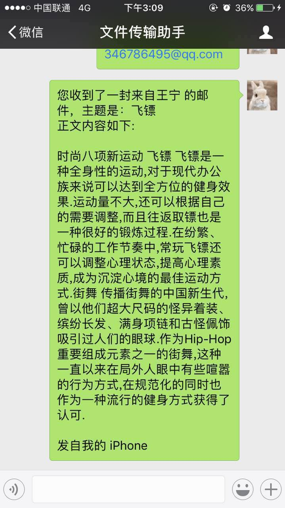

---
layout: post
title: "Wechaty-Mail: An email tool build on Wechaty"
date: 2017-12-25 21:00 +0800
author: wangning
---

> Author: [@wangning](https://github.com/wnbupt/wechaty_email) is a postgraduate student at BUPT who is a frontend full stack engineer, with rich Machine Learning/NLP/Image project experiences.

As soon as I learn how to use 6 lines of JavaScript to achieve a simple chatbot based on [Wechaty](https://github.com/Chatie/wechaty), I was deeply attracted and decide to develop an easy-to-use email tool based on it. [Wechaty-Mail](https://github.com/wnbupt/wechaty_email) is an application based on Wechaty which can help you get notifications in WeChat when you receive new emails.

<!--more-->

## screenshot of the application

For example, my binding email address is 346786495@qq.com

## How to use Wechaty-Mail?

* Support email types: Gmail/Outlook/Netease mails(163/126)/QQ mail/Sina mail.
* authorize the mailbox and turn on the IMAP service in mail settings.
* Configure your own email address and password in the source code and enjoy it.
* Ding-dong! you’ve just got an email notification from WeChat FileHelper!

Find more details in my github repository [Wechaty-Email](https://github.com/wnbupt/wechaty_email)

## Appendix, packages we used
* [Wechaty](https://github.com/chatie/wechaty): A great and easy-to–use WeChat middleware.
* [Imap](https://github.com/mscdex/node-imap): An IMAP client module for node.js.
* [Mailparser](https://github.com/nodemailer/mailparser): An advanced email parser for Node.js.

