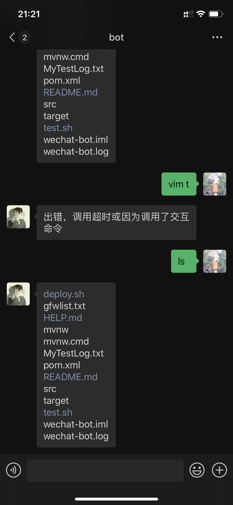

> 这个项目是基于SpringBoot和SpringMVC的，语言是kotlin，构建工具是maven。

## 准备工作（创建自己的wechaty-hostie-token）
假设我们首先拥有的是padplus的token。
因为java-wechaty需要的是hostie的，所以这就需要先做一下转换。

然后执行以下命令

```bash
docker pull wechaty/wechaty
export WECHATY_PUPPET_PADPLUS_TOKEN=puppet_padplus_*****
export WECHATY_HOSTIE_PORT=8788

export WECHATY_PUPPET=wechaty-puppet-padplus
export WECHATY_LOG=verbose

docker run -d\
  --rm \
  -ti \
  -e WECHATY_LOG="$WECHATY_LOG" \
  -e WECHATY_PUPPET="$WECHATY_PUPPET" \
  -e WECHATY_PUPPET_PADPLUS_TOKEN="$WECHATY_PUPPET_PADPLUS_TOKEN" \
  -e WECHATY_HOSTIE_PORT="$WECHATY_HOSTIE_PORT" \
  -e WECHATY_TOKEN="$WECHATY_PUPPET_PADPLUS_TOKEN" \
  -p "$WECHATY_HOSTIE_PORT:$WECHATY_HOSTIE_PORT" \
  wechaty/wechaty

```

经过这一番操作，你的padplus token就可以当成hostie来用了。一开始看官方文档并没有找到，搞了很久才发现在issue里面有提到这个用法，所以在这里写出来方便后面的人。同理，python和go的版本也是这么弄。

## 核心代码
因为用了SpringBoot，所以比较好的办法是把它交给Spring管理，构造成一个Bean。

```java
@Configuration
open class AppConfig {

    private val log: Logger = LoggerFactory.getLogger(this.javaClass)

    @Value("\${wechat-bot.token}")
    private lateinit var wechatyToken: String

    @Bean
    open fun wechaty(): Wechaty {
        val bot = Wechaty.instance(wechatyToken)
        with(bot) {
            onScan(object : ScanListener {
                override fun handler(qrcode: String?, statusScanStatus: ScanStatus, data: String?) {
                    println(qrcode?.let { QrcodeUtils.getQr(it) })
                    val url = "https://wechaty.github.io/qrcode/$qrcode"
                    log.info("Online Image: $url")
                    ServerChanUtil.push("微信机器人又挂掉啦~", url)
                }
            })
            onMessage(object : MessageListener {
                override fun handler(message: Message) {
                    val from = message.from()
                    val room = message.room()
                    val text = message.text()
                    val result = CommandUtil.execute(text)
                    room?.say(result) ?: from!!.say(result)
                }
            })
            onLogin(object : LoginListener {
                override fun handler(self: ContactSelf) {
                    ServerChanUtil.push("登录成功~")
                }
            })
            start(false)
        }
        return bot
    }

}
```

命令行工具类

```java
object CommandUtil {

    fun execute(command: String): String {
        return try {
            val process = Runtime.getRuntime().exec(command);
            if (!process.waitFor(5, TimeUnit.SECONDS)) {
                process.destroy()
                return "出错，调用超时或因为调用了交互命令"
            }
            val input = BufferedReader(InputStreamReader(process.inputStream))
            var line: String?
            var result = ""
            while (input.readLine().also { line = it } != null) {
                result += line + "\n"
            }
            input.close()
            if (result.isBlank()) result = "没有任何输出"
            result
        } catch (e: IOException) {
            e.message!! + "\nusage: command [args]"
        }
    }
}
```


## 额外的事情
添加了Server酱的接口，在微信掉线以后会通过微信公众号发送二维码url，登录成功以后也会有通知。


## 部署
#### 1. 自行编译
```java
git clone https://github.com/suninsky/wechat-bot.git
```
修改application.properties参数

```java
server.port=8090
wechat-bot.token=YOUR_TOKEN
server-chan.token=YOUR_TOKEN
```
第一个是运行端口，可默认。
第二个是wechaty-hostie的token，必选。
第三个是server-chan的token，可选。

#### 2.  直接使用target中的jar包

```java
java -jar wechat-bot-1.0.jar --wechat-bot.token=YOUR_TOKEN  --server-chan.token=YOUR_TOKEN
```

## 使用
扫码登录机器人以后，即可。群聊和私聊都可以操控shell，所以机器人需要谨慎加好友和群。考虑到安全问题，目前只能操作wechat-bot-1.0.jar所在的目录。以及，不支持交互式的命令。如果不小心输入了交互式的命令，将在5秒后返回。

## 例子


