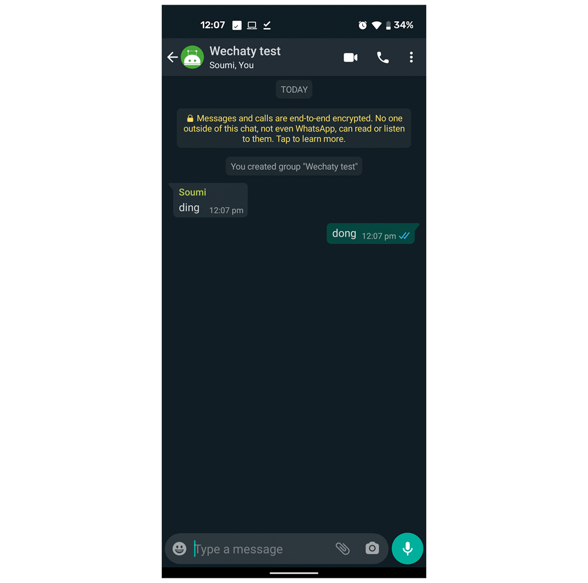

Wechaty **Ding Dong bot** is a simple bot which replies with a `dong` whenever it recieves a `ding`.

## Try out the bot

You can try out the **Wechaty Ding Dong bot** using this interactive CodeSandbox.

Just scan the generated QR code with **WeChat** app, and you are ready to play with the bot!

<iframe
  class="codesandbox"
  src="https://codesandbox.io/embed/github/wechaty/wechaty-getting-started/tree/master/examples/third-parties/codesandbox?fontsize=12&hidenavigation=1&module=%2Fding-dong-bot.ts&theme=dark"
  sandbox="allow-modals allow-forms allow-popups allow-scripts allow-same-origin"
></iframe>

## Building the bot

If you want to run `ding-dong bot` locally and build it from scratch you can refer [here](../docs/getting-started/running-locally.mdx).

## Bot demonstration

For the demo, the bot is started on a device using **WhatsApp**. You can see in the below screenshot it responds to the `ding` message with a `dong`.

## References

* [Wechaty Getting Started GitHub repository](https://github.com/wechaty/wechaty-getting-started)
