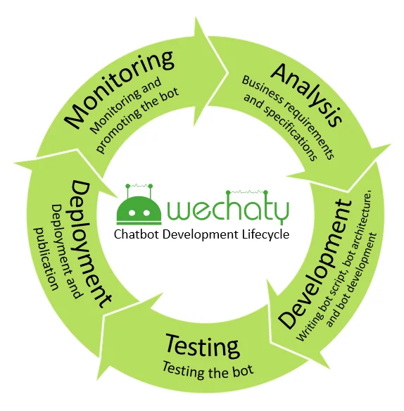

Wechaty is an exciting SDK for developing chatbots for popular Instant Messaging systems such as Wechat, Wecom, Whatsapp, and Gitter. It provides developers with the unique capability of building chatbots that meet their needs and requirements. If you are thinking of building a chatbot using Wechaty, careful planning is recommended to increase your chances of success just like in any other software project. Below is an end-to-end process worth looking into when using Wechaty to build a chatbot:

- **Articulate business requirements**

  Articulate the business problem you are seeking to solve by building a chatbot. You should specify the customers the chatbot will interact with, their characteristics, and the value the chatbot will deliver to them and ultimately to your business. Doing that will give a sense of focus and direction as you seek to solve this well-articulated problem in the subsequent stages.

- **Bot specification**

  Outline the features and functionality of the bot in this step. Think through each feature to make sure your bot will meet the business requirements articulated in the first step. Wechaty provides features for message processing, room management, contact management, friendship management, and intelligent dialogue management.

- **Writing bot script**

  Unlike other software projects, chatbots are conversational in nature. They interact with clients. This is where you write a bot script to guide the user towards accomplishing the desired task. It is important to keep the script short, interesting, engaging, and focused. This will ensure that the user is engaged until the desired task is completed without losing interest.

- **Bot architecture**

  This involves creating the engineering design of the bot. This design comprises both client-facing and back-end components. The client-facing component is what the client sees and it is the conversational interface. The bot is integrated with other third-party services at the back-end.

- **Bot development**

  This is the development stage of the chatbot development and it is the part where Wechaty excels because you can develop a chatbot in a few lines of code with Wechaty. At this stage, coding and testing take place simultaneously. Both unit and integration tests can be conducted at this stage to make sure that the bot functions as expected.

- Bot testing

  This is not a standalone stage of the bot development process. It is intertwined with the other stages of the Chatbot development lifecycle. Testing should be done both inside the emulator and the Instant Messaging platform you are developing for. You will need to test whether units that make up your chatbot are functioning as expected. Integration tests are also conducted against the bot script written in the previous stage of the life cycle at the end. Tests must also be conducted to ensure that the bot does not violate any of the terms and conditions of the Instant Messaging platform for which you are developing. This can also be a hindrance to some extent because there are restrictions imposed by IM systems when the chatbot is still in its development stage.

- **Deployment and publication**

  The bot is deployed to a hosted environment after it is finished and working according to specifications. With Wechaty, you can develop chatbots for different Instant Messaging systems. Each IM has its own rules and policies for managing chatbots. Most IM systems require you to go through a formal application process and agree to their terms and conditions before deployment with different levels of rigor.

- **Monitoring the bot**

  After deployment and users have started using the bot, it is important to constantly monitor the bot to ensure it is "well-behaved". There could be issues with the bot which you might have missed in development which can be identified and fixed from the information gathered at this stage. It is possible for the bot to behave differently in development and production contexts or over time.

- **Promoting the bot**

  This is where you create awareness about your bot among the users and clients. A sound strategy is needed here to ensure the information reaches a majority of your clients. You can use a cross-section of mediums for advertisement where necessary.

- **Analyzing bot performance**

  After the bot has been deployed, collect data about its performance as clients start using it. This data is analyzed to make improvements to the bot and also become a source of knowledge as you develop other bots in the future. The data which has been collected and documented will constitute the knowledge base not only for you, but for the entire community of chatbot makers.

- **Repeat**

  Building a chatbot is not an event but a process. What you have learned in the development stage and data collected in production should be recycled for improving the bot. Building a chatbot is an iterative process for continuous improvement. This can also be necessary due to changes in the terms and conditions of the Instant Messaging platform over time which might require modifications to the behavior of your chatbot.
