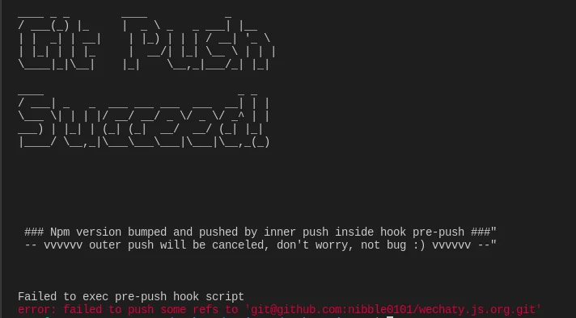

The Troubleshooting section discusses the most common problems that you will encounter while creating a chatbot using Wechaty, contributing to Wechaty codebase, contributing to Wechaty documentation, or developing Wechaty puppet and how to fix them.

## Chatbot developers

### I cannot log in with my Wechat account

Wechat accounts registered after 2017 cannot log in via Web API because this is a limitation. Click [this issue](https://github.com/wechaty/wechaty/issues/872) for more information.
However, Wechaty supports protocols other than Web API, such as Pad. Learn more about it [in this issue](https://github.com/wechaty/wechaty/issues/1296).

### Nothing happens when I dispatch an action when using Wechaty with Redux

Redux is a state management library you can use with Wechaty. It has the concept of [immutability](https://redux.js.org/faq/immutable-data). Sometimes, you can dispatch an action that correctly updates the state in the redux store but your view does not update. One of the reasons for that happening is because you are mutating the existing state instead of returning the new state. Therefore never mutate state when using Redux with Wechaty even if it is tempting to do so.

### Ding dong bot displays error after scanning QR code

When running the ding dong bot using [wechaty-getting-started repository](https://github.com/wechaty/wechaty-getting-started), on [Gitpod](quick-start/running-on-gitpod.md) or [Google cloud shell](quick-start/running-on-google-cloud-shell.md), the default Instant Messaging platform is [Wechat](https://www.wechat.com/en/). Scanning QR codes for other Instant messaging platforms will not work unless you explicitly set the value of the`WECHATY_PUPPET` environment variable to the puppet service provider name as described in the [wechaty-getting-started README page](https://github.com/wechaty/wechaty.js.org#readme).

## Wechaty documentation

### I am getting `Failed to exec pre-push hook script` error when I try to push my changes to GitHub

There is a [pre-push hook](https://github.com/Chatie/git-scripts#readme) that has been configured to run `npm run lint` and then `npm version patch` before `git push` for better code quality and version management.

If you see `Failed to exec pre-push hook script` message with `Git push succeed` message like in the image below, then you can ignore the error message. Your changes have been successfully pushed to GitHub.



On the other hand, you may encounter `Failed to exec pre-push hook script` error without `Git push succeed` message. If it is your first time pushing the current branch to remote or you have not set the current local branch to track the remote, try temporarily disabling the `pre-push` hook by prepending `NO_HOOK=1` to the `git push` command and then push with `-u` or `--set-upstream` flag so that the local branch will start tracking the remote.

```sh
# for Linux & Mac
NO_HOOK=1 git push -u remote-repository branch-name

# for Windows
set NO_HOOK=1  git push -u remote-repository branch-name
```

You can also push with `--no-verify` flag instead of prepending `NO_HOOK=1`.

```sh
git push -u remote-repository branch-name --no-verify
```

If you used the above command successfully and the local branch is tracking the remote, you can run `git push` the next time you push your changes to GitHub without prepending `NO_HOOK=1` to `git push`. Your changes will be successfully pushed to GitHub.

```sh
git push
```

### I am submitting a blog post for publication but the tests are failing

We have a set of [guidelines](https://github.com/wechaty/wechaty.js.org#readme) that you must follow when writing a blog post for publication. If the tests are failing after creating a pull request, it is most likely because you missed something or did not follow the required writing style. We recommed that you read through the [How to post a blog](https://github.com/wechaty/wechaty.js.org#how-to-post-a-blog) section of the [wechaty.js.org repository README](https://github.com/wechaty/wechaty.js.org#readme) one more time.

You can also reach out to us on the [Wechaty Gitter channel](https://gitter.im/wechaty/wechaty) if you fail to make the tests pass. We shall be happy to help.

### `npm run build` or `npx docusaurus start` throws an error

You might have used docusaurus before and therefore used certain commands for starting the development server, triggering build process and deploying docusaurus project among others. For the wechaty documentation, check the `package.json` file for all the scripts you can run.

## My problem has not been discussed here

If your problem is not covered here, you can chat with us on [Wechaty Gitter](https://gitter.im/wechaty/wechaty) or you may create an issue on [Wechaty issues](https://github.com/wechaty/wechaty/issues). Please update this page once you have found a solution. Someone else might face the same problem in the future.
