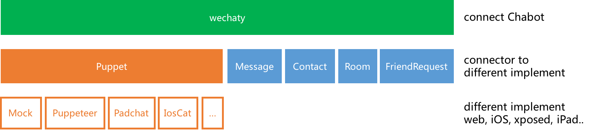

When building a chatbot, the choice of architecture model used is informed primarily by the core purpose of the project. In the Wechaty ecosystem, there are several interrelated and interdependent components that constitute a chatbot. Highlighted below are some of these key components. It is important to understand them and how they fit together to take full advantage of the features offered by the Wechaty ecosystem.

The following diagram shows out that we can reuse almost everything in TypeScript, and what we need to do is only the block located at the top right of the diagram: `Wechaty (Polyglot)`.

```ascii
  +--------------------------+ +--------------------------+
  |                          | |                          |
  |   Wechaty (TypeScript)   | |    Wechaty(Polyglot)     |
  |                          | |  Python, Go, Rust, etc.  |
  +--------------------------+ +--------------------------+

  +-------------------------------------------------------+
  |                 Wechaty Puppet Service                |
  |                                                       |
  |                (wechaty-puppet-service)               |
  +-------------------------------------------------------+

+---------------------  wechaty_grpc  ----------------------+

  +-------------------------------------------------------+
  |                   Wechaty Puppet                      |
  |                                                       |
  |                   (wechaty-puppet)                    |
  +-------------------------------------------------------+

  +--------------------------+ +--------------------------+
  |      Pad Protocol        | |      Web Protocol        |
  |                          | |                          |
  | wechaty-puppet-padlocal  | |  (wechaty-puppet-wechat) |
  +--------------------------+ +--------------------------+
  +--------------------------+ +--------------------------+
  |     Friday Protocol      | |       Mac Protocol       |
  |                          | |                          |
  |  (wechaty-puppet-frida)  | |   (wechaty-puppet-mac)   |
  +--------------------------+ +--------------------------+
```

> Chart made by [AsciiFlow](http://asciiflow.com/)

- **Instant Messaging platforms**

  With Wechaty, you can build chatbots for Instant Messaging systems such as Wechat and Whatsapp among others. They constitute the front-end interface your clients will interact with. One prominent advantage Wechaty has over other SDKs is that you write code once and use the same code for all Instant Messaging platforms. Your source code should work for different IM service tokens without making any changes to the codebase. What is required is just switching the service token and environment variable `WECHATY_PUPPET`.

- **Wechaty Puppet**

  Wechaty Puppet is a standard for maintaining compatibility between Instant Messaging(IM) systems. Wechaty Puppet defines the universal Instant Messaging interface for compatibility between Wechaty API and variants of IM systems.

- **Wechaty Puppet Providers**

  Wechaty puppet provider refers to RPA module used for connecting Wechaty API to the corresponding Instant Messaging platform bot account. Each supported Instant Messaging system has its own Puppet provider. See [Puppet Providers](puppet-providers/overview.mdx) section for a complete list of puppet providers.

  For example, the Wechaty Puppet Provider for WeChat is [wechaty-puppet-wechat](https://github.com/wechaty/wechaty-puppet-wechat), that for Whatsapp is [wechaty-puppet-whatsapp](https://github.com/wechaty/wechaty-puppet-whatsapp), and for Lark is [wechaty-puppet-lark](https://github.com/wechaty/wechaty-puppet-lark).

- **Wechaty Puppet Service**

  Wechaty Puppet Service is gRPC for Wechaty Puppet Provider. For example, we can cloudify the Wechaty Puppet Provider wechaty-puppet-padlocal to a Wechaty Puppet Service by running our Wechaty Puppet Service Token Gateway.

- **Wechaty gRPC**

  Initially, Wechaty was built using TypeScript. Support for other languages such as Python, Go, Java, PHP, .NET, and Scala was later introduced in 2020 so that chatbot makers can build chatbots in their preferred language. This version of Wechaty which offers multi-language support is referred to as **Wechaty polyglot**. The introduction of Wechaty polyglot however came with its challenges because all Wechaty puppet providers were built using TypeScript and delivered via npm. Translating all of them to the languages supported by Wechaty polyglot was a monumental challenge. To solve this problem, Wechaty gRPC was created. The goal of Wechaty RPC is to _cloudify_ Wechaty Puppet Providers. It ensures we can use the Wechaty Puppet Providers remotely via network and Polyglot Wechaty can use the Wechaty Puppet API from the TypeScript ecosystem.
