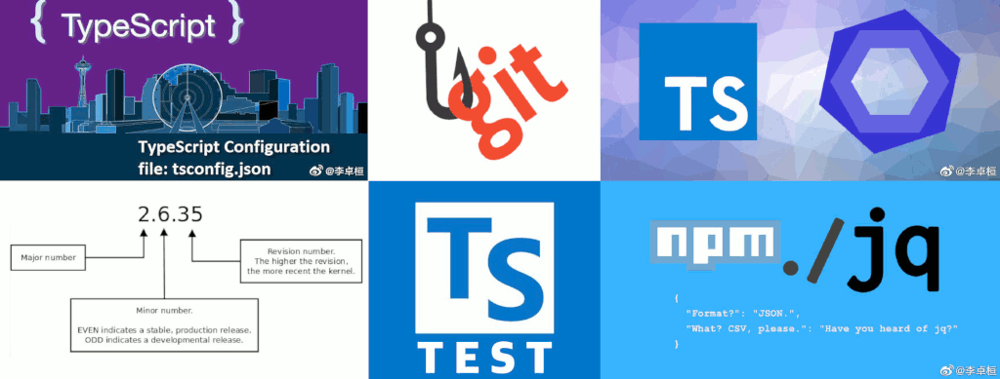
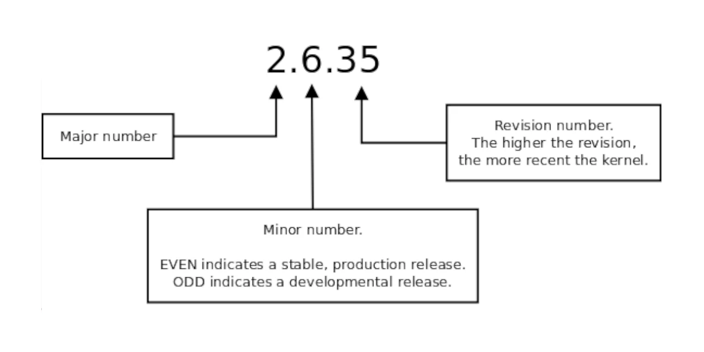
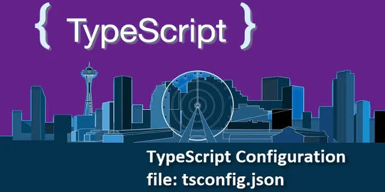
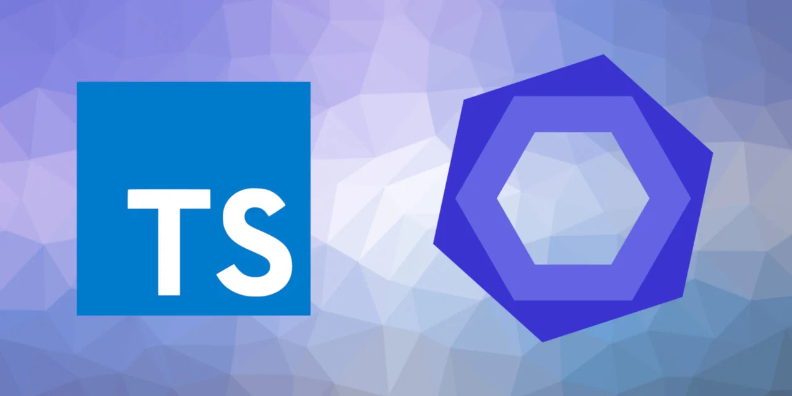
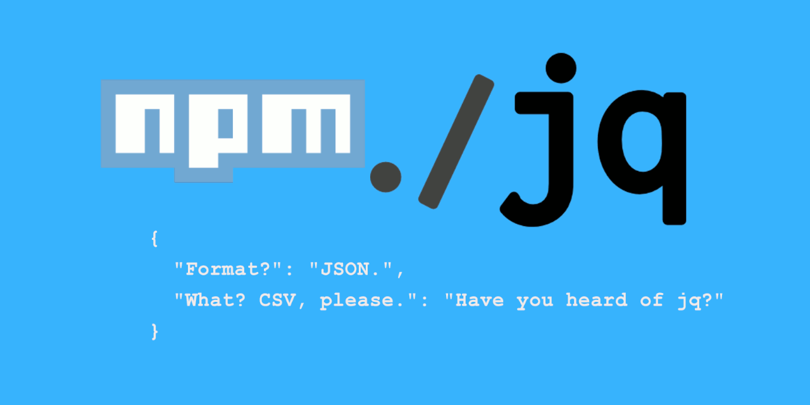

The DevOps model is all the rage for most software teams because of the immense benefits it delivers in terms of efficiency over the traditional software development and management processes. Like in any other software project, there are several DevOps toolsets you can use to automate and streamline your Wechaty chatbot building process. You can integrate them as part of your workflow whether you are developing a chatbot or Wechaty puppet. These tools can help improve your efficiency and code quality. Below are some of the tools you can use to automate your workflow in addition to the traditional DevOps tools.

## [@chatie/semver](https://www.npmjs.com/package/@chatie/semver)



[@chatie/semver](https://www.npmjs.com/package/@chatie/semver) is a simple npm package that provides CLI utility for identifying whether a package VERSION is for production(stable) or development. It is a wrapper for [semver](https://www.npmjs.com/package/semver) package. It also provides TypeScript support.

```sh
$ semver-is-prod 1.0.0
YES: 1.0.0 is production release
$ echo $?
0

$ semver-is-prod 1.1.0
NO: 1.1.0 is development release
$ echo $?
1
```

It follows [semantic versioning 2.0](http://semver.org/). It uses the MINOR version to indicate whether the release is STABLE or NOT.

Numbering rule:

- Even numbers such as 0.8, 0.12 indicate a stable release and are fit for production.
- Odd numbers such as 0.11 or 0.13 represent development release.

## [@chatie/git-scripts](https://npmjs.com/package/@chatie/git-scripts)


This npm package is a wrapper for the [git-scripts](https://www.npmjs.com/package/git-scripts) package. It provides githooks integration for chatie projects. In addition to the features that come with [git-scripts](https://www.npmjs.com/package/git-scripts) package, the `pre-push hook` has been configured to run `npm run lint` followed by `npm version patch` before `git push` for better code quality and version management. You can learn more about `git-scripts` package from its [GitHub home page](https://github.com/nkzawa/git-scripts).

You can add the following to the `package.json` file to configure `@chatie/git-scripts` after installation.

```js
"git": {
    "scripts": {
      "pre-push": "npx git-scripts-pre-push"
    }
  }
```

This hook has a feature for temporarily and permanently disabling `pre-push` as explained in the sections below.

### Temporary

You can set `NO_HOOK=1` before `git push` to temporarily disable `pre-push` git hook.

```shell
# for Linux & Mac
  NO_HOOK=1 git push

# for Windows
  set NO_HOOK=1 git push
```

### Permanent

To permanently disable the pre-push git hook, you can delete the related settings in `package.json` file.

```shell
-  "git": {
-    "scripts": {
-      "pre-push": "npx git-scripts-pre-push"
-    }
-  }
```

## [@chatie/tsconfig](https://npmjs.com/package/@chatie/tsconfig)



This package is for centralized management of all Wechaty project `tsconfig.json` files created. It provides reusable TypeScript configuration files for you to extend from. You can use it to extend `@chatie/tsconfig` from your `tsconfig.json` file to have the chatie version of the TypeScript configuration.

After installation using the command `npm install @chatie/tsconfig`, it automatically creates a `tsconfig.json` file at the root of the project directory which references `@chatie/tsconfig` configuration. You will also get the latest TypeScript & ts-node binarys installed.

```js
{
  "extends": "@chatie/tsconfig",
  "compilerOptions": {
    "outDir": "dist",
  },
  "exclude": [
    "node_modules/",
    "dist/",
    "tests/fixtures/",
  ],
  "include": [
    "app/**/*.ts",
    "bin/*.ts",
    "bot/**/*.ts",
    "examples/**/*.ts",
    "scripts/**/*.ts",
    "src/**/*.ts",
    "tests/**/*.spec.ts",
  ],
}
```

## [@chatie/eslint-config](https://www.npmjs.com/package/@chatie/eslint-config)



You can configure a tool as part of your DevOps continuous integration pipeline to detect and fix problems in your codebase. Since [`tslint`](https://www.npmjs.com/package/tslint) is not supported, you can use [`eslint`](https://eslint.org/) instead to detect and fix problems. [`@chatie/eslint-config`](https://www.npmjs.com/package/@chatie/eslint-config) is a handy npm package you can use for configuring [`eslint`](https://eslint.org/). It can effectively manage Wechaty `eslintrc.js` files.

You can install it by running the command `npm install --save-dev @chatie/eslint-config`. If you don't have the `.eslintrc.js` configuration file, `@chatie/eslint-config` will automatically create it for you. The `.eslintrc.js` file will contain the following:

```js
module.exports = {
  extends: "@chatie",
};
```

## [pkg-jq](https://www.npmjs.com/package/pkg-jq)



This tool, which is distributed as npm package, by default searches for `package.json` file in the current and the parent directories. It then uses `jq` syntax to manipulate the `json` file. It is powered by [node-jq](https://npmjs.com/package/node-jq).

The features of `pkg-jq`:

- Search package.json in current and all parent directories by default. This feature is powered by `pkg-up`.
- Uses `jq` syntax to manipulate the `json` file, powered by `node-jq`.
- It has in-place edit support by specify a `-i` or `--in-place` argument.

## [tstest](https://www.npmjs.com/package/tstest)


[pytest](https://docs.pytest.org/en/6.2.x/) in TypeScript. This module was meant to be a TypeScript version of pytest however currently, it’s only a wrapper of `blue-tape` and `@types/blue-tape`.

## [Wechaty with Docker](#placeholder-link)

Wechaty is fully dockerized. You can integrate Docker as part of your DevOps model by running Wechaty as a microservice in a [docker](https://www.docker.com/) container. To get a taste of Wechaty and Docker, there is a [docker-wechaty-getting-started repository](https://github.com/wechaty/docker-wechaty-getting-started) which you can clone and run on your machine with zero configuration.

## Example scripts

Below are some useful scripts that you can intergrate into your devops workflow.

### generate-version.sh

This helper script will automatically generate a `src/version.ts` file with the version number from the `package.json` file of the current project.

```sh
#!/usr/bin/env bash
set -e

SRC_VERSION_TS_FILE='src/version.ts'

[ -f ${SRC_VERSION_TS_FILE} ] || {
  echo ${SRC_VERSION_TS_FILE}" not found"
  exit 1
}

VERSION=$(npx pkg-jq -r .version)

cat <<_SRC_ > ${SRC_VERSION_TS_FILE}
/**
 * This file was auto generated from scripts/generate-version.sh
 */
export const VERSION: string = '${VERSION}'
_SRC_
```

### package-publish-config-tag.sh

This helper script will set the NPM module version to `@next` if the semver is not production, and set to `@latest` if the semver is production.

```sh
#!/usr/bin/env bash
set -e

VERSION=$(npx pkg-jq -r .version)

if npx --package @chatie/semver semver-is-prod $VERSION; then
  npx pkg-jq -i '.publishConfig.tag="latest"'
  echo "production release: publicConfig.tag set to latest."
else
  npx pkg-jq -i '.publishConfig.tag="next"'
  echo 'development release: publicConfig.tag set to next.'
fi
```

### Scripts for Installing Chatie DevOps Toolsets for Existing Project

```shell
# package.json jq modification util
npm install --save-dev pkg-jq


#
# @chatie/tsconfig
#

# @chatie/tsconfig will re-generate it automatically
rm -f tsconfig.json

npm uninstall \
  @types/node \
  ts-node \
  typescript \

npm install --save-dev @chatie/tsconfig


#
# @chatie/eslint-config
#

# @chatie/eslint-config will re-generate it automatically
rm -f .eslintrc.*

npm uninstall \
  @wwwouter/tslint-contrib \
  eslint \
  markdownlint-cli \
  tslint \
  tslint-config-standard \
  tslint-eslint-rules \
  tslint-jsdoc-rules \

npm install --save-dev @chatie/eslint-config

npx pkg-jq -i ".scripts.\"lint:es\"=\"eslint --ignore-pattern tests/fixtures/ '{bin,examples,scripts,src,tests}/**/*.ts'\""

#
# @chatie/git-scripts
#

npm uninstall git-scripts
npx pkg-jq -i 'del(.git)'

npm install --save-dev @chatie/git-scripts

#
# @chatie/semver
#

npm uninstall \
  @types/semver \
  semver \

npm install --save-dev @chatie/semver

#
# tstest
#
npm uninstall \
  @types/blue-tape \
  @types/sinon \
  blue-tape \
  sinon \
  sinon-test \

npm install --save-dev \
  tstest \

#
# Other Settings
#

# Set default npm publish tag to @next instead of @latest
npx pkg-jq -i '.publishConfig.tag="next"'

```

For more about DevOps tools in the Wechaty ecosystem, you can read the following blog posts.

- [Chatie DevOps toolset](https://wechaty.js.org/2019/06/12/chatie-devops-toolset/)
- [Wonderful Wechaty DevOps tools](https://wechaty.js.org/2020/06/20/wonderful-wechaty-devops-tools/)
