<!-- Pushes a curious reader through the first few minutes of use. -->

## In Next 10 Minutes

Let's run Wechaty to:

1. Get a [WeChat](https://web.wechat.com/) QR Code (scan to login if you have a WeChat account)
1. Get a [Whatsapp](https://web.whatsapp.com/) QR Code (scan to login if you have a Whatsapp account)
1. After you logged in to the WeChat or Whatsapp, your code will be able to process the received messages, as well as reply them as you wish.

## Run Ding Dong BOT

To help you play with Wechaty quick and easy, we will run [ding-dong BOT](https://github.com/wechaty/wechaty-getting-started/blob/master/examples/ding-dong-bot.ts) from [Wechaty Getting Started Template](https://github.com/wechaty/wechaty-getting-started) GitHub repo in your browser with any of the following online IDEs:

1. [Gitpod](#gitpod): The easiest way to getting started by login with your GitHub account.
1. [Google Cloud Shell](#google-cloud-shell): Has a great step by step online tutorial grantuee you can learn something by login with your Google account.

### 1. Gitpod [![][gitpod_img]][gitpod_link] {#gitpod}

[gitpod_img]: https://img.shields.io/badge/Gitpod-Ready--to--Code-blue?logo=gitpod
[gitpod_link]: https://gitpod.io/#https://github.com/wechaty/wechaty-getting-started

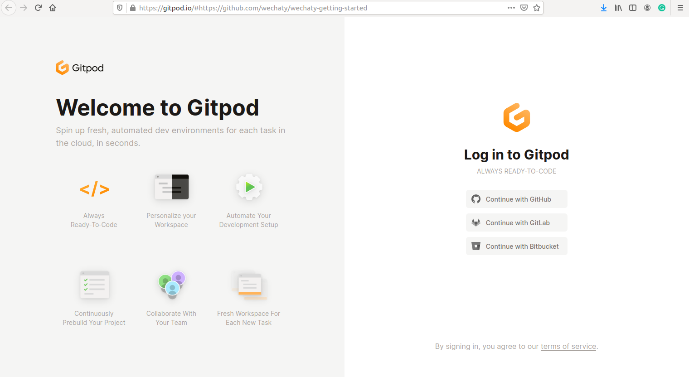

Gitpod in an online IDE which provides you with a complete development envioronment accompanied by a VS-Code powered IDE and a cloud-based Linux container. This is what the below link will take you to! Happy hacking!

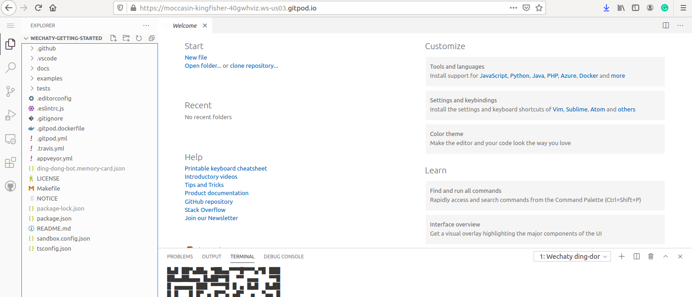

Let's [run your first Ding Dong bot with Gitpod!][gitpod_link]

> Read more: [Getting Started Without Leave Your Browser: Wechaty ❤️ Gitpod](https://wechaty.js.org/2021/02/06/wechaty-getting-started-without-leave-your-browser/)

### 2. Google Cloud Shell [![][shell_img]][shell_link] {#google-cloud-shell}

<!-- https://gstatic.com/cloudssh/images/open-btn.svg -->
[shell_img]: https://img.shields.io/badge/%F0%9F%92%BB%20Google%20Cloud%20Shell-%3C%2F%3E-blue
[shell_link]: https://ssh.cloud.google.com/cloudshell/editor?cloudshell_git_repo=https%3A%2F%2Fgithub.com%2Fwechaty%2Fwechaty-getting-started&cloudshell_open_in_editor=examples/ding-dong-bot.ts&cloudshell_workspace=.&cloudshell_tutorial=examples/tutorials/google-cloud-shell-tutorial.md

#### Once you click on the link below, you see this page :

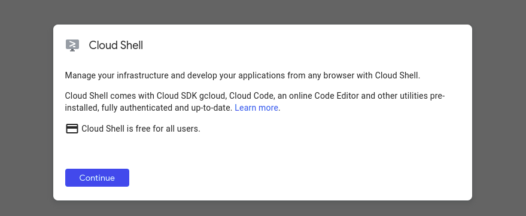

#### Click Continue. You will see this page :

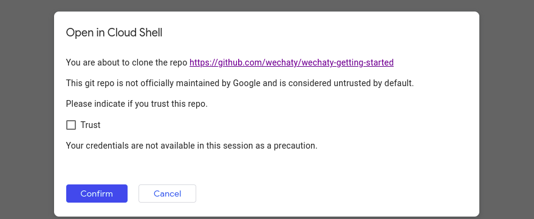

#### It will the take you to the Google Cloud shell editor :

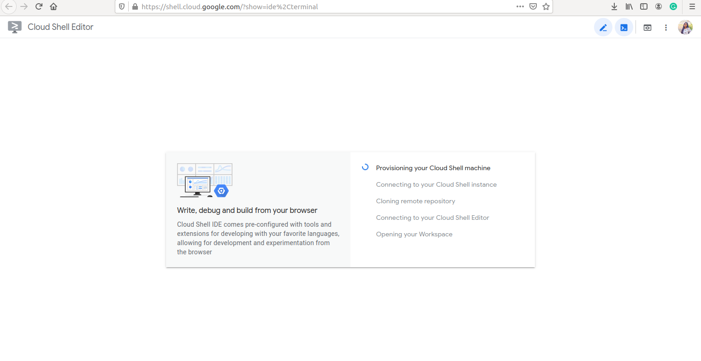

#### The Wechaty tutorial will open up!

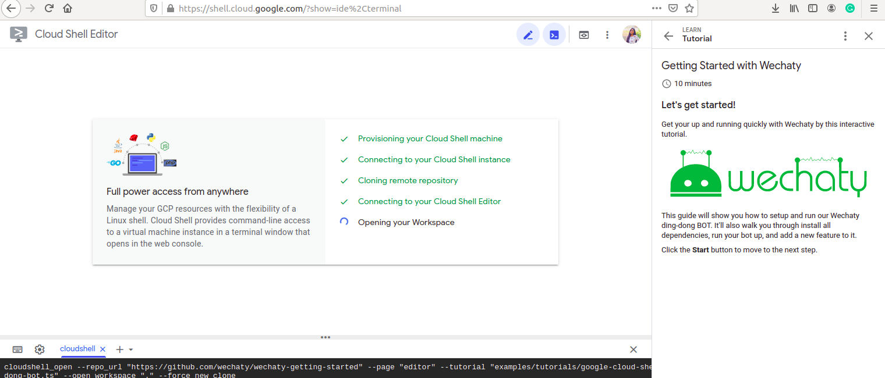

## Setting up development envioronment :

1. Install Node.js v16+.
2. Git clone wechaty-getting-started repo
3. Install system depending packages

**1. Install Node.js **

Node.js has been pre-installed in Google-Cloud Shell already.

**2. Git clone wechaty-getting-started repo with ``git clone ``.**

The **Git Repo **has been already cloned in **Google Cloud Shell**.

**3. Install system dependancy packages**

The puppeteer needs ```libgbm 1``` to be presented in the system, we need to install it first, run :

```sudo apt install -y libgbml ```

Follow the instructions to install required dependancies.

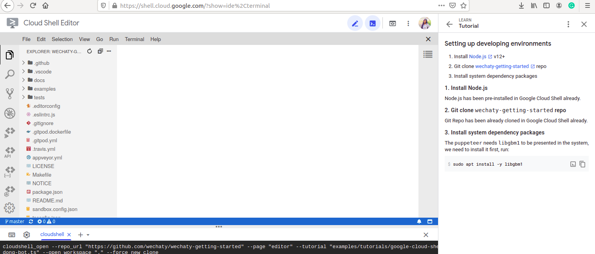

#### Next, install NPM :

Install the NPM packages with ```npm install```.

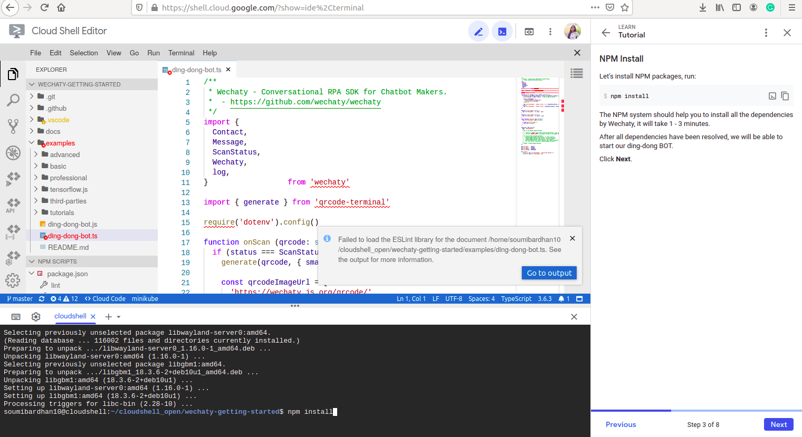

### Now we are ready to get started with our ding-dong bot!

Its source code is in ```examples/ding-dong-bot.ts```.

#### Lets try running Ding-Dong Bot with Whatsapp :

To start our bot with whatsapp, we need to define WECHATY_PUPPET = wechaty-puppet-whatsapp. Run the following on the terminal :

```
export \
WECHATY_PUPPET=wechaty-puppet-whatsapp
npm start
```

You will see a **QR Code** appear on the **cloud terminal**. **Scan** it with your **Whatsapp scanner.**.

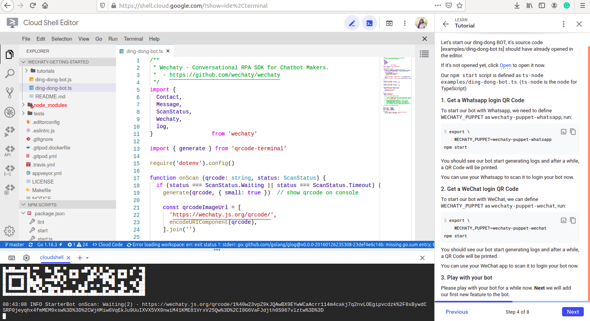

### Now you will be able to play with the ding-dong-bot! The messages received on whatsapp will also be displayed on the cloud terminal.

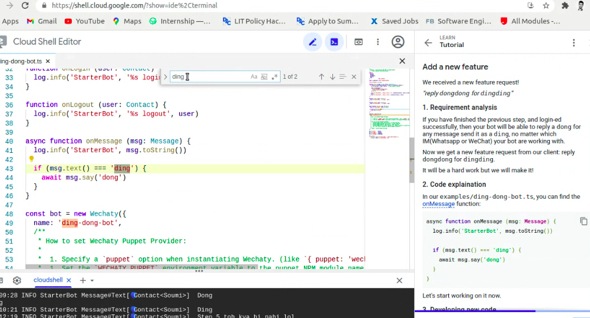

If you have finished the previous step, and login-ed successfully, then your bot will be able to reply a dong for any message send it as a ding, no matter which IM(Whatsapp or WeChat) your bot is working with. You can even add your own features!

#### Now if you get a new feature request from your client: reply dongdong for dingding, you can do it super fast! Just updated the onMessage function in your ding-dong-bot.ts file!

```
async function onMessage (msg: Message) {
  log.info('StarterBot', msg.toString())

  if (msg.text() === 'ding') {
    await msg.say('dong')
  }
  if (msg.text() === 'dingding') {
    await msg.say('dongdong')
  }
}
```

#### That's it! We have added 3 lines of code to implment our new feature. Do not forget to save the file changes to the disk.

Next up, start your brand new new ding-dong BOT and test your new feature! Once you complete the tutorial, you will be directed to the completion page.

### Congratulations, you did it!

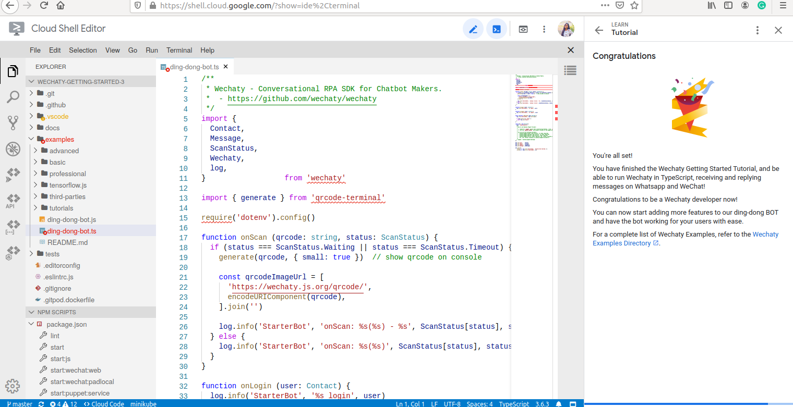

Click here to [get started with Google Cloud Shell][shell_link]

> Read more: [Google Cloud Shell Tutorials for Wechaty](https://wechaty.js.org/2021/02/20/google-cloud-shell-tutorials/)

## Contact Us

You can [join our Gitter](https://gitter.im/wechaty/wechaty) network if you aren’t already a member.
