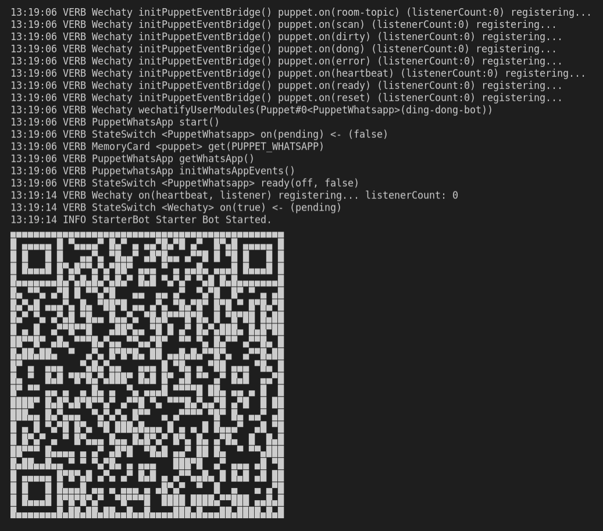
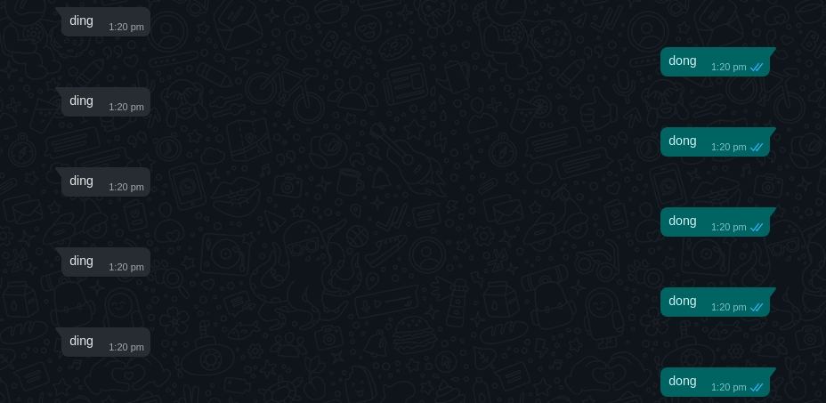

<!-- MDX import -->
import Tabs     from '@theme/Tabs'
import TabItem  from '@theme/TabItem'

import ShortestChatbots from '../polyglot/transclusions/shortest-chatbots.mdx'

<!-- Pushes a curious reader through the first few minutes of use. -->

[](https://github.com/Wechaty/wechaty)
[](https://www.typescriptlang.org/)

For running Ding Dong Bot, you can setup your own server for running locally. Just follow the steps below:

1. Getting Started
1. Clone the [Ding Dong Bot](https://github.com/wechaty/wechaty-getting-started) repository
1. Install dependencies
1. Run the bot

## Try out the bot

[](https://codesandbox.io/s/github/wechaty/wechaty-getting-started/tree/main/examples/third-parties/codesandbox?hidenavigation=1&module=%2Fding-dong-bot.ts&theme=dark)

You can try out Ding Dong Bot using this interactive CodeSandbox.

Just scan the generated QR code with **WeChat** app and you are ready to go.

<iframe
  class="codesandbox"
  src="https://codesandbox.io/embed/github/wechaty/wechaty-getting-started/tree/main/examples/third-parties/codesandbox?fontsize=12&hidenavigation=1&module=%2Fding-dong-bot.ts&theme=dark"
  sandbox="allow-modals allow-forms allow-popups allow-scripts allow-same-origin"
></iframe>

## Requirements

1. [Node.js](https://nodejs.dev/) v16+
1. [Wechaty Puppet Service TOKEN](https://wechaty.js.org/docs/puppet-services/) (if you want to use RPA protocols other than Web)

## Usage

<ShortestChatbots />

## Getting Started

In this tutorial you will learn to use Ding Dong bot which replies with a `dong` message when it receives a `ding` message.

Before getting started make sure you have `Node` installed on your system. If you do not have `Node.js` installed (or have a version below 12),
then you need to install the latest version of `Node.js` by following the links below:

:::note Node.js installation docs

* [Windows](https://nodejs.org/en/download/package-manager/#windows)
* [Linux\(Debian/Ubuntu\)](https://nodejs.org/en/download/package-manager/#debian-and-ubuntu-based-linux-distributions)
* [macOS](https://nodejs.org/en/download/package-manager/#macos)

> Installation guide for `Node.js` in other platforms can be found [here](https://nodejs.org/en/download/package-manager/).

:::

You can head over to [Building the bot](#building-the-bot) section to learn how to build the bot on your own.

If you just want to try out the bot on your local system, follow the steps below.

### 1. Install make

You will need `make` for running the **Makefile**, use the command below to install:

<Tabs
  groupId="operating-systems"
  defaultValue="linux"
  values={[
    { label: 'Linux',   value: 'linux', },
    { label: 'macOS',   value: 'mac', },
    { label: 'Windows', value: 'windows', },
  ]
}>

<TabItem value="linux">

```sh
sudo apt install build-essential
```

</TabItem>
<TabItem value="mac">

```sh
brew install make
```

</TabItem>
<TabItem value="windows">

```sh
choco install make
```

</TabItem>
</Tabs>

### 2. Clone repository

You can clone the [Ding Dong Bot](https://github.com/wechaty/wechaty-getting-started) repository by following the below command, and navigate to the directory:

```bash
git clone https://github.com/wechaty/wechaty-getting-started
cd wechaty-getting-started
```

### 3. Install dependencies

For installing the required `npm` dependencies run the following:

```bash
# npm install
make install
```

### 4. Run the bot

First, you have to `export/set` the environment variables, and then you can run the bot:

<Tabs
  groupId="operating-systems"
  defaultValue="linux"
  values={[
    { label: 'Linux',   value: 'linux', },
    { label: 'macOS',   value: 'mac', },
    { label: 'Windows', value: 'windows', },
  ]
}>

<TabItem value="linux">

```bash
export WECHATY_LOG=verbose
export WECHATY_PUPPET=wechaty-puppet-wechat
make bot
# the above is equals to the below command:
# npm start
#   or, npx ts-node examples/ding-dong-bot.ts
```

</TabItem>
<TabItem value="mac">

```bash
export WECHATY_LOG=verbose
export WECHATY_PUPPET=wechaty-puppet-wechat
make bot
# the above is equals to the below command:
# npm start
#   or, npx ts-node examples/ding-dong-bot.ts
```

</TabItem>
<TabItem value="windows">

```bash
set WECHATY_LOG=verbose
set WECHATY_PUPPET=wechaty-puppet-wechat
make bot
# the above is equals to the below command:
# npm start
#   or, npx ts-node examples/ding-dong-bot.ts
```

</TabItem>
</Tabs>

> There are various **Wechaty puppets** available, you can know more about them [here](https://github.com/wechaty/wechaty-getting-started#working-with-different-puppets).

This will generate a QR code. Scan it using Wechat or WhatsApp depending upon the puppet used.

You are ready to play with the bot.

## Building the bot

Let's get started with building the Ding Dong bot using Wechaty.

### 1. Initialize project

Create a new folder called `ding-dong-bot` and move into that directory.

```bash
mkdir ding-dong-bot
cd ding-dong-bot
```

Use the following command to initialize an npm project:

```bash
npm init -y
```

This will generate the `package.json` file containing these:

```json
{
  "name": "ding-dong-bot",
  "version": "1.0.0",
  "description": "",
  "main": "index.js",
  "scripts": {
    "test": "echo \"Error: no test specified\" && exit 1"
  },
  "keywords": [],
  "author": "",
  "license": "ISC"
}
```

### 2. Install dependencies

For building the ding dong bot you will require these dependencies:

* [wechaty](https://www.npmjs.com/package/wechaty): Official Wechaty package
* [qrcode-terminal](https://www.npmjs.com/package/qrcode-terminal): Displays the QR code

For installing these dependencies run the following commands:

- **For installing wechaty**

```bash
npm install wechaty
```

- **For installing qrcode-terminal**

```bash
npm install qrcode-terminal
```

You will also need to add dependencies for using any [Wechaty Puppet](https://wechaty.js.org/docs/puppet-providers/)
which helps to integrate Wechaty with various **instant messaging (IM) systems** (such as WeChat, Whatsapp, and Gitter):

1. If you want to use **[WhatsApp](https://www.whatsapp.com/)**, install `wechaty-puppet-whatsapp`:

  ```bash
  npm install wechaty-puppet-whatsapp
  ```
2. If you want to use **[WeChat](https://www.wechat.com/)**, you can try the following puppets:

   * **Web Protocol:** Install `wechaty-puppet-wechat`:

     ```bash
     npm install wechaty-puppet-wechat
     ```

   * **iPad Protocol:**
     * padlocal: Install `wechaty-puppet-padlocal`:

       ```bash
       npm install wechaty-puppet-padlocal
       ```

       Then get a token like `puppet_padlocal_XXX`, know more about puppet service padlocal [here](http://wechaty.js.org/docs/puppet-services/padlocal).

     * paimon: Install `wechaty-puppet-service`:

       ```bash
       npm install wechaty-puppet-service
       ```

       Then get a token like `puppet_paimon_XXX`, know more about puppet service paimon [here](http://wechaty.js.org/docs/puppet-services/paimon).

3. If you want to use **[WeCom](https://work.weixin.qq.com/)**, install `wechaty-puppet-service`:

  ```bash
  npm install wechaty-puppet-service
  ```

  Then get a token like `puppet_wxwork_XXXXX`, more about puppet service wxwork [here](https://wechaty.js.org/docs/puppet-services/wxwork/).

> You can find more information about the puppets [here](https://wechaty.js.org/docs/puppet-providers/).

Now, you are ready to write the main code for the bot.

### 3. Writing code for bot

Create a new file `ding-dong-bot.ts`. We will be writing the code here.

Let's import the required packages in this file:

```ts
import {
  Contact,
  Message,
  ScanStatus,
  WechatyBuilder,
  log,
}from 'wechaty'

import { generate } from 'qrcode-terminal'

require('dotenv').config()
```

Now we will write some functions which will be required for handling different events returned by bot.

**onScan**

This function will be required for generating QR code for puppet specified and Displays it on console.

```ts
function onScan (qrcode: string, status: ScanStatus) {
  if (status === ScanStatus.Waiting || status === ScanStatus.Timeout) {
    generate(qrcode, { small: true })  // show qrcode on console

    const qrcodeImageUrl = [
      'https://wechaty.js.org/qrcode/',
      encodeURIComponent(qrcode),
    ].join('')

    log.info('StarterBot', 'onScan: %s(%s) - %s', ScanStatus[status], status, qrcodeImageUrl)
  } else {
    log.info('StarterBot', 'onScan: %s(%s)', ScanStatus[status], status)
  }
}
```
**1.**  If `status` is **Waiting** or **Timeout** then function `onScan` will generate qrcode

**2.**  `qrcodeImageUrl` is used for reading the generated `qrcode`. `encodeURIComponent(qrcode)` encodes a URI (string that refers to a resource ie. qrcode) by replacing each instance of certain characters by UTF-8 encoding of characters.

**3.**  After reading the `qrcode` it return `ScanStatus`.

**onLogin**

This function will print message when a user logs into the bot.

```ts
function onLogin (user: Contact) {
  log.info('StarterBot', '%s login', user)
}
```

**onLogout**

This will print message when a user logs out.

```ts
function onLogout (user: Contact) {
  log.info('StarterBot', '%s logout', user)
}
```

**onMessage**

This will print a log message. If the message is `ding` then it will print `dong`.

```ts
async function onMessage (msg: Message) {
  log.info('StarterBot', msg.toString())

  if (msg.text() === 'ding') {
    await msg.say('dong')
  }
}
```

Now initializing the bot by providing a name.

```ts
const bot = WechatyBuilder.build({
  name: 'ding-dong-bot'
})
```

Assigning proper functions to call when an event is triggered.

```ts
bot.on('scan',    onScan)
bot.on('login',   onLogin)
bot.on('logout',  onLogout)
bot.on('message', onMessage)
```

Finally for starting the bot

```ts
bot.start()
  .then(() => log.info('StarterBot', 'Starter Bot Started.'))
  .catch(e => log.error('StarterBot', 'Failed to start the bot:', e))
```

## Running the bot

You have to **export/set** an environment variable with the type of puppet to use:

<Tabs
  groupId="operating-systems"
  defaultValue="linux"
  values={[
    { label: 'Linux',   value: 'linux', },
    { label: 'macOS',   value: 'mac', },
    { label: 'Windows', value: 'windows', },
  ]
}>

<TabItem value="linux">

```bash
export WECHATY_LOG=verbose
export WECHATY_PUPPET=wechaty-puppet-wechat

# For using WhatsApp:
# export WECHATY_PUPPET=wechaty-puppet-whatsapp

# For using WeCom:
# export WECHATY_PUPPET=wechaty-puppet-service
# export WECHATY_PUPPET_SERVICE_TOKEN="puppet_wxwork_XXXXX"
```

</TabItem>
<TabItem value="mac">

```bash
export WECHATY_LOG=verbose
export WECHATY_PUPPET=wechaty-puppet-wechat

# For using WhatsApp:
# export WECHATY_PUPPET=wechaty-puppet-whatsapp

# For using WeCom:
# export WECHATY_PUPPET=wechaty-puppet-service
# export WECHATY_PUPPET_SERVICE_TOKEN="puppet_wxwork_XXXXX"
```

</TabItem>
<TabItem value="windows">

```bash
set WECHATY_LOG=verbose
set WECHATY_PUPPET=wechaty-puppet-wechat

# For using WhatsApp:
# set WECHATY_PUPPET=wechaty-puppet-whatsapp

# For using WeCom:
# set WECHATY_PUPPET=wechaty-puppet-service
# set WECHATY_PUPPET_SERVICE_TOKEN="puppet_wxwork_XXXXX"
```

</TabItem>
</Tabs>

> If you are using WeCom, you can get token from [puppet service wxwork](http://wechaty.js.org/docs/puppet-services/wxwork).

Run the bot using the following command:

```sh
ts-node ding-dong-bot.ts
```

This will start bot and generate QR code like this:



Scan it using your **WeChat/WhatsApp** as per the puppet you have selected, and you are ready to play with the bot!

## Bot demonstration



## Conclusion

You have learnt to make a ding dong bot.

## References

* [Wechaty Getting Started GitHub repository](https://github.com/wechaty/wechaty-getting-started)
