## Welcome to How to Guide

How to Guide is important because it guides us through the steps involved in addressing key problems and use-cases.

### How To Contribute To this section

- Fork this repository

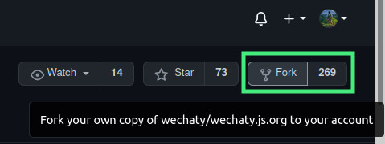

- <a href="\locally">Follow these steps to run locally </a>

- Create your documentation branch: `git checkout -b branch-name`

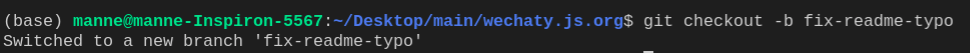

- Make changes to the file

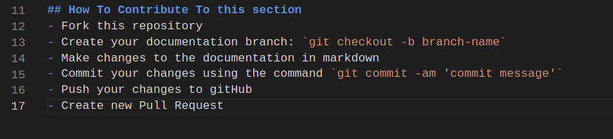

- Run test for making sure the changes are valid `npm run test`

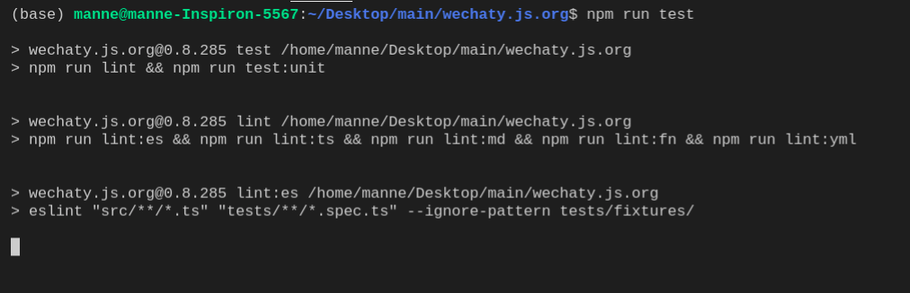

- Add changes to the staging area `git add .`

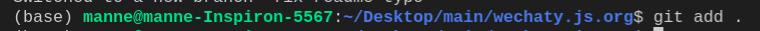

- Commit your changes using the command `git commit -m 'commit message'`

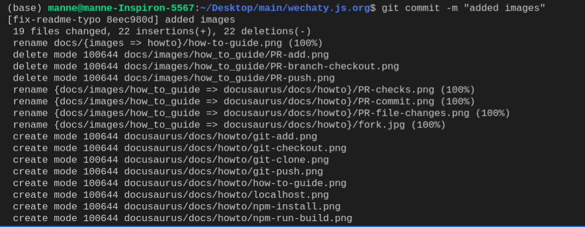

- Push your changes to gitHub `git push origin branch-name`

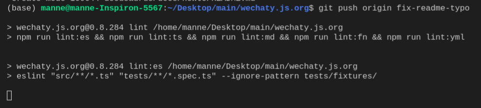

- Create new Pull Request

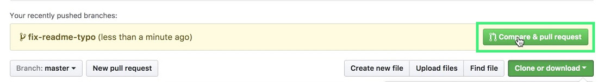

- Make sure to pass all the Test Cases

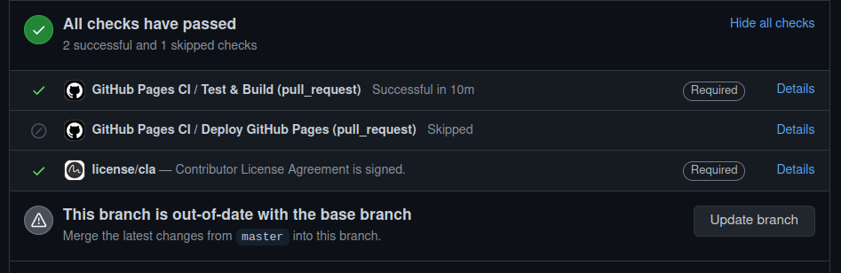

<section id="locally">

### How to Run Locally

</section>

- Clone this repository: `git clone "https://github.com/wechaty/wechaty.js.org"`

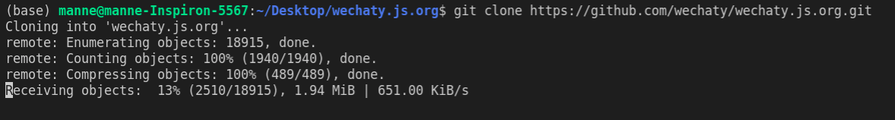

- Run the commands :
  - `npm install`
  - `npm run docusaurus:build`
  - `npm run docusaurus:serve`
  
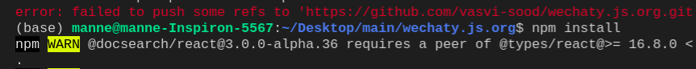

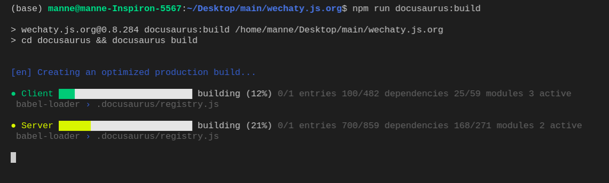

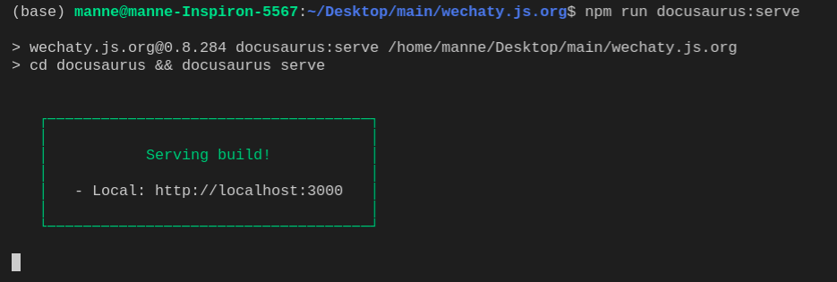

- The site will be running  locally on `http://localhost:3000`

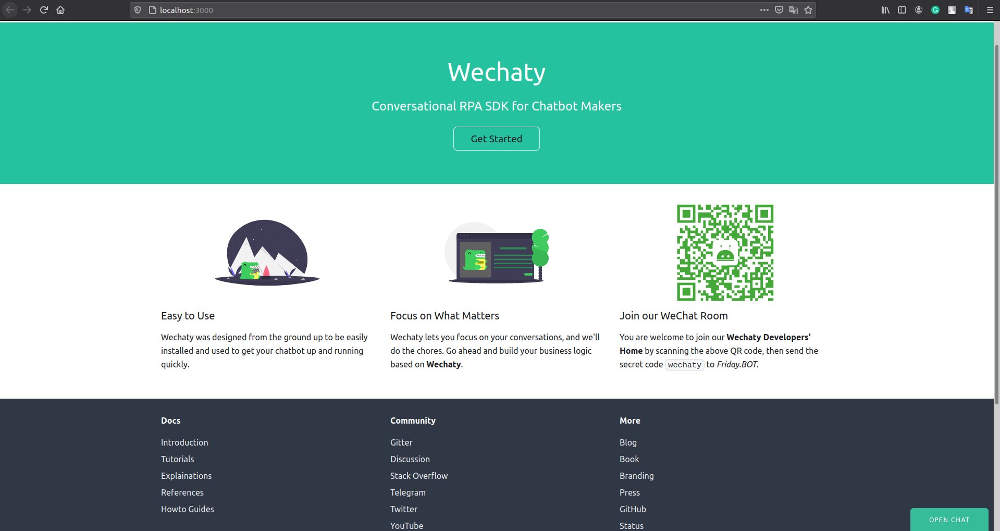

### Copyright & License

- Code & Docs © 2016-now Wechaty Contributors <https://github.com/wechaty>
- Code released under the Apache-2.0 License
- Docs released under Creative Commons
