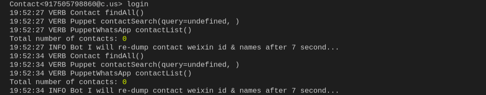
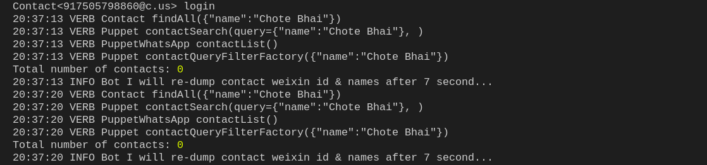

import Tabs from '@theme/Tabs'
import TabItem from '@theme/TabItem'

Use the guide to help you integrate additional functions to an existing project which is present at [Github/Contact-Bot](https://github.com/wechaty/wechaty/blob/1523c5e02be46ebe2cc172a744b2fbe53351540e/examples/contact-bot.ts) or check that your existing local system will run on Wechaty. If, you wish to learn on how to build the bot on your own, please visit one of our [Building the bot](https://wechaty.js.org/docs/examples/basic/contact-bot#building-the-bot) section.

The steps outlined here mainly focuses on working with Javascript, but user are free to switch between any languages.All wechaty contacts are encapsulated as a Contact.

## Prerequisites

* Your system must have [Node.js](https://nodejs.org/en/download/package-manager/) installed (version >= 12).
* Your system must have [Wechaty](https://github.com/wechaty/wechaty) (version >= 0.40).
* You need to be familiar with the basics of Wechaty platform. If not, follow our [tutorials](https://wechaty.js.org/docs/tutorials/) section.
* You need to have at least a minimal application ready to work, follow one of our [Example/Contact-Bot](https://wechaty.js.org/docs/examples/basic/contact-bot).

### If you don't know where to start from

See [Running our first ding-dong bot](https://wechaty.js.org/docs/getting-started/quick-start).

The below function needs a basic scipt that can help run the bot. The basic script starts by importing the code from [Github/Contact-Bot](https://github.com/wechaty/wechaty/blob/1523c5e02be46ebe2cc172a744b2fbe53351540e/examples/contact-bot.ts).Integrate the below code, for this action to work.

## All contacts - define how to list all contact

This section help you list down all your contacts from the Instant messaging platform you choose to intergrate this bot by its `id`, `name` & `type`.

<Tabs
  groupId="programming-languages"
  defaultValue="ts"
  values={[
    { label: 'TypeScript',  value: 'ts', },
    { label: 'JavaScript',  value: 'js', },
    { label: 'Python',      value: 'py', },
    { label: 'Go',          value: 'go', },
    { label: 'Java',        value: 'java', },
    { label: 'PHP',         value: 'php', },
    { label: 'Scala',       value: 'scala', },
    { label: 'C#',          value: 'csharp', },
    { label: 'Rust',        value: 'rust', },
  ]
}>

<TabItem value="ts">

```ts
import { Contact } from 'wechaty'

async function onReady () {
  const contactList = await bot.Contact.findAll()
  console.info('Total number of contacts:', contactList.length)

  for (const contact of contactList) {
    console.info('Id:',   contact.id)
    console.info('Name:', contact.name())

    const type = contact.type()
    console.info('Type:', Contact.Type[type])
  }
}

bot.on('ready', onReady)
```

</TabItem>
<TabItem value="js">

```js
const { Contact } = require('wechaty')

async function onReady () {
  const contactList = await bot.Contact.findAll()
  console.info('Total number of contacts:', contactList.length)

  for (const contact of contactList) {
    console.info('Id:',   contact.id)
    console.info('Name:', contact.name())
    
    const type = contact.type()
    console.info('Type:', Contact.Type[type])
  }
}

bot.on('ready', onReady)
```

</TabItem>
<TabItem value="py">

```py
from typing import List
from wechaty import Wechaty, Contact

class MyBot(Wechaty):
    async def on_ready(self, _):
        contacts: List[Contact] = await self.Contact.find_all()
        for contact in contacts:
            print(f'id<{contact.contact_id}>, name<{contact.name}>, type<{contact.type()}>')
```

</TabItem>
<TabItem value="go">

```go
// TODO: Pull Request is welcome!
```

</TabItem>
<TabItem value="java">

```java
// TODO: Pull Request is welcome!
```

</TabItem>
<TabItem value="php">

```php
// TODO: Pull Request is welcome!
```

</TabItem>
<TabItem value="scala">

```scala
// TODO: Pull Request is welcome!
```

</TabItem>
<TabItem value="csharp">

```csharp
// TODO: Pull Request is welcome!
```

</TabItem>
<TabItem value="rust">

```rust
// TODO: Pull Request is welcome!
```

</TabItem>
</Tabs>

The expected output of the JavaScript code is:


## Search in contacts - define how to search within contacts

This guide help you find your contact from the list of contacts from the Instant messaging platform you choose to intergrate this bot.

<Tabs
  groupId="programming-languages"
  defaultValue="ts"
  values={[
    { label: 'TypeScript',  value: 'ts', },
    { label: 'JavaScript',  value: 'js', },
    { label: 'Python',      value: 'py', },
    { label: 'Go',          value: 'go', },
    { label: 'Java',        value: 'java', },
    { label: 'PHP',         value: 'php', },
    { label: 'Scala',       value: 'scala', },
    { label: 'C#',          value: 'csharp', },
    { label: 'Rust',        value: 'rust', },
  ]
}>

<TabItem value="ts">

```ts
async function onReady () {
  // find by id:
  const filehelper = await bot.Contact.find('filehelper')
  console.info('filehelper:', filehelper)

  // find by name:
  const nameContainsJList = await bot.Contact.findAll({ name: /j/i })
  console.info('Total number of contacts:', nameContainsJList.length)

  for (const contact of nameContainsJList) {
    console.info('contact:', contact)
  }
}

bot.on('ready', onReady)
```

</TabItem>
<TabItem value="js">

```js
const { Contact } = require('wechaty')

async function onReady () {
  // find by id:
  const filehelper = await bot.Contact.find('filehelper')
  console.info('filehelper:', filehelper)

  // find by name:
  const nameContainsJList = await bot.Contact.findAll({ name: /j/i })
  console.info('Total number of contacts:', nameContainsJList.length)

  for (const contact of nameContainsJList) {
    console.info('contact:', contact)
  }
}

bot.on('ready', onReady)
```

</TabItem>
<TabItem value="py">

```py
from typing import List, Optional
from wechaty import Wechaty, Contact
from wechaty_puppet.schemas.contact import ContactQueryFilter

class MyBot(Wechaty):
    async def on_ready(self, _):
        # find by id
        filehelper: Optional[Contact] = await self.Contact.find('filehelper')
        if filehelper:
            print(f'filehelper<{filehelper}>')
        
        # find by name
        contacts: List[Contact] = await self.Contact.find_all(ContactQueryFilter(name='your-friend-name'))
        print(f'total number of contacts: {len(contacts)}')

        for contact in contacts:
            print(contact)
```

</TabItem>
<TabItem value="go">

```go
// TODO: Pull Request is welcome!
```

</TabItem>
<TabItem value="java">

```java
// TODO: Pull Request is welcome!
```

</TabItem>
<TabItem value="php">

```php
// TODO: Pull Request is welcome!
```

</TabItem>
<TabItem value="scala">

```scala
// TODO: Pull Request is welcome!
```

</TabItem>
<TabItem value="csharp">

```csharp
// TODO: Pull Request is welcome!
```

</TabItem>
<TabItem value="rust">

```rust
// TODO: Pull Request is welcome!
```

</TabItem>
</Tabs>

The expected output of the JavaScript code is:

