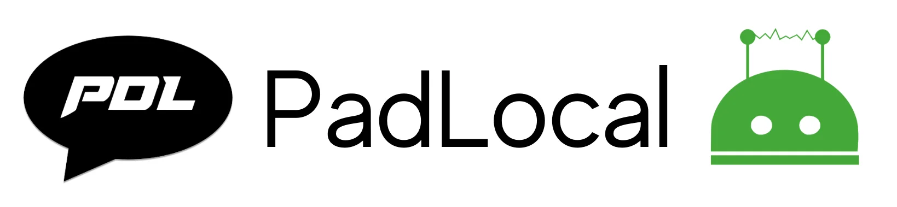

PadLocal is a most powerful Wechaty puppet provider which consumes Wechaty puppet services and includes sending or receiving files, texts individually or in a group. In this how to guide, you will learn how to deploy the bot in PadLocal locally and integrate bot from the list of examples present in [starter templete](https://github.com/wechaty/wechaty-getting-started).



## Requirements

1. Your system must have [Node.js](https://nodejs.org/en/download/package-manager/) installed (version >= 12).
2. Your system must have [Wechaty](https://github.com/wechaty/wechaty) (version >= 0.40).
3. Run [wechaty-puppet-padlocal](https://www.npmjs.com/package/wechaty-puppet-padlocal).

## Deployment

<!-- MDX import -->
import Tabs from '@theme/Tabs'
import TabItem from '@theme/TabItem'

<Tabs
  groupId="operating-systems"
  defaultValue="linux"
  values={[
    { label: 'Linux',   value: 'linux', },
    { label: 'macOS',   value: 'mac', },
    { label: 'Windows', value: 'windows', },
  ]
}>

<TabItem value="linux">

```sh
npm install wechaty-puppet-padlocal
export WECHATY_PUPPET=wechaty-puppet-padlocal
export WECHATY_PUPPET_PADLOCAL_TOKEN=__TOKEN__
npm start
```

</TabItem>
<TabItem value="mac">

```sh
npm install wechaty-puppet-padlocal
export WECHATY_PUPPET=wechaty-puppet-padlocal
export WECHATY_PUPPET_PADLOCAL_TOKEN=__TOKEN__
npm start
```

</TabItem>
<TabItem value="windows">

```sh
npm install wechaty-puppet-padlocal
set WECHATY_PUPPET=wechaty-puppet-padlocal
set WECHATY_PUPPET_PADLOCAL_TOKEN=__TOKEN__
npm start
```

</TabItem>
</Tabs>

## Integration

Let's take up an example on how to integrate bot from [starter templete](https://github.com/wechaty/wechaty-getting-started) to PadLocal. The step is similar for all other bots as well.

### Prerequisite

1. Official Wechaty package: [package/wechaty](https://www.npmjs.com/package/wechaty).
2. Your free trail token for 7 days: [pad-local.com](http://pad-local.com/).

You can follow up the steps mentioned below:

1. Initialize the project by creating a new folder `my-bot`.

```bash
mkdir my-bot
cd my-bot
npm init -y
npm install ts-node typescript -g --registry=https://r.npm.taobao.org
tsc --init --target ES6
```

2. Install Wechaty using the following commands:

```bash
npm install wechaty@latest --registry=https://r.npm.taobao.org
```

3. Install PadLocal puppet using the following commands:

```bash
npm install wechaty-puppet-padlocal@latest --registry=https://r.npm.taobao.org
```

4. Create a new folder `src` and add a file `my-bot.ts`. Add any of the functions from <a href="#"> add functionality to the bot</a> section to the snippet below:

```bash
import {PuppetPadlocal} from "wechaty-puppet-padlocal";
import {Contact, Message, ScanStatus, Wechaty} from "wechaty";

const token: string = ""            // padlocal token
const puppet = new PuppetPadlocal({ token })
const bot = new Wechaty({
    name: "TestBot",
    puppet,
})
/*
 *Your function goes here
 */
```

5. After you are done with the file, you can run the bot using the following commands:

```bash
ts-node my-bot.ts
```
Now, you are ready to play with the bot!

You can deploy the bot with popular container solutions as well such as:

* [Deploy with Heroku](#a)
* [Deploy with Docker](#b)

## References

* Find out some more information about puppet from [docs/puppet-providers](https://wechaty.js.org/docs/puppet-providers/).
* Find out the more bot repository from [wechaty-getting-started](https://github.com/wechaty/wechaty-getting-started).
* Find out the PadLocal repository at [wechaty-puppet-padlocal](https://github.com/padlocal/wechaty-puppet-padlocal).
* Find out API usage documentation at [API usage documentation (TypeScript JavaScript)](https://github.com/padlocal/wechaty-puppet-padlocal/wiki/API-%E4%BD%BF%E7%94%A8%E6%96%87%E6%A1%A3-(TypeScript-JavaScript)).
* Find out common questions at [Frequently Asked Questions List](https://github.com/padlocal/wechaty-puppet-padlocal/wiki/%E5%B8%B8%E8%A7%81%E9%97%AE%E9%A2%98%E5%88%97%E8%A1%A8).

## Blogs

* [A preliminary study of Python-wechaty & wechaty-puppet-padlocal](https://wechaty.js.org/2021/03/08/python-wechaty-and-wechaty-puppet-padlocal/).
* [How Python Wechaty uses PadLocal Puppet Service](https://wechaty.js.org/2021/02/03/python-wechaty-for-padlocal-puppet-service/).
* [How .NET Wechaty uses PadLocal Puppet Service](https://wechaty.js.org/2021/01/28/csharp-wechaty-for-padlocal-puppet-service/).
