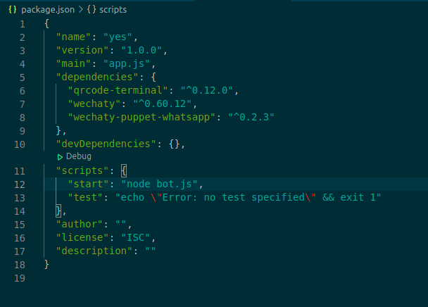

<!-- MDX import -->
import Tabs from '@theme/Tabs'
import TabItem from '@theme/TabItem'

:::tip

The wechaty bot is available in various programming languages!

:::

Events are functions that define the operations the bot can perform. Some common events are login, logout, onMessage etc.

After getting familiar with the ding dong bot, this tutorial will focus on creating a bot from scratch adding various events one by one.

For simplicity, this tutorial will guide you to create a bot in javascript but but you can choose between various programming languages available.  

## Getting started

<ol>
<li>Create an empty project folder</li>
<li> Add a bot.js file</li>
<li>In the termial write the following command</li>

```bash
npm init
```

A package.json file is created.

<li>In the terminal install the necesary dependencies</li>

```bash
npm i qrcode-terminal wechaty 
```

```bash
 npm i wechaty-puppet-PUPPET-PROVIDER
```

The <i>PUPPET-PROVIDER</i> represents the messaging platform you want to integrate your bot with.

- For whatsapp:

```bash
 npm i wechaty-puppet-whatsapp
```

- For wechat

```bash
 npm i wechaty-puppet-wechat
```

<li> In the package.json file add a script</li>

`"start": "node bot.js"`

</img>

<li> In the terminal type the following Commands</li>

```bash
 export WECHATY_LOG=verbose
 ```

<ul>

<li> For whatsapp:</li>

```bash
export WECHATY_PUPPET=wechaty-puppet-whatsaap
```

<li>For wechat</li>

```bash
export WECHATY_PUPPET=wechaty-puppet-wechat
```

</ul>

<li>Now we can run the bot using the command:</li>

``` bash
npm start
```

But before that we need to add events to the bot. For following along the tutorial use the javascript code from the polyglot.
</ol>

## Basic Events

### `Scan` Event

The scan event generates a QR code to integrate your bot to a puppet provider

<Tabs
  groupId="programming-languages"
  defaultValue="ts"
  values={[
    { label: 'TypeScript',  value: 'ts', },
    { label: 'JavaScript',  value: 'js', },
    { label: 'Python',      value: 'py', },
    { label: 'Go',          value: 'go', },
    { label: 'Java',        value: 'java', },
    { label: 'PHP',         value: 'php', },
    { label: 'Scala',       value: 'scala', },
    { label: 'C#',          value: 'csharp', },
    { label: 'Rust',        value: 'rust', },
  ]
}>

<TabItem value="ts">

```ts
import { ScanStatus } from 'wechaty'

async function onScan (
  qrcode: undefined | string,
  status: ScanStatus,
) {
  console.info('Scan QR Code to login, status:', status, ScanStatus[status])
  console.info('https://wechaty.js.org/qrcode/' + encodeURIComponent(qrcode))
}

bot.on('scan', onScan)
await bot.start()
```

</TabItem>
<TabItem value="js">

```ts
const { Wechaty,ScanStatus,log } = require('wechaty')

async function onScan (qrcode,status)
 {
  console.info('Scan QR Code to login, status:', status, ScanStatus[status])
  console.info('https://wechaty.js.org/qrcode/' + encodeURIComponent(qrcode))
}

const bot = new Wechaty({
    name: 'bot-name',
  })

bot.on('scan', onScan)
bot.start()
  .then(() => log.info('StarterBot', 'Starter Bot Started.'))
  .catch(e => log.error('StarterBot', e))
```

</TabItem>
<TabItem value="py">

```py
from wechaty import Wechaty, ScanStatus
from typing import Optional
import asyncio

# method one
def on_scan (qrcode, status):
    print('Scan QR Code to login: {}\n'.format(staus))
    print('https://wechaty.js.org/qrcode/{}'.format(qrcode))

bot = Wechaty()
bot.on('scan', on_scan)
asyncio.run(bot.start())

# method two (suggested)
class MyBot(Wechaty):
    async def on_scan(self, qr_code: str, status: ScanStatus, data: Optional[str]):
        """listen scan event"""
        print('Scan QR Code to login: {}\n'.format(staus))
        print('https://wechaty.js.org/qrcode/{}'.format(qrcode))

asyncio.run(MyBot().start())
```

</TabItem>
<TabItem value="go">

```go
// TODO: Pull Request is welcome!
```

</TabItem>
<TabItem value="java">

```java
// TODO: Pull Request is welcome!
```

</TabItem>
<TabItem value="php">

```php
// TODO: Pull Request is welcome!
```

</TabItem>
<TabItem value="scala">

```scala
// TODO: Pull Request is welcome!
```

</TabItem>
<TabItem value="csharp">

```csharp
// TODO: Pull Request is welcome!
```

</TabItem>
<TabItem value="rust">

```rust
// TODO: Pull Request is welcome!
```

</TabItem>
</Tabs>

### `login` Event: bot contact

TODO: introducing `login` event

<Tabs
  groupId="programming-languages"
  defaultValue="ts"
  values={[
    { label: 'TypeScript',  value: 'ts', },
    { label: 'JavaScript',  value: 'js', },
    { label: 'Python',      value: 'py', },
    { label: 'Go',          value: 'go', },
    { label: 'Java',        value: 'java', },
    { label: 'PHP',         value: 'php', },
    { label: 'Scala',       value: 'scala', },
    { label: 'C#',          value: 'csharp', },
    { label: 'Rust',        value: 'rust', },
  ]
}>

<TabItem value="ts">

```ts
import { Contact } from 'wechaty'

function onLogin (bot: Contact) {
  console.info('Bot logged in:', bot)
}

bot.on('login', onLogin)
await bot.start()
```

</TabItem>
<TabItem value="js">

```js
function onLogin (bot) {
  console.info('Bot logged in:', bot)
}

bot.on('login', onLogin)
await bot.start()
```

</TabItem>
<TabItem value="py">

```py
from wechaty import Wechaty, Contact
from typing import Optional
import asyncio

# method one
def on_login (contact: Contact):
  print(f'User {contact} logged in\n')

bot.on('login', on_login)

# method two (suggested)
class MyBot(Wechaty):
    async def on_login(self, contact: Contact):
        print(f'User {contact} logged in\n')

asyncio.run(MyBot().start())
```

</TabItem>
<TabItem value="go">

```go
// TODO: Pull Request is welcome!
```

</TabItem>
<TabItem value="java">

```java
// TODO: Pull Request is welcome!
```

</TabItem>
<TabItem value="php">

```php
// TODO: Pull Request is welcome!
```

</TabItem>
<TabItem value="scala">

```scala
// TODO: Pull Request is welcome!
```

</TabItem>
<TabItem value="csharp">

```csharp
// TODO: Pull Request is welcome!
```

</TabItem>
<TabItem value="rust">

```rust
// TODO: Pull Request is welcome!
```

</TabItem>
</Tabs>

### `logout` Event

TODO: introducing `logout` event

<Tabs
  groupId="programming-languages"
  defaultValue="ts"
  values={[
    { label: 'TypeScript',  value: 'ts', },
    { label: 'JavaScript',  value: 'js', },
    { label: 'Python',      value: 'py', },
    { label: 'Go',          value: 'go', },
    { label: 'Java',        value: 'java', },
    { label: 'PHP',         value: 'php', },
    { label: 'Scala',       value: 'scala', },
    { label: 'C#',          value: 'csharp', },
    { label: 'Rust',        value: 'rust', },
  ]
}>

<TabItem value="ts">

```ts
// TODO: Pull Request is welcome!
```

</TabItem>
<TabItem value="js">

```js
// TODO: Pull Request is welcome!
```

</TabItem>
<TabItem value="py">

```py
from wechaty import Wechaty, Contact
import asyncio

# method one
async def on_logout(contact: Contact):
    print(f'User <{contact}> logout')

bot = MyBot()
bot.on('logout', on_logout)
asyncio.run(bot.start())

# method two (suggested)
class MyBot(Wechaty):
    async def on_logout(self, contact: Contact):
        print(f'User <{contact}> logout')

async def start():
    await MyBot().start()

asyncio.run(start())
```

</TabItem>
<TabItem value="go">

```go
// TODO: Pull Request is welcome!
```

</TabItem>
<TabItem value="java">

```java
// TODO: Pull Request is welcome!
```

</TabItem>
<TabItem value="php">

```php
// TODO: Pull Request is welcome!
```

</TabItem>
<TabItem value="scala">

```scala
// TODO: Pull Request is welcome!
```

</TabItem>
<TabItem value="csharp">

```csharp
// TODO: Pull Request is welcome!
```

</TabItem>
<TabItem value="rust">

```rust
// TODO: Pull Request is welcome!
```

</TabItem>
</Tabs>

### `message` Event

TODO: introducing `message` event

<Tabs
  groupId="programming-languages"
  defaultValue="ts"
  values={[
    { label: 'TypeScript',  value: 'ts', },
    { label: 'JavaScript',  value: 'js', },
    { label: 'Python',      value: 'py', },
    { label: 'Go',          value: 'go', },
    { label: 'Java',        value: 'java', },
    { label: 'PHP',         value: 'php', },
    { label: 'Scala',       value: 'scala', },
    { label: 'C#',          value: 'csharp', },
    { label: 'Rust',        value: 'rust', },
  ]
}>

<TabItem value="ts">

```ts
import { Message } from 'wechaty'

function onMessage (message: Message) {
  console.info('New message:', message)
}

bot.on('message', onMessage)
await bot.start()
```

</TabItem>
<TabItem value="js">

```js
function onMessage (message) {
  console.info('New message:', message)
}

bot.on('message', onMessage)
await bot.start()
```

</TabItem>
<TabItem value="py">

```py
from wechaty import Wechaty, Message
import asyncio

# method one
async def on_message(msg: Message):
    print(f'receive message <{msg}>')

bot = MyBot()
bot.on('message', on_message)
asyncio.run(bot.start())

# method two (suggested)
class MyBot(Wechaty):
    async def on_message(self, msg: Message):
        print(f'receive message <{msg}>')

asyncio.run(MyBot().start())
```

</TabItem>
<TabItem value="go">

```go
// TODO: Pull Request is welcome!
```

</TabItem>
<TabItem value="java">

```java
// TODO: Pull Request is welcome!
```

</TabItem>
<TabItem value="php">

```php
// TODO: Pull Request is welcome!
```

</TabItem>
<TabItem value="scala">

```scala
// TODO: Pull Request is welcome!
```

</TabItem>
<TabItem value="csharp">

```csharp
// TODO: Pull Request is welcome!
```

</TabItem>
<TabItem value="rust">

```rust
// TODO: Pull Request is welcome!
```

</TabItem>
</Tabs>

### `friendship` Event: friend requests

TODO: introducing `friendship` event

<Tabs
  groupId="programming-languages"
  defaultValue="ts"
  values={[
    { label: 'TypeScript',  value: 'ts', },
    { label: 'JavaScript',  value: 'js', },
    { label: 'Python',      value: 'py', },
    { label: 'Go',          value: 'go', },
    { label: 'Java',        value: 'java', },
    { label: 'PHP',         value: 'php', },
    { label: 'Scala',       value: 'scala', },
    { label: 'C#',          value: 'csharp', },
    { label: 'Rust',        value: 'rust', },
  ]
}>

<TabItem value="ts">

```ts
// TODO: Pull Request is welcome!
```

</TabItem>
<TabItem value="js">

```js
// TODO: Pull Request is welcome!
```

</TabItem>
<TabItem value="py">

```py
from wechaty import Wechaty, Friendship
import asyncio

# method one
async def on_friendship(friendship: Friendship):
    print(f'receive friendship<{friendship}> event')

bot = MyBot()
bot.on('friendship', on_friendship)
asyncio.run(bot.start())

# method two (suggested)
class MyBot(Wechaty):
    async def on_friendship(self, friendship: Friendship):
        print(f'receive friendship<{friendship}> event')

asyncio.run(MyBot().start())
```

</TabItem>
<TabItem value="go">

```go
// TODO: Pull Request is welcome!
```

</TabItem>
<TabItem value="java">

```java
// TODO: Pull Request is welcome!
```

</TabItem>
<TabItem value="php">

```php
// TODO: Pull Request is welcome!
```

</TabItem>
<TabItem value="scala">

```scala
// TODO: Pull Request is welcome!
```

</TabItem>
<TabItem value="csharp">

```csharp
// TODO: Pull Request is welcome!
```

</TabItem>
<TabItem value="rust">

```rust
// TODO: Pull Request is welcome!
```

</TabItem>
</Tabs>

## Room Events

### `room-topic` Event: messages

TODO: introducing `room-topic` event

<Tabs
  groupId="programming-languages"
  defaultValue="ts"
  values={[
    { label: 'TypeScript',  value: 'ts', },
    { label: 'JavaScript',  value: 'js', },
    { label: 'Python',      value: 'py', },
    { label: 'Go',          value: 'go', },
    { label: 'Java',        value: 'java', },
    { label: 'PHP',         value: 'php', },
    { label: 'Scala',       value: 'scala', },
    { label: 'C#',          value: 'csharp', },
    { label: 'Rust',        value: 'rust', },
  ]
}>

<TabItem value="ts">

```ts
// TODO: Pull Request is welcome!
```

</TabItem>
<TabItem value="js">

```js
// TODO: Pull Request is welcome!
```

</TabItem>
<TabItem value="py">

```py
from wechaty import Wechaty, Room, Contact
from datetime import datetime
import asyncio

# method one
async def on_room_topic(room: Room, new_topic: str, old_topic: str, changer: Contact, date: datetime):
    print(f'receive room topic changed event <from<{new_topic}> to <{old_topic}>> from room<{room}> ')

bot = MyBot()
bot.on('room-topic', on_room_topic)
asyncio.run(bot.start())

# method two (suggested)
class MyBot(Wechaty):
    async def on_room_topic(self, room: Room, new_topic: str, old_topic: str, changer: Contact, date: datetime):
        print(f'receive room topic changed event <from<{new_topic}> to <{old_topic}>> from room<{room}> ')

asyncio.run(MyBot().start())
```

</TabItem>
<TabItem value="go">

```go
// TODO: Pull Request is welcome!
```

</TabItem>
<TabItem value="java">

```java
// TODO: Pull Request is welcome!
```

</TabItem>
<TabItem value="php">

```php
// TODO: Pull Request is welcome!
```

</TabItem>
<TabItem value="scala">

```scala
// TODO: Pull Request is welcome!
```

</TabItem>
<TabItem value="csharp">

```csharp
// TODO: Pull Request is welcome!
```

</TabItem>
<TabItem value="rust">

```rust
// TODO: Pull Request is welcome!
```

</TabItem>
</Tabs>

### `room-invite` Event: messages

TODO: introducing `room-invite` event

<Tabs
  groupId="programming-languages"
  defaultValue="ts"
  values={[
    { label: 'TypeScript',  value: 'ts', },
    { label: 'JavaScript',  value: 'js', },
    { label: 'Python',      value: 'py', },
    { label: 'Go',          value: 'go', },
    { label: 'Java',        value: 'java', },
    { label: 'PHP',         value: 'php', },
    { label: 'Scala',       value: 'scala', },
    { label: 'C#',          value: 'csharp', },
    { label: 'Rust',        value: 'rust', },
  ]
}>

<TabItem value="ts">

```ts
// TODO: Pull Request is welcome!
```

</TabItem>
<TabItem value="js">

```js
// TODO: Pull Request is welcome!
```

</TabItem>
<TabItem value="py">

```py
from wechaty import Wechaty, RoomInvitation
import asyncio


# method one
async def on_room_invite(room_invitation: RoomInvitation):
    print(f'receive room invitation<{room_invitation}> event')

bot = MyBot()
bot.on('room-invite', on_room_invite)
asyncio.run(bot.start())

# method two (suggested)
class MyBot(Wechaty):
    async def on_room_invite(self, room_invitation: RoomInvitation):
        print(f'receive room invitation<{room_invitation}> event')

asyncio.run(MyBot().start())
```

</TabItem>
<TabItem value="go">

```go
// TODO: Pull Request is welcome!
```

</TabItem>
<TabItem value="java">

```java
// TODO: Pull Request is welcome!
```

</TabItem>
<TabItem value="php">

```php
// TODO: Pull Request is welcome!
```

</TabItem>
<TabItem value="scala">

```scala
// TODO: Pull Request is welcome!
```

</TabItem>
<TabItem value="csharp">

```csharp
// TODO: Pull Request is welcome!
```

</TabItem>
<TabItem value="rust">

```rust
// TODO: Pull Request is welcome!
```

</TabItem>
</Tabs>

### `room-join` Event: messages

TODO: introducing `room-join` event

<Tabs
  groupId="programming-languages"
  defaultValue="ts"
  values={[
    { label: 'TypeScript',  value: 'ts', },
    { label: 'JavaScript',  value: 'js', },
    { label: 'Python',      value: 'py', },
    { label: 'Go',          value: 'go', },
    { label: 'Java',        value: 'java', },
    { label: 'PHP',         value: 'php', },
    { label: 'Scala',       value: 'scala', },
    { label: 'C#',          value: 'csharp', },
    { label: 'Rust',        value: 'rust', },
  ]
}>

<TabItem value="ts">

```ts
// TODO: Pull Request is welcome!
```

</TabItem>
<TabItem value="js">

```js
// TODO: Pull Request is welcome!
```

</TabItem>
<TabItem value="py">

```py
from wechaty import Wechaty, Contact, Room
from typing import List
from datetime import datetime
import asyncio

# method one
async def on_room_join(room: Room, invitees: List[Contact], inviter: Contact, date: datetime):
    print(f'receive room join event from Room<{room}>')

bot = Wechaty()
bot.on('room-join', on_room_join)
asyncio.run(bot.start())

# method two (suggested)
class MyBot(Wechaty):
    async def on_room_join(self, room: Room, invitees: List[Contact], inviter: Contact, date: datetime):
        print(f'receive room join event from Room<{room}>')

asyncio.run(MyBot().start())
```

</TabItem>
<TabItem value="go">

```go
// TODO: Pull Request is welcome!
```

</TabItem>
<TabItem value="java">

```java
// TODO: Pull Request is welcome!
```

</TabItem>
<TabItem value="php">

```php
// TODO: Pull Request is welcome!
```

</TabItem>
<TabItem value="scala">

```scala
// TODO: Pull Request is welcome!
```

</TabItem>
<TabItem value="csharp">

```csharp
// TODO: Pull Request is welcome!
```

</TabItem>
<TabItem value="rust">

```rust
// TODO: Pull Request is welcome!
```

</TabItem>
</Tabs>

### `room-leave` Event: messages

TODO: introducing `room-leave` event

<Tabs
  groupId="programming-languages"
  defaultValue="ts"
  values={[
    { label: 'TypeScript',  value: 'ts', },
    { label: 'JavaScript',  value: 'js', },
    { label: 'Python',      value: 'py', },
    { label: 'Go',          value: 'go', },
    { label: 'Java',        value: 'java', },
    { label: 'PHP',         value: 'php', },
    { label: 'Scala',       value: 'scala', },
    { label: 'C#',          value: 'csharp', },
    { label: 'Rust',        value: 'rust', },
  ]
}>

<TabItem value="ts">

```ts
// TODO: Pull Request is welcome!
```

</TabItem>
<TabItem value="js">

```js
// TODO: Pull Request is welcome!
```

</TabItem>
<TabItem value="py">

```py
from wechaty import Wechaty, Contact, Room
from typing import List
from datetime import datetime
import asyncio

# method one
async def on_room_leave(room: Room, leavers: List[Contact], remover: Contact, date: datetime):
    print(f'receive room leave event from Room<{room}>')

bot = Wechaty()
bot.on('room-leave', on_room_leave)
asyncio.run(bot.start())

# method two (suggested)
class MyBot(Wechaty):
    async def on_room_leave(self, room: Room, leavers: List[Contact], remover: Contact, date: datetime):
        print(f'receive room leave event from Room<{room}>')

asyncio.run(MyBot().start())
```

</TabItem>
<TabItem value="go">

```go
// TODO: Pull Request is welcome!
```

</TabItem>
<TabItem value="java">

```java
// TODO: Pull Request is welcome!
```

</TabItem>
<TabItem value="php">

```php
// TODO: Pull Request is welcome!
```

</TabItem>
<TabItem value="scala">

```scala
// TODO: Pull Request is welcome!
```

</TabItem>
<TabItem value="csharp">

```csharp
// TODO: Pull Request is welcome!
```

</TabItem>
<TabItem value="rust">

```rust
// TODO: Pull Request is welcome!
```

</TabItem>
</Tabs>

## System events

### `ready` Event

TODO: introducing `ready` event

<Tabs
  groupId="programming-languages"
  defaultValue="ts"
  values={[
    { label: 'TypeScript',  value: 'ts', },
    { label: 'JavaScript',  value: 'js', },
    { label: 'Python',      value: 'py', },
    { label: 'Go',          value: 'go', },
    { label: 'Java',        value: 'java', },
    { label: 'PHP',         value: 'php', },
    { label: 'Scala',       value: 'scala', },
    { label: 'C#',          value: 'csharp', },
    { label: 'Rust',        value: 'rust', },
  ]
}>

<TabItem value="ts">

```ts
// TODO: Pull Request is welcome!
```

</TabItem>
<TabItem value="js">

```js
// TODO: Pull Request is welcome!
```

</TabItem>
<TabItem value="py">

```py
from wechaty import Wechaty
from wechaty_puppet import EventReadyPayload
import asyncio

# method one
async def on_ready(payload: EventReadyPayload):
    """Any initialization work can be put in here

    Args:
        payload (EventReadyPayload): ready data
    """
    print(f'receive ready event<{payload}>')

bot = Wechaty()
bot.on('ready', on_ready)
asyncio.run(bot.start())

# method two (suggested)
class MyBot(Wechaty):
    async def on_ready(self, payload: EventReadyPayload):
        """Any initialization work can be put in here

        Args:
            payload (EventReadyPayload): ready data
        """
        print(f'receive ready event<{payload}>')
        
asyncio.run(MyBot().start())
```

</TabItem>
<TabItem value="go">

```go
// TODO: Pull Request is welcome!
```

</TabItem>
<TabItem value="java">

```java
// TODO: Pull Request is welcome!
```

</TabItem>
<TabItem value="php">

```php
// TODO: Pull Request is welcome!
```

</TabItem>
<TabItem value="scala">

```scala
// TODO: Pull Request is welcome!
```

</TabItem>
<TabItem value="csharp">

```csharp
// TODO: Pull Request is welcome!
```

</TabItem>
<TabItem value="rust">

```rust
// TODO: Pull Request is welcome!
```

</TabItem>
</Tabs>

### `heartbeat` Event: messages

TODO: introducing `heartbeat` event

<Tabs
  groupId="programming-languages"
  defaultValue="ts"
  values={[
    { label: 'TypeScript',  value: 'ts', },
    { label: 'JavaScript',  value: 'js', },
    { label: 'Python',      value: 'py', },
    { label: 'Go',          value: 'go', },
    { label: 'Java',        value: 'java', },
    { label: 'PHP',         value: 'php', },
    { label: 'Scala',       value: 'scala', },
    { label: 'C#',          value: 'csharp', },
    { label: 'Rust',        value: 'rust', },
  ]
}>

<TabItem value="ts">

```ts
// TODO: Pull Request is welcome!
```

</TabItem>
<TabItem value="js">

```js
// TODO: Pull Request is welcome!
```

</TabItem>
<TabItem value="py">

```py
from wechaty import Wechaty
from wechaty_puppet import EventHeartbeatPayload
import asyncio

# method one
async def on_heartbeat(payload: EventHeartbeatPayload):
    print(f'receive heartbeat event from server <{payload}>')

bot = Wechaty()
bot.on('heartbeat', on_heartbeat)
asyncio.run(bot.start())

# method two (suggested)
class MyBot(Wechaty):
    async def on_heartbeat(self, payload: EventHeartbeatPayload):
        print(f'receive heartbeat event from server <{payload}>')
        
asyncio.run(MyBot().start())
```

</TabItem>
<TabItem value="go">

```go
// TODO: Pull Request is welcome!
```

</TabItem>
<TabItem value="java">

```java
// TODO: Pull Request is welcome!
```

</TabItem>
<TabItem value="php">

```php
// TODO: Pull Request is welcome!
```

</TabItem>
<TabItem value="scala">

```scala
// TODO: Pull Request is welcome!
```

</TabItem>
<TabItem value="csharp">

```csharp
// TODO: Pull Request is welcome!
```

</TabItem>
<TabItem value="rust">

```rust
// TODO: Pull Request is welcome!
```

</TabItem>
</Tabs>

### `error` Event

TODO: introducing `error` event

<Tabs
  groupId="programming-languages"
  defaultValue="ts"
  values={[
    { label: 'TypeScript',  value: 'ts', },
    { label: 'JavaScript',  value: 'js', },
    { label: 'Python',      value: 'py', },
    { label: 'Go',          value: 'go', },
    { label: 'Java',        value: 'java', },
    { label: 'PHP',         value: 'php', },
    { label: 'Scala',       value: 'scala', },
    { label: 'C#',          value: 'csharp', },
    { label: 'Rust',        value: 'rust', },
  ]
}>

<TabItem value="ts">

```ts
// TODO: Pull Request is welcome!
```

</TabItem>
<TabItem value="js">

```js
// TODO: Pull Request is welcome!
```

</TabItem>
<TabItem value="py">

```py
from wechaty import Wechaty
from wechaty_puppet import EventErrorPayload
import asyncio

# method one
async def on_error(payload: EventErrorPayload):
    print(f'receive error event<{payload}> from sever')

bot = Wechaty()
bot.on('error', on_error)
asyncio.run(bot.start())

# method two (suggested)
class MyBot(Wechaty):
    async def on_error(self, payload: EventErrorPayload):
        print(f'receive error event<{payload}> from sever')
        
asyncio.run(MyBot().start())
```

</TabItem>
<TabItem value="go">

```go
// TODO: Pull Request is welcome!
```

</TabItem>
<TabItem value="java">

```java
// TODO: Pull Request is welcome!
```

</TabItem>
<TabItem value="php">

```php
// TODO: Pull Request is welcome!
```

</TabItem>
<TabItem value="scala">

```scala
// TODO: Pull Request is welcome!
```

</TabItem>
<TabItem value="csharp">

```csharp
// TODO: Pull Request is welcome!
```

</TabItem>
<TabItem value="rust">

```rust
// TODO: Pull Request is welcome!
```

</TabItem>
</Tabs>
