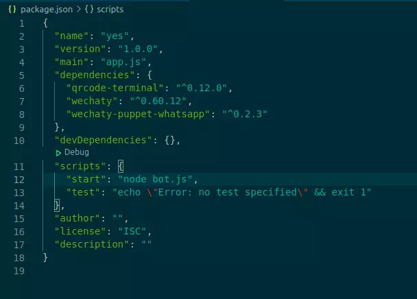

<!-- MDX import -->
import Tabs from '@theme/Tabs'
import TabItem from '@theme/TabItem'

:::tip

The wechaty bot is available in various programming languages!

:::

Before starting this guide, make sure you are already familiar with the ding dong bot. If not, go to [examples/basics](https://wechaty.js.org/docs/examples/basic/ding-dong-bot). In this section, you will learn how to add various events to a bot. Events are functions that define the operations a bot can perform. Some common events include `login`, `logout`, `onMessage`. The guide will demonstrate in JavaScript, but you can choose between various programming languages available.

## Getting started

<ol>
<li>Create an empty project folder</li>
<li> Add a bot.js file</li>
<li>In the terminal, type the following command:</li>

```bash
npm init
```

A package.json file is created.

<li>In the terminal, install the necessary dependencies</li>

```bash
npm i qrcode-terminal wechaty 
```

```bash
 npm i wechaty-puppet-PUPPET-PROVIDER
```

The <i>PUPPET-PROVIDER</i> represents the messaging platform you want to integrate your bot with.

- For WhatsApp:

```bash
 npm i wechaty-puppet-whatsapp
```

- For WeChat:

```bash
 npm i wechaty-puppet-wechat
```

<li> In the package.json file, add a script:</li>

`"start": "node bot.js"`

</img>

<li> In the terminal, type the following commands:</li>

```bash
 export WECHATY_LOG=verbose
 ```

<ul>

<li> For WhatsApp:</li>

```bash
export WECHATY_PUPPET=wechaty-puppet-whatsaap
```

<li>For WeChat:</li>

```bash
export WECHATY_PUPPET=wechaty-puppet-wechat
```

</ul>

<li>Now, we can run the bot using the command:</li>

``` bash
npm start
```

But, before that we need to add events to the bot. See the following examples:
</ol>

## Basic Events

### `scan` Event

The `scan` event generates a QR code to integrate your bot to a puppet provider.

<Tabs
  groupId="programming-languages"
  defaultValue="ts"
  values={[
    { label: 'TypeScript',  value: 'ts', },
    { label: 'JavaScript',  value: 'js', },
    { label: 'Python',      value: 'py', },
    { label: 'Go',          value: 'go', },
    { label: 'Java',        value: 'java', },
    { label: 'PHP',         value: 'php', },
    { label: 'Scala',       value: 'scala', },
    { label: 'C#',          value: 'csharp', },
    { label: 'Rust',        value: 'rust', },
  ]
}>

<TabItem value="ts">

```ts
import { ScanStatus } from 'wechaty'

async function onScan (
  qrcode: undefined | string,
  status: ScanStatus,
) {
  console.info('Scan QR Code to login, status:', status, ScanStatus[status])
  console.info('https://wechaty.js.org/qrcode/' + encodeURIComponent(qrcode))
}

bot.on('scan', onScan)
await bot.start()
```

</TabItem>
<TabItem value="js">

```ts
const { Wechaty,ScanStatus,log } = require('wechaty')

async function onScan (qrcode,status)
 {
  console.info('Scan QR Code to login, status:', status, ScanStatus[status])
  console.info('https://wechaty.js.org/qrcode/' + encodeURIComponent(qrcode))
}

const bot = new Wechaty({
    name: 'bot-name',
  })

bot.on('scan', onScan)
bot.start()
  .then(() => log.info('StarterBot', 'Starter Bot Started.'))
  .catch(e => log.error('StarterBot', e))
```

</TabItem>
<TabItem value="py">

```py
from wechaty import Wechaty, ScanStatus
from typing import Optional
import asyncio

# method one
def on_scan (qrcode, status):
    print('Scan QR Code to login: {}\n'.format(staus))
    print('https://wechaty.js.org/qrcode/{}'.format(qrcode))

bot = Wechaty()
bot.on('scan', on_scan)
asyncio.run(bot.start())

# method two (suggested)
class MyBot(Wechaty):
    async def on_scan(self, qr_code: str, status: ScanStatus, data: Optional[str]):
        """listen scan event"""
        print('Scan QR Code to login: {}\n'.format(staus))
        print('https://wechaty.js.org/qrcode/{}'.format(qrcode))

asyncio.run(MyBot().start())
```

</TabItem>
<TabItem value="go">

```go
// TODO: Pull Request is welcome!
```

</TabItem>
<TabItem value="java">

```java
// TODO: Pull Request is welcome!
```

</TabItem>
<TabItem value="php">

```php
// TODO: Pull Request is welcome!
```

</TabItem>
<TabItem value="scala">

```scala
// TODO: Pull Request is welcome!
```

</TabItem>
<TabItem value="csharp">

```csharp
// TODO: Pull Request is welcome!
```

</TabItem>
<TabItem value="rust">

```rust
// TODO: Pull Request is welcome!
```

</TabItem>
</Tabs>

### `login` Event: bot contact

The `login` event logs the bot in, with the contact of the user.

<Tabs
  groupId="programming-languages"
  defaultValue="ts"
  values={[
    { label: 'TypeScript',  value: 'ts', },
    { label: 'JavaScript',  value: 'js', },
    { label: 'Python',      value: 'py', },
    { label: 'Go',          value: 'go', },
    { label: 'Java',        value: 'java', },
    { label: 'PHP',         value: 'php', },
    { label: 'Scala',       value: 'scala', },
    { label: 'C#',          value: 'csharp', },
    { label: 'Rust',        value: 'rust', },
  ]
}>

<TabItem value="ts">

```ts
import { Contact } from 'wechaty'

function onLogin (bot: Contact) {
  console.info('Bot logged in:', bot)
}

bot.on('login', onLogin)
await bot.start()
```

</TabItem>
<TabItem value="js">

```js
function onLogin (bot) {
  console.info('Bot logged in:', bot)
}

bot.on('login', onLogin)
await bot.start()
```

</TabItem>
<TabItem value="py">

```py
from wechaty import Wechaty, Contact
from typing import Optional
import asyncio

# method one
def on_login (contact: Contact):
  print(f'User {contact} logged in\n')

bot.on('login', on_login)

# method two (suggested)
class MyBot(Wechaty):
    async def on_login(self, contact: Contact):
        print(f'User {contact} logged in\n')

asyncio.run(MyBot().start())
```

</TabItem>
<TabItem value="go">

```go
// TODO: Pull Request is welcome!
```

</TabItem>
<TabItem value="java">

```java
// TODO: Pull Request is welcome!
```

</TabItem>
<TabItem value="php">

```php
// TODO: Pull Request is welcome!
```

</TabItem>
<TabItem value="scala">

```scala
// TODO: Pull Request is welcome!
```

</TabItem>
<TabItem value="csharp">

```csharp
// TODO: Pull Request is welcome!
```

</TabItem>
<TabItem value="rust">

```rust
// TODO: Pull Request is welcome!
```

</TabItem>
</Tabs>

### `logout` Event

The `logout` event logs the bot out.

<Tabs
  groupId="programming-languages"
  defaultValue="ts"
  values={[
    { label: 'TypeScript',  value: 'ts', },
    { label: 'JavaScript',  value: 'js', },
    { label: 'Python',      value: 'py', },
    { label: 'Go',          value: 'go', },
    { label: 'Java',        value: 'java', },
    { label: 'PHP',         value: 'php', },
    { label: 'Scala',       value: 'scala', },
    { label: 'C#',          value: 'csharp', },
    { label: 'Rust',        value: 'rust', },
  ]
}>

<TabItem value="ts">

```ts
// TODO: Pull Request is welcome!
```

</TabItem>
<TabItem value="js">

```js
function onLogout (user) {
  log.info('StarterBot', '%s logout', user)
}
bot.on('logout',  onLogout)
await bot.start()
```

</TabItem>
<TabItem value="py">

```py
from wechaty import Wechaty, Contact
import asyncio

# method one
async def on_logout(contact: Contact):
    print(f'User <{contact}> logout')

bot = MyBot()
bot.on('logout', on_logout)
asyncio.run(bot.start())

# method two (suggested)
class MyBot(Wechaty):
    async def on_logout(self, contact: Contact):
        print(f'User <{contact}> logout')

async def start():
    await MyBot().start()

asyncio.run(start())
```

</TabItem>
<TabItem value="go">

```go
// TODO: Pull Request is welcome!
```

</TabItem>
<TabItem value="java">

```java
// TODO: Pull Request is welcome!
```

</TabItem>
<TabItem value="php">

```php
// TODO: Pull Request is welcome!
```

</TabItem>
<TabItem value="scala">

```scala
// TODO: Pull Request is welcome!
```

</TabItem>
<TabItem value="csharp">

```csharp
// TODO: Pull Request is welcome!
```

</TabItem>
<TabItem value="rust">

```rust
// TODO: Pull Request is welcome!
```

</TabItem>
</Tabs>

### `message` Event

The `message` event notifies you when a new message arrives.

<Tabs
  groupId="programming-languages"
  defaultValue="ts"
  values={[
    { label: 'TypeScript',  value: 'ts', },
    { label: 'JavaScript',  value: 'js', },
    { label: 'Python',      value: 'py', },
    { label: 'Go',          value: 'go', },
    { label: 'Java',        value: 'java', },
    { label: 'PHP',         value: 'php', },
    { label: 'Scala',       value: 'scala', },
    { label: 'C#',          value: 'csharp', },
    { label: 'Rust',        value: 'rust', },
  ]
}>

<TabItem value="ts">

```ts
import { Message } from 'wechaty'

function onMessage (message: Message) {
  console.info('New message:', message)
}

bot.on('message', onMessage)
await bot.start()
```

</TabItem>
<TabItem value="js">

```js
function onMessage (message) {
  console.info('New message:', message)
}

bot.on('message', onMessage)
await bot.start()
```

</TabItem>
<TabItem value="py">

```py
from wechaty import Wechaty, Message
import asyncio

# method one
async def on_message(msg: Message):
    print(f'receive message <{msg}>')

bot = MyBot()
bot.on('message', on_message)
asyncio.run(bot.start())

# method two (suggested)
class MyBot(Wechaty):
    async def on_message(self, msg: Message):
        print(f'receive message <{msg}>')

asyncio.run(MyBot().start())
```

</TabItem>
<TabItem value="go">

```go
// TODO: Pull Request is welcome!
```

</TabItem>
<TabItem value="java">

```java
// TODO: Pull Request is welcome!
```

</TabItem>
<TabItem value="php">

```php
// TODO: Pull Request is welcome!
```

</TabItem>
<TabItem value="scala">

```scala
// TODO: Pull Request is welcome!
```

</TabItem>
<TabItem value="csharp">

```csharp
// TODO: Pull Request is welcome!
```

</TabItem>
<TabItem value="rust">

```rust
// TODO: Pull Request is welcome!
```

</TabItem>
</Tabs>

### `friendship` Event: friend requests

The `friendship` event alerts you when someone sends you a friend request.

<Tabs
  groupId="programming-languages"
  defaultValue="ts"
  values={[
    { label: 'TypeScript',  value: 'ts', },
    { label: 'JavaScript',  value: 'js', },
    { label: 'Python',      value: 'py', },
    { label: 'Go',          value: 'go', },
    { label: 'Java',        value: 'java', },
    { label: 'PHP',         value: 'php', },
    { label: 'Scala',       value: 'scala', },
    { label: 'C#',          value: 'csharp', },
    { label: 'Rust',        value: 'rust', },
  ]
}>

<TabItem value="ts">

```ts
// TODO: Pull Request is welcome!
```

</TabItem>
<TabItem value="js">

```js
bot
.on('friendship', async friendship => {
  let logMsg
  const fileHelper = bot.Contact.load('filehelper')

  try {
    logMsg = 'received `friend` event from ' + friendship.contact().name()
    await fileHelper.say(logMsg)
    console.log(logMsg)

    switch (friendship.type()) {
      /**
       *
       * 1. New Friend Request
       *
       * when request is set, we can get verify message from `request.hello`,
       * and accept this request by `request.accept()`
       */
      case Friendship.Type.Receive:
        if (friendship.hello() === 'ding') {
          logMsg = 'accepted automatically because verify messsage is "ding"'
          console.log('before accept')
          await friendship.accept()

          // if want to send msg , you need to delay sometimes
          await new Promise(r => setTimeout(r, 1000))
          await friendship.contact().say('hello from Wechaty')
          console.log('after accept')

        } else {
          logMsg = 'not auto accepted, because verify message is: ' + friendship.hello()
        }
        break

        /**
         *
         * 2. Friend Ship Confirmed
         *
         */
      case Friendship.Type.Confirm:
        logMsg = 'friend ship confirmed with ' + friendship.contact().name()
        break
    }
  } catch (e) {
    logMsg = e.message
  }

  console.log(logMsg)
  await fileHelper.say(logMsg)

})
```

</TabItem>
<TabItem value="py">

```py
from wechaty import Wechaty, Friendship
import asyncio

# method one
async def on_friendship(friendship: Friendship):
    print(f'receive friendship<{friendship}> event')

bot = MyBot()
bot.on('friendship', on_friendship)
asyncio.run(bot.start())

# method two (suggested)
class MyBot(Wechaty):
    async def on_friendship(self, friendship: Friendship):
        print(f'receive friendship<{friendship}> event')

asyncio.run(MyBot().start())
```

</TabItem>
<TabItem value="go">

```go
// TODO: Pull Request is welcome!
```

</TabItem>
<TabItem value="java">

```java
// TODO: Pull Request is welcome!
```

</TabItem>
<TabItem value="php">

```php
// TODO: Pull Request is welcome!
```

</TabItem>
<TabItem value="scala">

```scala
// TODO: Pull Request is welcome!
```

</TabItem>
<TabItem value="csharp">

```csharp
// TODO: Pull Request is welcome!
```

</TabItem>
<TabItem value="rust">

```rust
// TODO: Pull Request is welcome!
```

</TabItem>
</Tabs>

## Room Events

### `room-topic` Event: messages

The `room-topic` event alerts you when someone changes the room topic.

<Tabs
  groupId="programming-languages"
  defaultValue="ts"
  values={[
    { label: 'TypeScript',  value: 'ts', },
    { label: 'JavaScript',  value: 'js', },
    { label: 'Python',      value: 'py', },
    { label: 'Go',          value: 'go', },
    { label: 'Java',        value: 'java', },
    { label: 'PHP',         value: 'php', },
    { label: 'Scala',       value: 'scala', },
    { label: 'C#',          value: 'csharp', },
    { label: 'Rust',        value: 'rust', },
  ]
}>

<TabItem value="ts">

```ts
// TODO: Pull Request is welcome!
```

</TabItem>
<TabItem value="js">

```js
bot
.on('room-topic', async function(room, topic, oldTopic, changer) {
  try {
    log.info('Bot', 'EVENT: room-topic - Room "%s" change topic from "%s" to "%s" by member "%s"',
                    room,
                    oldTopic,
                    topic,
                    changer,
                )
    await room.say(`room-topic - change topic from "${oldTopic}" to "${topic}" by member "${changer.name()}"` )
  } catch (e) {
    log.error('Bot', 'room-topic event exception: %s', e.stack)
  }
})
```

</TabItem>
<TabItem value="py">

```py
from wechaty import Wechaty, Room, Contact
from datetime import datetime
import asyncio

# method one
async def on_room_topic(room: Room, new_topic: str, old_topic: str, changer: Contact, date: datetime):
    print(f'receive room topic changed event <from<{new_topic}> to <{old_topic}>> from room<{room}> ')

bot = MyBot()
bot.on('room-topic', on_room_topic)
asyncio.run(bot.start())

# method two (suggested)
class MyBot(Wechaty):
    async def on_room_topic(self, room: Room, new_topic: str, old_topic: str, changer: Contact, date: datetime):
        print(f'receive room topic changed event <from<{new_topic}> to <{old_topic}>> from room<{room}> ')

asyncio.run(MyBot().start())
```

</TabItem>
<TabItem value="go">

```go
// TODO: Pull Request is welcome!
```

</TabItem>
<TabItem value="java">

```java
// TODO: Pull Request is welcome!
```

</TabItem>
<TabItem value="php">

```php
// TODO: Pull Request is welcome!
```

</TabItem>
<TabItem value="scala">

```scala
// TODO: Pull Request is welcome!
```

</TabItem>
<TabItem value="csharp">

```csharp
// TODO: Pull Request is welcome!
```

</TabItem>
<TabItem value="rust">

```rust
// TODO: Pull Request is welcome!
```

</TabItem>
</Tabs>

### `room-invite` Event: messages

The `room-invite` event alerts you when there is a room invitation.

<Tabs
  groupId="programming-languages"
  defaultValue="ts"
  values={[
    { label: 'TypeScript',  value: 'ts', },
    { label: 'JavaScript',  value: 'js', },
    { label: 'Python',      value: 'py', },
    { label: 'Go',          value: 'go', },
    { label: 'Java',        value: 'java', },
    { label: 'PHP',         value: 'php', },
    { label: 'Scala',       value: 'scala', },
    { label: 'C#',          value: 'csharp', },
    { label: 'Rust',        value: 'rust', },
  ]
}>

<TabItem value="ts">

```ts
// TODO: Pull Request is welcome!
```

</TabItem>
<TabItem value="js">

```js
const bot = new Wechaty()
bot.on('room-invite', async roomInvitation => {
  try {
    console.log(`received room-invite event.`)
    await roomInvitation.accept()
  } catch (e) {
    console.error(e)
  }
}
.start()
```

</TabItem>
<TabItem value="py">

```py
from wechaty import Wechaty, RoomInvitation
import asyncio


# method one
async def on_room_invite(room_invitation: RoomInvitation):
    print(f'receive room invitation<{room_invitation}> event')

bot = MyBot()
bot.on('room-invite', on_room_invite)
asyncio.run(bot.start())

# method two (suggested)
class MyBot(Wechaty):
    async def on_room_invite(self, room_invitation: RoomInvitation):
        print(f'receive room invitation<{room_invitation}> event')

asyncio.run(MyBot().start())
```

</TabItem>
<TabItem value="go">

```go
// TODO: Pull Request is welcome!
```

</TabItem>
<TabItem value="java">

```java
// TODO: Pull Request is welcome!
```

</TabItem>
<TabItem value="php">

```php
// TODO: Pull Request is welcome!
```

</TabItem>
<TabItem value="scala">

```scala
// TODO: Pull Request is welcome!
```

</TabItem>
<TabItem value="csharp">

```csharp
// TODO: Pull Request is welcome!
```

</TabItem>
<TabItem value="rust">

```rust
// TODO: Pull Request is welcome!
```

</TabItem>
</Tabs>

### `room-join` Event: messages

The `room-join` event alerts you when anyone joins the room.

<Tabs
  groupId="programming-languages"
  defaultValue="ts"
  values={[
    { label: 'TypeScript',  value: 'ts', },
    { label: 'JavaScript',  value: 'js', },
    { label: 'Python',      value: 'py', },
    { label: 'Go',          value: 'go', },
    { label: 'Java',        value: 'java', },
    { label: 'PHP',         value: 'php', },
    { label: 'Scala',       value: 'scala', },
    { label: 'C#',          value: 'csharp', },
    { label: 'Rust',        value: 'rust', },
  ]
}>

<TabItem value="ts">

```ts
// TODO: Pull Request is welcome!
```

</TabItem>
<TabItem value="js">

```js
bot
.on('room-join', async function(room, inviteeList, inviter) {
  log.info( 'Bot', 'EVENT: room-join - Room "%s" got new member "%s", invited by "%s"',
            await room.topic(),
            inviteeList.map(c => c.name()).join(','),
            inviter.name(),
          )
  console.log('bot room-join room id:', room.id)
  const topic = await room.topic()
  await room.say(`welcome to "${topic}"!`, inviteeList[0])
})
```

</TabItem>
<TabItem value="py">

```py
from wechaty import Wechaty, Contact, Room
from typing import List
from datetime import datetime
import asyncio

# method one
async def on_room_join(room: Room, invitees: List[Contact], inviter: Contact, date: datetime):
    print(f'receive room join event from Room<{room}>')

bot = Wechaty()
bot.on('room-join', on_room_join)
asyncio.run(bot.start())

# method two (suggested)
class MyBot(Wechaty):
    async def on_room_join(self, room: Room, invitees: List[Contact], inviter: Contact, date: datetime):
        print(f'receive room join event from Room<{room}>')

asyncio.run(MyBot().start())
```

</TabItem>
<TabItem value="go">

```go
// TODO: Pull Request is welcome!
```

</TabItem>
<TabItem value="java">

```java
// TODO: Pull Request is welcome!
```

</TabItem>
<TabItem value="php">

```php
// TODO: Pull Request is welcome!
```

</TabItem>
<TabItem value="scala">

```scala
// TODO: Pull Request is welcome!
```

</TabItem>
<TabItem value="csharp">

```csharp
// TODO: Pull Request is welcome!
```

</TabItem>
<TabItem value="rust">

```rust
// TODO: Pull Request is welcome!
```

</TabItem>
</Tabs>

### `room-leave` Event: messages

The `room-leave` event alerts you when anyone leaves the room.

<Tabs
  groupId="programming-languages"
  defaultValue="ts"
  values={[
    { label: 'TypeScript',  value: 'ts', },
    { label: 'JavaScript',  value: 'js', },
    { label: 'Python',      value: 'py', },
    { label: 'Go',          value: 'go', },
    { label: 'Java',        value: 'java', },
    { label: 'PHP',         value: 'php', },
    { label: 'Scala',       value: 'scala', },
    { label: 'C#',          value: 'csharp', },
    { label: 'Rust',        value: 'rust', },
  ]
}>

<TabItem value="ts">

```ts
// TODO: Pull Request is welcome!
```

</TabItem>
<TabItem value="js">

```js
bot
.on('room-leave', async function(room, leaverList) {
  log.info('Bot', 'EVENT: room-leave - Room "%s" lost member "%s"',
                  await room.topic(),
                  leaverList.map(c => c.name()).join(','),
              )
  const topic = await room.topic()
  const name  = leaverList[0] ? leaverList[0].name() : 'no contact!'
  await room.say(`kick off "${name}" from "${topic}"!` )
})
```

</TabItem>
<TabItem value="py">

```py
from wechaty import Wechaty, Contact, Room
from typing import List
from datetime import datetime
import asyncio

# method one
async def on_room_leave(room: Room, leavers: List[Contact], remover: Contact, date: datetime):
    print(f'receive room leave event from Room<{room}>')

bot = Wechaty()
bot.on('room-leave', on_room_leave)
asyncio.run(bot.start())

# method two (suggested)
class MyBot(Wechaty):
    async def on_room_leave(self, room: Room, leavers: List[Contact], remover: Contact, date: datetime):
        print(f'receive room leave event from Room<{room}>')

asyncio.run(MyBot().start())
```

</TabItem>
<TabItem value="go">

```go
// TODO: Pull Request is welcome!
```

</TabItem>
<TabItem value="java">

```java
// TODO: Pull Request is welcome!
```

</TabItem>
<TabItem value="php">

```php
// TODO: Pull Request is welcome!
```

</TabItem>
<TabItem value="scala">

```scala
// TODO: Pull Request is welcome!
```

</TabItem>
<TabItem value="csharp">

```csharp
// TODO: Pull Request is welcome!
```

</TabItem>
<TabItem value="rust">

```rust
// TODO: Pull Request is welcome!
```

</TabItem>
</Tabs>

## System events

### `ready` Event

The `ready` event is executed when all data has been loaded successfully.

<Tabs
  groupId="programming-languages"
  defaultValue="ts"
  values={[
    { label: 'TypeScript',  value: 'ts', },
    { label: 'JavaScript',  value: 'js', },
    { label: 'Python',      value: 'py', },
    { label: 'Go',          value: 'go', },
    { label: 'Java',        value: 'java', },
    { label: 'PHP',         value: 'php', },
    { label: 'Scala',       value: 'scala', },
    { label: 'C#',          value: 'csharp', },
    { label: 'Rust',        value: 'rust', },
  ]
}>

<TabItem value="ts">

```ts
// TODO: Pull Request is welcome!
```

</TabItem>
<TabItem value="js">

```js
    const contact = this.wechaty.Contact.load(contactId)
    await contact.ready()
    return contact
```

</TabItem>
<TabItem value="py">

```py
from wechaty import Wechaty
from wechaty_puppet import EventReadyPayload
import asyncio

# method one
async def on_ready(payload: EventReadyPayload):
    """Any initialization work can be put in here

    Args:
        payload (EventReadyPayload): ready data
    """
    print(f'receive ready event<{payload}>')

bot = Wechaty()
bot.on('ready', on_ready)
asyncio.run(bot.start())

# method two (suggested)
class MyBot(Wechaty):
    async def on_ready(self, payload: EventReadyPayload):
        """Any initialization work can be put in here

        Args:
            payload (EventReadyPayload): ready data
        """
        print(f'receive ready event<{payload}>')
        
asyncio.run(MyBot().start())
```

</TabItem>
<TabItem value="go">

```go
// TODO: Pull Request is welcome!
```

</TabItem>
<TabItem value="java">

```java
// TODO: Pull Request is welcome!
```

</TabItem>
<TabItem value="php">

```php
// TODO: Pull Request is welcome!
```

</TabItem>
<TabItem value="scala">

```scala
// TODO: Pull Request is welcome!
```

</TabItem>
<TabItem value="csharp">

```csharp
// TODO: Pull Request is welcome!
```

</TabItem>
<TabItem value="rust">

```rust
// TODO: Pull Request is welcome!
```

</TabItem>
</Tabs>

### `heartbeat` Event: messages

The `Heartbeat` event helps to send emojis to a specified contact or group periodically.

<Tabs
  groupId="programming-languages"
  defaultValue="ts"
  values={[
    { label: 'TypeScript',  value: 'ts', },
    { label: 'JavaScript',  value: 'js', },
    { label: 'Python',      value: 'py', },
    { label: 'Go',          value: 'go', },
    { label: 'Java',        value: 'java', },
    { label: 'PHP',         value: 'php', },
    { label: 'Scala',       value: 'scala', },
    { label: 'C#',          value: 'csharp', },
    { label: 'Rust',        value: 'rust', },
  ]
}>

<TabItem value="ts">

```ts
// TODO: Pull Request is welcome!
```

</TabItem>
<TabItem value="js">

```js
const config = {
    contact: 'filehelper', // contact who will receive the emoji
    emoji: {
        heartbeat: '😎', // the emoji to send
    },
    intervalSeconds: 60, // sends the emoji after an interval of 60 seconds
}
bot.use(
    Heartbeat(config),
)
bot.start()
```

</TabItem>
<TabItem value="py">

```py
from wechaty import Wechaty
from wechaty_puppet import EventHeartbeatPayload
import asyncio

# method one
async def on_heartbeat(payload: EventHeartbeatPayload):
    print(f'receive heartbeat event from server <{payload}>')

bot = Wechaty()
bot.on('heartbeat', on_heartbeat)
asyncio.run(bot.start())

# method two (suggested)
class MyBot(Wechaty):
    async def on_heartbeat(self, payload: EventHeartbeatPayload):
        print(f'receive heartbeat event from server <{payload}>')
        
asyncio.run(MyBot().start())
```

</TabItem>
<TabItem value="go">

```go
// TODO: Pull Request is welcome!
```

</TabItem>
<TabItem value="java">

```java
// TODO: Pull Request is welcome!
```

</TabItem>
<TabItem value="php">

```php
// TODO: Pull Request is welcome!
```

</TabItem>
<TabItem value="scala">

```scala
// TODO: Pull Request is welcome!
```

</TabItem>
<TabItem value="csharp">

```csharp
// TODO: Pull Request is welcome!
```

</TabItem>
<TabItem value="rust">

```rust
// TODO: Pull Request is welcome!
```

</TabItem>
</Tabs>

### `error` Event

The `error` event makes the bot to throw an error whenever an error is encounterd.

<Tabs
  groupId="programming-languages"
  defaultValue="ts"
  values={[
    { label: 'TypeScript',  value: 'ts', },
    { label: 'JavaScript',  value: 'js', },
    { label: 'Python',      value: 'py', },
    { label: 'Go',          value: 'go', },
    { label: 'Java',        value: 'java', },
    { label: 'PHP',         value: 'php', },
    { label: 'Scala',       value: 'scala', },
    { label: 'C#',          value: 'csharp', },
    { label: 'Rust',        value: 'rust', },
  ]
}>

<TabItem value="ts">

```ts
// TODO: Pull Request is welcome!
```

</TabItem>
<TabItem value="js">

```js
function onError (e) {
  console.error('Bot error:', e)
}
bot.on('error',  onError)
function onLogin (bot) {
  console.info('Bot logged in:', bot)
}

bot.on('login', onLogin)
await bot.start()
```

</TabItem>
<TabItem value="py">

```py
from wechaty import Wechaty
from wechaty_puppet import EventErrorPayload
import asyncio

# method one
async def on_error(payload: EventErrorPayload):
    print(f'receive error event<{payload}> from sever')

bot = Wechaty()
bot.on('error', on_error)
asyncio.run(bot.start())

# method two (suggested)
class MyBot(Wechaty):
    async def on_error(self, payload: EventErrorPayload):
        print(f'receive error event<{payload}> from sever')
        
asyncio.run(MyBot().start())
```

</TabItem>
<TabItem value="go">

```go
// TODO: Pull Request is welcome!
```

</TabItem>
<TabItem value="java">

```java
// TODO: Pull Request is welcome!
```

</TabItem>
<TabItem value="php">

```php
// TODO: Pull Request is welcome!
```

</TabItem>
<TabItem value="scala">

```scala
// TODO: Pull Request is welcome!
```

</TabItem>
<TabItem value="csharp">

```csharp
// TODO: Pull Request is welcome!
```

</TabItem>
<TabItem value="rust">

```rust
// TODO: Pull Request is welcome!
```

</TabItem>
</Tabs>
