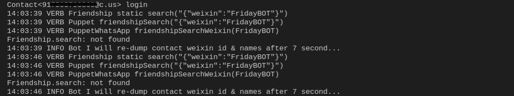
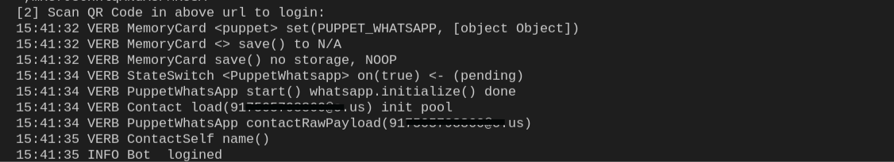

import Tabs from '@theme/Tabs'
import TabItem from '@theme/TabItem'

Sending and accepting friend requests can easily be done using wechaty onfriendship function. This guide help you Send request, Receive request(in friend event), Confirmation friendship(friend event) in a room.

Use the guide to help you integrate additional functions to an existing project which is present at [Github/Friend-Bot](https://github.com/wechaty/wechaty/blob/1523c5e02be46ebe2cc172a744b2fbe53351540e/examples/friend-bot.ts) or check that your existing local system will run on Wechaty. If, you wish to learn on how to build the bot on your own, please visit one of our [Building the bot](https://wechaty.js.org/docs/examples/basic/contact-bot#building-the-bot) section.

The steps outlined here mainly focuses on working with Javascript, but user are free to switch between any languages.This guide help you Send, receive friend request, and friend confirmation events.

## Prerequisites

* Your system must have [Node.js](https://nodejs.org/en/download/package-manager/) installed (version >= 12).
* Your system must have [Wechaty](https://github.com/wechaty/wechaty) (version >= 0.40).
* You need to be familiar with the basics of Wechaty platform. If not, follow our [tutorials](https://wechaty.js.org/docs/tutorials/) section.
* You need to have at least a minimal application ready to work, follow one of our [Example/Friend-Bot](https://wechaty.js.org/docs/examples/advanced/friend-bot/).

### If you don't know where to start from

See [Running our first ding-dong bot](https://wechaty.js.org/docs/getting-started/quick-start).

The below function needs a basic scipt that can help run the bot. The basic script starts by importing the code from [Github/Friend-Bot](https://github.com/wechaty/wechaty/blob/1523c5e02be46ebe2cc172a744b2fbe53351540e/examples/friend-bot.ts).Integrate the below code, for this action to work.

## Send Request - define how to send a friend request

Trying to expand the network can help you extend the employment opportunities and professional resources. If you have questions like "How can I friend someone on IM platform?" then you need this section to send friend requests.

<Tabs
  groupId="programming-languages"
  defaultValue="ts"
  values={[
    { label: 'TypeScript',  value: 'ts', },
    { label: 'JavaScript',  value: 'js', },
    { label: 'Python',      value: 'py', },
    { label: 'Go',          value: 'go', },
    { label: 'Java',        value: 'java', },
    { label: 'PHP',         value: 'php', },
    { label: 'Scala',       value: 'scala', },
    { label: 'C#',          value: 'csharp', },
    { label: 'Rust',        value: 'rust', },
  ]
}>

<TabItem value="ts">

```ts
async function onReady () {
  const weixin  = 'FridayBOT' // weixin id
  const contact = await bot.Friendship.search({ weixin })

  if (contact) {
    console.info('Sending friend request...')
    await bot.Friendship.add(contact)
  } else {
    console.info('Friendship.search: not found')
  }
}

bot.on('ready', onReady)
```

</TabItem>
<TabItem value="js">

```js
async function onReady () {
  const weixin  = 'FridayBOT' // weixin id
  const contact = await bot.Friendship.search({ weixin })

  if (contact) {
    console.info('Sending friend request...')
    await bot.Friendship.add(contact)
  } else {
    console.info('Friendship.search: not found')
  }
}

bot.on('ready', onReady)
```

</TabItem>
<TabItem value="py">

```py
from typing import Optional
from wechaty import Wechaty, Contact

class MyBot(Wechaty):
    async def on_ready(self, _):
        contact: Optional[Contact] = await self.Friendship.search(phone='phone-of-someone')
        if contact:
            self.Friendship.add(contact)
```

</TabItem>
<TabItem value="go">

```go
// TODO: Pull Request is welcome!
```

</TabItem>
<TabItem value="java">

```java
// TODO: Pull Request is welcome!
```

</TabItem>
<TabItem value="php">

```php
// TODO: Pull Request is welcome!
```

</TabItem>
<TabItem value="scala">

```scala
// TODO: Pull Request is welcome!
```

</TabItem>
<TabItem value="csharp">

```csharp
// TODO: Pull Request is welcome!
```

</TabItem>
<TabItem value="rust">

```rust
// TODO: Pull Request is welcome!
```

</TabItem>
</Tabs>

The expected output of the JavaScript code is:


## Receive Request - define how to accept the friend request

The more you network, the more you'll grow and learn how to make lasting connections,so are the others. When someone sends you the request, you choose whether to have the friend connection or to reject the connection.This section elaborates on how to accept friend requests.

<Tabs
  groupId="programming-languages"
  defaultValue="ts"
  values={[
    { label: 'TypeScript',  value: 'ts', },
    { label: 'JavaScript',  value: 'js', },
    { label: 'Python',      value: 'py', },
    { label: 'Go',          value: 'go', },
    { label: 'Java',        value: 'java', },
    { label: 'PHP',         value: 'php', },
    { label: 'Scala',       value: 'scala', },
    { label: 'C#',          value: 'csharp', },
    { label: 'Rust',        value: 'rust', },
  ]
}>

<TabItem value="ts">

```ts
const { Friendship } = require('wechaty')

async function onFriendship (friendship: Friendship) {
  if (friendship.type() === Friendship.Type.Receive) {
    console.info('New request from', friendship.contact())
    console.info('Hello message:', friendship.hello())
    await friendship.accept()
  } else if (friendship.type() === Friendship.Type.Confirm) {
    console.info('New request confirmed with', friendship.contact().name())
  }
}

bot.on('friendship', onFriendship)
```

</TabItem>
<TabItem value="js">

```js
const { Friendship } = require('wechaty')

async function onFriendship (friendship) {
  if (friendship.type() === Friendship.Type.Receive) {
    console.info('New request from', friendship.contact())
    console.info('Hello message:', friendship.hello())
    await friendship.accept()
  } else if (friendship.type() === Friendship.Type.Confirm) {
    console.info('New request confirmed with', friendship.contact().name())
  }
}

bot.on('friendship', onFriendship)
```

</TabItem>
<TabItem value="py">

```py
from wechaty import Wechaty, Friendship, FriendshipType

class MyBot(Wechaty):
    async def on_friendship(self, friendship: Friendship):
        if friendship.type() == FriendshipType.FRIENDSHIP_TYPE_RECEIVE:
            await friendship.accept()
```

</TabItem>
<TabItem value="go">

```go
// TODO: Pull Request is welcome!
```

</TabItem>
<TabItem value="java">

```java
// TODO: Pull Request is welcome!
```

</TabItem>
<TabItem value="php">

```php
// TODO: Pull Request is welcome!
```

</TabItem>
<TabItem value="scala">

```scala
// TODO: Pull Request is welcome!
```

</TabItem>
<TabItem value="csharp">

```csharp
// TODO: Pull Request is welcome!
```

</TabItem>
<TabItem value="rust">

```rust
// TODO: Pull Request is welcome!
```

</TabItem>
</Tabs>

The expected output of the JavaScript code is:

