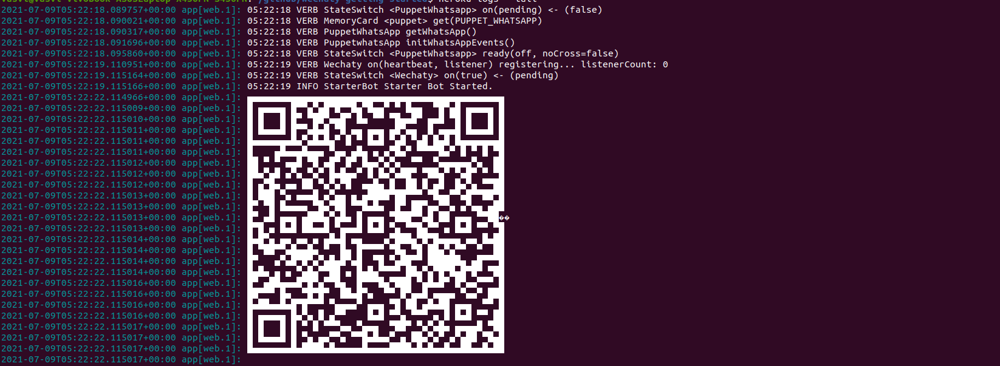

## Using the "Deploy to Heroku" Button

> The ‘Deploy to Heroku’ button enables users to deploy apps to Heroku without leaving the web browser, and with little or no configuration. The button is ideal for customers, open-source project maintainers or add-on providers who wish to provide their customers with a quick and easy way to deploy and configure a Heroku app.

This is a sample deploy with Heroku button for the Wechaty Heroku starter project.

### Setting up a Deploy to Heroku Button

This guide demonstrates setting up a Deploy to Heroku Button with [Wechaty Starter Repository](https://github.com/wechaty/wechaty-getting-started)
<ol>
<li> Fork the <a href ="https://github.com/wechaty/wechaty-getting-started">Wechaty Starter Repositor</a>.</li>
<li> Create a branch <b>feature</b> in the forked repository.</li>
<li> On branch feature, create an app.json file in the root directory.Add in fields such as name, description, logo, etc. If you want to know how an app.js file looks like check <a href="https://github.com/wechaty/heroku-wechaty-getting-started/blob/master/app.json">this link</a>.</li>
<li>In the Readme.md file add the following code snippet

``
</li>
<li> The deploy with heroku button is now set up.

</li>
</ol>

## Deploying with Heroku

This guide demonstrates running the ding-dong bot with Heroku CLI. However you can choose to run any custom bot, with similar steps.

### Prerequisites

<ol>
<li> Fork the <a href ="https://github.com/wechaty/wechaty-getting-started">Wechaty Starter Repositor</a>.</li>
<li>Clone the Starter repository.

`git clone https://github.com/wechaty/wechaty-getting-started`
</li>
<li> Download the <a href="https://devcenter.heroku.com/articles/heroku-cli">Heroku Cli</a>.</li>
</ol>

### Getting Started

<ol>
<li>On branch feature, create an app.json file in the root directory.Add in fields such as name, description, logo, etc. If you want to know how an app.js file looks like check <a href="https://github.com/wechaty/heroku-wechaty-getting-started/blob/master/app.json">this link</a>.</li>
<li>On branch feature, create a file  named `Procfile` in the root directory.Note that this file has no extension.
Write the following code in the file:

`web:WECHATY_LOG=verbose WECHATY_PUPPET=wechaty-puppet-whatsapp node examples/ding-dong-bot.js`
</li>
<li>Commit the changes in the feature branch.</li>
</ol>

### Creating a Heroku Remote

<ol>
<li>Open the following link in your browser:

`https://heroku.com/deploy?template=https://github.com/user-name/wechaty-getting-started/tree/feature`

Remember to replace user-name with your Github username.
</li>
<li>Add the necessary details and click on deploy app button.</li>
</img>
</img>

<li>After the app has been successfully created, open the terminal and add the heroku remote to your local github repository.

`heroku git:remote -a wechaty-test-123`

Here wechaty-test-123 is the name of the app, created in the previous step. You have to write your own app name.
</li>

<li>Push the feature branch of your local repository to the main branch of heroku using the following command:

`git push heroku feature:main`
</li>
</ol>

### Running the bot

To run the Bot on the Heroku CLI use the command `heroku local web` on your terminal. The ding-dong starter bot  is now successfully running.

## Use Cases

1. [Friday BOT](https://github.com/wechaty/friday) - <https://bot-friday.herokuapp.com/>
1. [OSSBot](https://github.com/kaiyuanshe/OSS-bot) - <https://oss-bot-dev.herokuapp.com/>
1. [Mike BO](https://github.com/huan/mike-bo) - <http://mike-bo.herokuapp.com/>
1. [QiJi BOT](https://github.com/juzibot/qijibot) - <https://qiji-bot.herokuapp.com/>
1. [Bot Ops](https://github.com/juzibot/botops) - <https://bot-ops.herokuapp.com/>
1. [Rui Assistant BOT](https://github.com/juzibot/rui-bot)
1. [Juzi.BOT](https://github.com/juzibot/juzi-bot)
