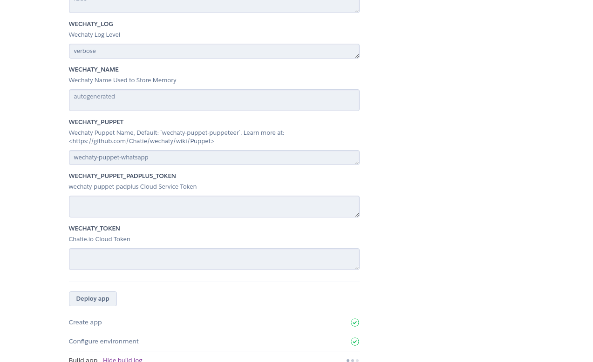

[](https://github.com/wechaty/wechaty)
[](https://travis-ci.com/wechaty/heroku-wechaty-getting-started)
[](https://greenkeeper.io/)

## Using the "Deploy to Heroku" Button

> The ‘Deploy to Heroku’ button enables users to deploy apps to Heroku without leaving the web browser, and with little or no configuration. The button is ideal for customers, open-source project maintainers or add-on providers who wish to provide their customers with a quick and easy way to deploy and configure a Heroku app.

[](https://heroku.com/deploy?template=https://github.com/wechaty/heroku-wechaty-getting-started)

This is a sample deploy with Heroku button for the Wechaty Heroku starter project.

### Setting up a Deploy to Heroku Button

This guide demonstrates setting up a Deploy to Heroku Button with [Wechaty Starter Repository](https://github.com/wechaty/wechaty-getting-started).

1.  Fork the [Wechaty Starter Repository](https://github.com/wechaty/wechaty-getting-started)

2.  Create a branch `feature` in the forked repository.

3. On branch feature, create an app.json file in the root directory. Add items including name, description, logo in the fields. If you want to know how an app.json file looks like, check out [heroku-wechaty-getting-started templete](https://github.com/wechaty/heroku-wechaty-getting-started/blob/master/app.json)

4. In the Readme.md file, add the following code snippet:

```ts
`[](https://heroku.com/deploy)`
```

5. The deploy with heroku button is now set up.


## Deploying with Heroku

This guide demonstrates running the ding-dong bot with Heroku CLI. However you can choose to run any custom bot, with similar steps.

### Prerequisites

1. Fork the [Wechaty Starter Repository](https://github.com/wechaty/wechaty-getting-started")

2. Clone the Starter repository.

```ts
git clone https://github.com/wechaty/wechaty-getting-started
```

3.  Download the [Heroku Cli](https://devcenter.heroku.com/articles/heroku-cli)

### Getting Started

1. On branch feature, create an app.json file in the root directory.Add in fields such as name, description, logo, etc. If you want to know how an app.js file looks like check [heroku-wechaty-getting-started](https://github.com/wechaty/heroku-wechaty-getting-started/blob/master/app.json)
2. On branch feature, create a file  named `Procfile` in the root directory.Note that this file has no extension.
Write the following code in the file:

```ts
web:WECHATY_LOG=verbose WECHATY_PUPPET=wechaty-puppet-whatsapp node examples/ding-dong-bot.js
```

3. Commit the changes in the feature branch.


### Creating a Heroku Remote

1. Open the following link in your browser:

```ts
https://heroku.com/deploy?template=https://github.com/user-name/wechaty-getting-started/tree/feature
```

Remember to replace user-name with your Github username.

2. Add the necessary details and click on deploy app button.
</img>
</img>

3. After the app has been successfully created, open the terminal and add the heroku remote to your local github repository.

```ts
heroku git:remote -a wechaty-test-123
```
Here wechaty-test-123 is the name of the app, created in the previous step. You have to write your own app name.

4. Push the feature branch of your local repository to the main branch of heroku using the following command:

```ts
git push heroku feature:main
```

### Running the bot

To run the Bot on the Heroku CLI use the command `heroku local web` on your terminal. The ding-dong starter bot  is now successfully running.


## Use Cases

1. [Friday BOT](https://github.com/wechaty/friday) - [bot-friday.herokuapp.com](https://bot-friday.herokuapp.com/)
2. [OSSBot](https://github.com/kaiyuanshe/OSS-bot) - [oss-bot-dev.herokuapp.com](https://oss-bot-dev.herokuapp.com/)
3. [Mike BO](https://github.com/huan/mike-bo) - [mike-bo.herokuapp.com](http://mike-bo.herokuapp.com/)
4. [QiJi BOT](https://github.com/juzibot/qijibot) - [qiji-bot.herokuapp.com](https://qiji-bot.herokuapp.com/)
5. [Bot Ops](https://github.com/juzibot/botops) - [bot-ops.herokuapp.com](https://bot-ops.herokuapp.com/)
6. [Rui Assistant BOT](https://github.com/juzibot/rui-bot)
7. [Juzi.BOT](https://github.com/juzibot/juzi-bot)
