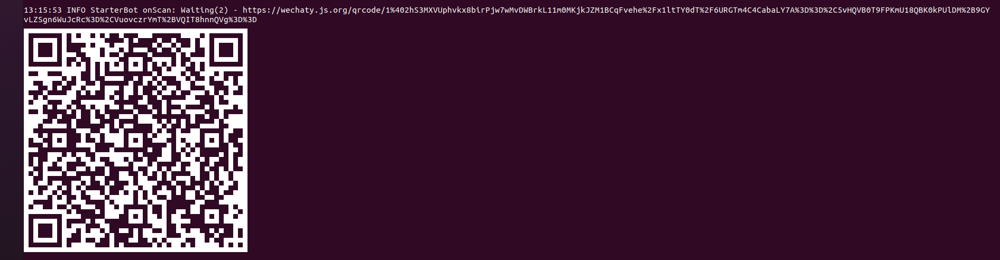

This will be a step by step guide on how to run the bot on most popular messaging apps, Whatsapp and Wechat:

:::tip

If you do not wish to run the bot locally, you can also use use Gitpod  or Google Cloud Shell. The steps can be found [here](../getting-started/quick-start)

:::

## Requirements

1. Node.js v12+
2. Build tools

## Installation

- ### Download Node.js  

  You can downlad the latest version from [here](https://nodejs.org/en/download/)

- ### Build Tools  

  On your terminal  run this command:

```bash
   sudo apt install build-essential
```

## Running Locally

This guide will go through the steps to generate QR code for the bot to test it with Whatsaap and Wechat.
<ol>
<li> Clone the <a href ="https://github.com/wechaty/wechaty-getting-started">Wechaty Getting Started</a> repository by following the commands below, and navigate to the directory: </li>

```bash
git clone https://github.com/wechaty/wechaty-getting-started
cd wechaty-getting-started
```

<li> Install the`npm dependencies` by running this command: </li>

```bash
 make install
 ```  

 <li> Set-up the the environment vaiables: </li>

 ```bash
 export WECHATY_LOG=verbose
 ```

<li>Setup the relevant puppet provider for the messaging app with which you want to test the bot: </li>
   <ul>
   <li> <b>Wechat</b> </li>
   </ul>

```bash
export WECHATY_PUPPET=wechaty-puppet-wechat
   ```

   <ul>
  <li>  <b>Whatsapp</b> </li>
  
  </ul>

```bash
export WECHATY_PUPPET=wechaty-puppet-whatsapp
   ```

<li> Start the ding dong bot by using the command: </li>

```bash
npm start
```

<li> Scan the code displayed on the terminal using Wechat/ Whatsapp Web </li>
</img>
The Ding Dong bot is now set up and can read recieved messages. Ding Dong bot is the simplest wechaty bot that automatically replies with a `dong` message when a `ding` message is recieved.
</ol>
