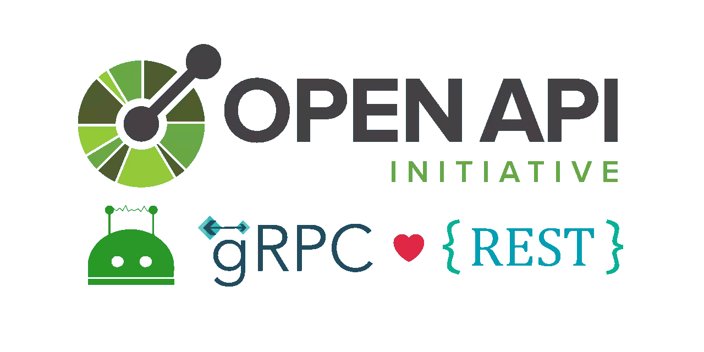
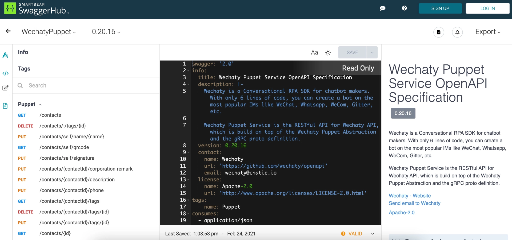

[](https://github.com/wechaty/openapi)



- GitHub Repo <https://github.com/wechaty/openapi>

## Getting Started

### About

**OpenAPI Specification** (formerly Swagger Specification) is an API description format for REST APIs. An OpenAPI file allows you to describe your entire API, including:

- Available endpoints (`/users`) and operations on each endpoint (`GET /users`, `POST /users`)
- Operation parameters Input and output for each operation
- Authentication methods
- Contact information, license, terms of use, and other information.

API specifications can be written in YAML or JSON. The format is easy to learn and readable to both humans and machines. The complete OpenAPI Specification can be found on GitHub: [OpenAPI 3.0 Specification](https://github.com/OAI/OpenAPI-Specification/blob/master/versions/3.0.2.md)

### Motivation

We have [OpenAPI](https://github.com/wechaty/openapi) for [Wechaty Puppet](https://github.com/wechaty/wechaty-puppet), and we want a RESTful API as well, so we built [OpenAPI Specification](https://www.openapis.org/) (OAS, former [Swagger](https://swagger.io/)) on top of gRPC, with the power of [gRPC OAS Gateway](https://github.com/grpc-ecosystem/grpc-gateway).

> [View Wechaty OpenAPI Specification on SwaggerHub](https://app.swaggerhub.com/apis/zixia/WechatyPuppet/)

### Features

1. A **Standalone HTTP Server** `wechaty-openapi-server`
2. An **Express Router** for easy mounting to any existing **Express HTTP Server**.

### Install

```sh
npm install wechaty-openapi
```

### Usage

#### 1. Standalone Server

```sh
export WECHATY_PUPPET_SERVICE_TOKEN=__YOUR_TOKEN__
wechaty-openapi-server \
  --mountpoint /api
  --port 8080
```

Then visit <http://localhost:8080/api>

#### 2. Express Router

> TBW

### Architecture

Thanks to the ecosystem of gRPC, we can generate OpenAPI Specification from our gRPC proto definitions automatically.

We are using [gRPC to JSON proxy generator following the gRPC HTTP spec](https://github.com/grpc-ecosystem/grpc-gateway) as the OpenAPI Specification generator ([protoc-gen-openapiv2](https://github.com/grpc-ecosystem/grpc-gateway/tree/master/protoc-gen-openapiv2)), and using [Like grpc-gateway, but written in node and dynamic](https://github.com/konsumer/grpc-dynamic-gateway) project to serve an HTTP RESTful API to gRPC proxy.

<a link="https://github.com/wechaty/openapi">
  
</a>

Image credit: [gRPC Gateway](https://grpc-ecosystem.github.io/grpc-gateway/)

Learn more about the RESTful API service for Wechaty from [Wechaty OpenAPI](https://github.com/wechaty/openapi).

See also: [AIP-4222 - Routing headers](https://google.aip.dev/client-libraries/4222)

### About OpenAPI and Swagger?

#### What Is OpenAPI?

OpenAPI Specification (formerly Swagger Specification) is an API description format for REST APIs.

An OpenAPI file allows you to describe your entire API, including:

- The available endpoints (/users) and operations on each endpoint (GET /users, POST /users).
- The operation parameters Input and Output for each operation
  Authentication methods.
- The contact information, license, terms of use, and other information.

API specifications can be written in YAML or JSON. The format is easy to learn and readable to both humans and machines. The complete OpenAPI Specification can be found on GitHub: OpenAPI 3.0 Specification.

#### What Is Swagger?

**Swagger** is a set of open-source tools built around the OpenAPI Specification that can help you design, build, document, and consume REST APIs. The major Swagger tools include:

- [Swagger Editor](https://editor.swagger.io/?_ga=2.144876020.132577923.1622577859-1127817875.1622577859) – browser-based editor where you can write OpenAPI specs.
- [Swagger UI](https://swagger.io/tools/swagger-ui/) – renders OpenAPI specs as interactive API documentation.
- [Swagger Codegen](https://github.com/swagger-api/swagger-codegen) – generates server stubs and client libraries from an OpenAPI spec.

#### Why Use OpenAPI?

The ability of APIs to describe their structure is the root of all awesomeness in OpenAPI. Once written, an OpenAPI specification and Swagger tools can drive your API development further in various ways:

- Design-first users: use [Swagger Codegen](https://swagger.io/swagger-codegen/) to **generate a server stub** for your API. Then, the only thing left is implementing the server logic – and your API is ready to go live!
- Use [Swagger Codegen](https://swagger.io/swagger-codegen/) to **generate client libraries** for your API in over 40 languages.
- Use [Swagger UI](https://swagger.io/swagger-ui/) to generate **interactive API documentation** that lets your users try out the API calls directly in the browser.
- Use the spec to connect API-related tools to your API. For example, import the spec to [SoapUI](https://soapui.org/) to create automated tests for your API.
- And more! Check out the [open-source](https://swagger.io/open-source-integrations/) and [commercial tools](https://swagger.io/commercial-tools/) that integrate with Swagger.

### How do I get started with Swagger and OAS?

If you're an API provider and want to use Swagger tools to build your APIs and the OpenAPI specification to describe your APIs - there are several approaches available:

#### Starting from scratch?

- Use the [Swagger Editor](http://editor.swagger.io/) to create your OAS definition and then use [Swagger Codegen](https://swagger.io/swagger-codegen/) to generate server implementation.
- Use the [Swagger UI](http://swagger.io/swagger-ui/) to visualize and document your OAS definition
- Design, document, and develop APIs as a team using [SwaggerHub](http://swaggerhub.com/)

#### Creating the OAS file from an existing API?

Finding an easy way to generate the OpenAPI definition from an existing API can be challenging. First, you have to reverse engineer the API and get acquainted with the process of developing the OAS from existing APIs. The good news is that Swagger tools can help you do this with ease.

- Use [Swagger Core open source project](https://github.com/swagger-api/swagger-core) to create the OAS from your existing Java APIs. Swagger Core supports frameworks like JAX-RS or node.js.

Have a look at this example to see how Swagger Core can help your JAX-RS implemented API - [https://github.com/swagger-api/swagger-core/wiki/Swagger-Core-JAX-RS-Project-Setup-1.5.X](https://github.com/swagger-api/swagger-core/wiki/Swagger-Core-JAX-RS-Project-Setup-1.5.X)

- [Swagger Inspector](https://goo.gl/cjDSNg) allows you to easily and quickly auto-generate an OAS definition from any API endpoint right from your browser

If, on the other hand, you're an API Consumer who wants to integrate with an API that has an OpenAPI definition, you can use [Swagger Inspector](https://goo.gl/cjDSNg) or the online version of [Swagger UI](http://petstore.swagger.io/) to explore the API (given that you have a URL to the APIs Swagger definition) - and then use [Swagger Codegen](https://swagger.io/swagger-codegen) to generate the client library of your choice. In either case - be sure to check out the long list of [open source projects](https://swagger.io/open-source-integrations/) and our commercial offering, [SwaggerHub](http://swaggerhub.com/).

### Wechaty Puppet Service OpenAPI Specification

Wechaty is a Conversational RPA SDK for chatbot makers. With only six lines of code, you can create a bot on the most popular IMs like WeChat, Whatsapp, WeCom, Gitter, etc.

Wechaty Puppet Service is the RESTful API for Wechaty API, built on top of the Wechaty Puppet Abstraction and the gRPC proto definition.

[WechatyPuppet](https://app.swaggerhub.com/apis/zixia/WechatyPuppet/0.20.16)



## Blogs

Read blogs with the `openapi` tag at <https://wechaty.js.org/tags.html#openapi>

## Learning Resources

To learn more about Open PI and Swagger you can find other learning resources and links below.

- **[OpenAPI 3.0 Official GitHub Repository](https://github.com/OAI/OpenAPI-Specification)** — The OpenAPI Initiative

- **[Tutorial: Learning the New OpenAPI Specification](https://swagger.io/docs/specification/about/):**
  You can find documentation for OpenAPI 3.0 and Swagger 2.0 Specification on Swagger.io. The updated documentation includes a detailed look at the updated structure and new features in the 3.0 specification.

- **[What Is the Difference Between Swagger and OpenAPI?](https://swagger.io/blog/difference-between-swagger-and-openapi/):**
  OpenAPI is the official name of the specification. The development of the specification is fostered by the OpenAPI Initiative, which involves more the 30 organizations from different areas of the tech world — including Microsoft, Google, IBM, and CapitalOne. Smartbear Software, which is the company that leads the development of the Swagger tools, is also a member of the OpenAPI Initiative, helping lead the evolution of the specification.

### **Tools**

- [openapi2proto](https://github.com/NYTimes/openapi2proto) - A tool for generating Protobuf v3 schemas and gRPC service definitions from OpenAPI specifications
- [OpenAPI.Tools](https://openapi.tools/)

### **Video Resources**

- **[Getting Started with Swagger: An Introduction to Swagger Tools](https://swagger.io/resources/webinars/getting-started-with-swagger/):**
  This training provides an introduction to API development with the OpenAPI Specification (formerly known as the Swagger Specification) and provides an overview of the different open-source, free, and commercial Swagger tools and how they can fit into your API development.

### Releases

Since its creation in 2016, a number of Wechaty versions have been released. For more information about the release history and the current stable version, you can read the [Wechaty release notes](https://github.com/Wechaty/wechaty/releases) on Github.

### Maintainer

Wechaty is maintained by [Huan](https://github.com/huan), [Rui](https://github.com/lijiarui), and a community of Open Source Contributors. We are always looking for people to join the Wechaty community to maintain the Wechaty codebase and documentation. You necessarily don't have to be a programmer to contribute to Wechaty. To get started contributing, you can read [Wechaty contributing docs](http://wechaty.js.org/docs/contributing/).

## Getting help

Wechaty has a community of very helpful contributors on different platforms you can join to get help from. Before joining any of the communities, we recommend that you read our Code of conduct]o that you adhere to our community guidelines. A full list of the different Wechaty communities can be accessed from the [Wechaty community](https://wechaty.js.org/docs/community/) section of this documentation.
