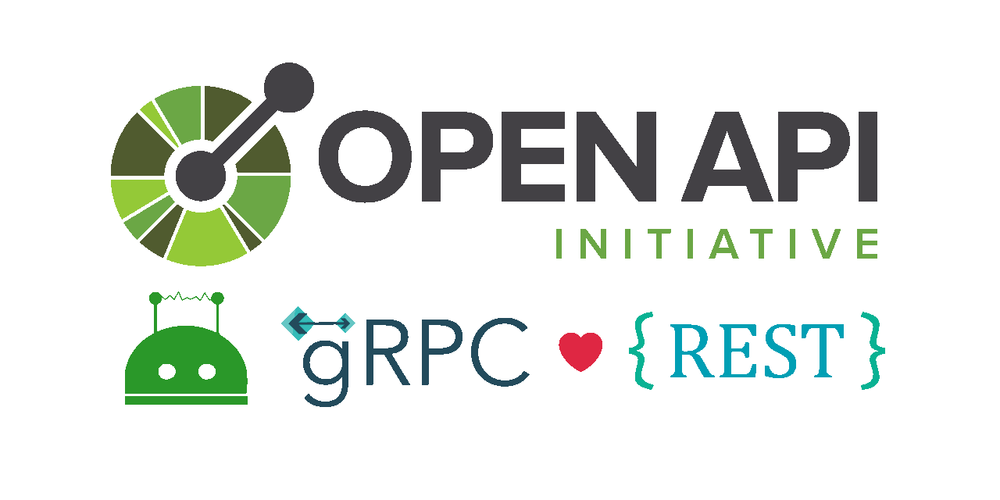

export const Highlight = ({ children, color }) => (
 <span
 style={{
 color: color,
 }}
 >
 {children}
 </span>
);

[](https://github.com/wechaty/openapi)



- GitHub Repo <https://github.com/wechaty/openapi>
- Getting Started Template Repo <https://github.com/wechaty/openapi-wechaty-getting-started>

## Getting Started

### About OpenAPI and Swagger?

#### What Is OpenAPI?

OpenAPI Specification (formerly Swagger Specification) is an API description format for REST APIs. An OpenAPI file allows you to describe your entire API, including:

- Available endpoints (<Highlight color="#e83e8c">/users</Highlight>) and operations on each endpoint (<Highlight color="#e83e8c">GET /users</Highlight>, <Highlight color="#e83e8c">POST /users</Highlight>)
- Operation parameters Input and output for each operation
  Authentication methods
- Contact information, license, terms of use, and other information.

API specifications can be written in YAML or JSON. The format is easy to learn and readable to both humans and machines. The complete OpenAPI Specification can be found on GitHub: OpenAPI 3.0 Specification.

#### What Is Swagger?

**Swagger** is a set of open-source tools built around the OpenAPI Specification that can help you design, build, document, and consume REST APIs. The major Swagger tools include:

- [Swagger Editor](https://editor.swagger.io/?_ga=2.144876020.132577923.1622577859-1127817875.1622577859) – browser-based editor where you can write OpenAPI specs.
- [Swagger UI](https://swagger.io/tools/swagger-ui/) – renders OpenAPI specs as interactive API documentation.
- [Swagger Codegen](https://github.com/swagger-api/swagger-codegen) – generates server stubs and client libraries from an OpenAPI spec.

#### Why Use OpenAPI?

The ability of APIs to describe their structure is the root of all awesomeness in OpenAPI. Once written, an OpenAPI specification and Swagger tools can drive your API development further in various ways:

- Design-first users: use [Swagger Codegen](https://swagger.io/swagger-codegen/) to **generate a server stub** for your API. Then, the only thing left is implementing the server logic – and your API is ready to go live!
- Use [Swagger Codegen](https://swagger.io/swagger-codegen/) to **generate client libraries** for your API in over 40 languages.
- Use [Swagger UI](https://swagger.io/swagger-ui/) to generate **interactive API documentation** that lets your users try out the API calls directly in the browser.
- Use the spec to connect API-related tools to your API. For example, import the spec to [SoapUI](https://soapui.org/) to create automated tests for your API.
- And more! Check out the [open-source](https://swagger.io/open-source-integrations/) and [commercial tools](https://swagger.io/commercial-tools/) that integrate with Swagger.

### How do I get started with Swagger and OAS?

If you're an API provider and want to use Swagger tools to build your APIs and the OpenAPI specification to describe your APIs - there are several approaches available:

#### Starting from scratch?

- Use the [Swagger Editor](http://editor.swagger.io/) to create your OAS definition and then use [Swagger Codegen](https://swagger.io/swagger-codegen/) to generate server implementation.
- Use the [Swagger UI](http://swagger.io/swagger-ui/) to visualize and document your OAS definition
- Design, document, and develop APIs as a team using [SwaggerHub](http://swaggerhub.com/)

#### Creating the OAS file from an existing API?

Finding an easy way to generate the OpenAPI definition from an existing API can be challenging. First, you have to reverse engineer the API and get acquainted with the process of developing the OAS from existing APIs. The good news is that Swagger tools can help you do this with ease.

- Use [Swagger Core open source project](https://github.com/swagger-api/swagger-core) to create the OAS from your existing Java APIs. Swagger Core supports frameworks like JAX-RS or node.js.

Have a look at this example to see how Swagger Core can help your JAX-RS implemented API - [https://github.com/swagger-api/swagger-core/wiki/Swagger-Core-JAX-RS-Project-Setup-1.5.X](https://github.com/swagger-api/swagger-core/wiki/Swagger-Core-JAX-RS-Project-Setup-1.5.X)

- [Swagger Inspector](https://goo.gl/cjDSNg) allows you to easily and quickly auto-generate an OAS definition from any API endpoint right from your browser

If, on the other hand, you're an API Consumer who wants to integrate with an API that has an OpenAPI definition, you can use [Swagger Inspector](https://goo.gl/cjDSNg) or the online version of [Swagger UI](http://petstore.swagger.io/) to explore the API (given that you have a URL to the APIs Swagger definition) - and then use [Swagger Codegen](https://swagger.io/swagger-codegen) to generate the client library of your choice. In either case - be sure to check out the long list of [open source projects](https://swagger.io/open-source-integrations/) and our commercial offering, [SwaggerHub](http://swaggerhub.com/).

```sh
git clone git@github.com:wechaty/openapi-wechaty-getting-started.git
cd openapi-wechaty-getting-started
$make install
make bot
```

### Wechaty Puppet Service OpenAPI Specification

Wechaty is a Conversational RPA SDK for chatbot makers. With only six lines of code, you can create a bot on the most popular IMs like WeChat, Whatsapp, WeCom, Gitter, etc.

Wechaty Puppet Service is the RESTful API for Wechaty API, built on top of the Wechaty Puppet Abstraction and the gRPC proto definition.

[WechatyPuppet](https://app.swaggerhub.com/apis/zixia/WechatyPuppet/0.20.16)


### Resources

- [Difference Between OpenAPI and Swagger](https://swagger.io/blog/difference-between-swagger-and-openapi/)
- [How to design APIs using OpenAPI 3.0](https://youtu.be/6kwmW_p_Tig)
- [Documenting Your Existing APIs: API Documentation Made Easy with OpenAPI & Swagger](https://swagger.io/blog/how-to-generate-openapi-swagger/)
- [Definition Driven API Development: How OAS & Swagger Help Teams Streamline Their API Development](https://swagger.io/blog/api-development-with-openapi-and-swagger/)
- [Swagger Inspector: A Developer Tool To Test APIs and Generate Your OpenAPI](https://swagger.io/blog/announcing-swagger-inspector/)

## Blogs

Read blogs with the `openapi` tag at <https://wechaty.js.org/tags.html#openapi>

## History

## Maintainers

- [@huan](https://wechaty.js.org/contributors/huan)
