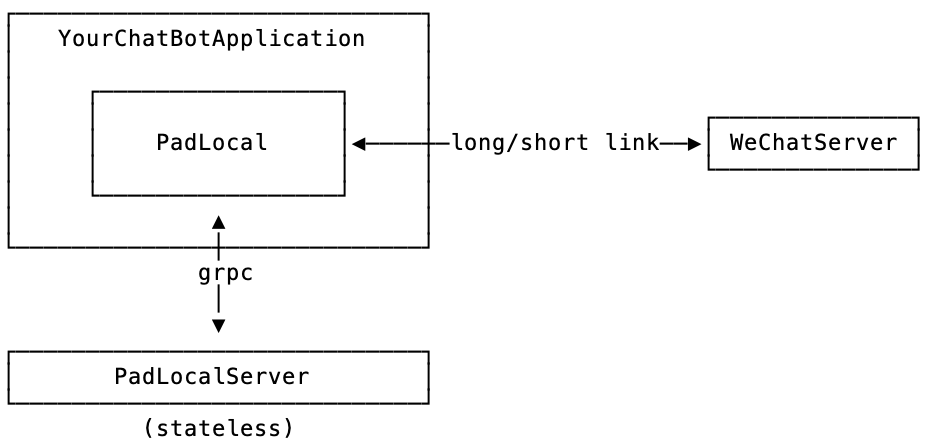

[](padlocal)


[](https://badge.fury.io/js/wechaty-puppet-padlocal)
[](https://www.npmjs.com/package/wechaty-puppet-padlocal?activeTab=versions)
[](https://github.com/padlocal/padlocal-client-ts)

- Repo: <https://github.com/padlocal/wechaty-puppet-padlocal>
- Support & Feedback: <https://github.com/padlocal/wechaty-puppet-padlocal/issues>

## Features

PadLocal is a full-featured Wechaty Puppet Provider.

Function | padlocal
---|---
**Message**|
Send and receive text|✅
Send and receive personal business cards|✅
Send and receive graphic links|✅
Send pictures and files|✅
Receive pictures and files|✅
Send video|✅
Receive video|✅
Send Mini Program|✅
Receive GIF|✅
Send GIF|✅
Receive voice message|✅
Send voice message|✅
Forward text|✅
Forward the picture|✅
Forward graphic link|✅
Forward audio|✅
Forward the video|✅
Forward file|✅
Forward GIF|❌
Forwarding applet|✅
**Group**|
Create group chat|✅
Set group announcement|✅
Get group announcement|✅
Group QR Code|✅
Pull people into the group|✅
Kick out of the group|✅
Exit group chat|✅
Change group name|✅
Group entry event|✅
Outliers|✅
Group name change event|✅
@群员|✅
Group list|✅
Group member list|✅
Group details|✅
**Contact**|
Modification notes|✅
Add friends|✅
Pass friends automatically|✅
Add friends|✅
Friends list|✅
Friends details|✅
**Other**|
Log in to WeChat|✅
Scan code status|✅
Exit WeChat|✅
Dependency Agreement|iPad

## Usage

:::tip TOKEN required

PadLocal is a Wechaty Puppet Provider which consumes Wechaty Puppet Service.

Learn about [how to get a PadLocal TOKEN](puppet-services/padlocal.md)

:::

<!-- MDX import -->
import Tabs from '@theme/Tabs'
import TabItem from '@theme/TabItem'

<Tabs
  groupId="operating-systems"
  defaultValue="linux"
  values={[
    { label: 'Linux',   value: 'linux', },
    { label: 'macOS',   value: 'mac', },
    { label: 'Windows', value: 'windows', },
  ]
}>

<TabItem value="linux">

```sh
npm install wechaty-puppet-padlocal
export WECHATY_PUPPET=wechaty-puppet-padlocal
export WECHATY_PUPPET_PADLOCAL_TOKEN=__TOKEN__
npm start
```

</TabItem>
<TabItem value="mac">

```sh
npm install wechaty-puppet-padlocal
export WECHATY_PUPPET=wechaty-puppet-padlocal
export WECHATY_PUPPET_PADLOCAL_TOKEN=__TOKEN__
npm start
```

</TabItem>
<TabItem value="windows">

```sh
npm install wechaty-puppet-padlocal
set WECHATY_PUPPET=wechaty-puppet-padlocal
set WECHATY_PUPPET_PADLOCAL_TOKEN=__TOKEN__
npm start
```

</TabItem>
</Tabs>

## History

In 2019 to 2020, the padlocal development team started making community-related products, and also started using Wechaty. Gradually their recognition and trust with Wechaty and the entire community was built up.

When the developer of Padlocal was working on a crawler system a few years ago, he came into contact with Wechaty. This project needed to regularly push the status information of the crawler and actively query related content crawled. At that time, there was a very popular saying: "Dialogue is a service", so he wondered whether these functions can be realized through WeChat? With the help of Wechaty, all functions were quickly realized, and the final effect was also very good.

### PadLocal: Wechaty puppet service provider

The puppet in the community was not perfect at that time. There were some gaps in the process of using it. Moreover, the life cycle of puppet is not particularly stable, and it may not be maintained after a period of time. They were worried that this uncertainty would affect their business, so they had the idea of ​​developing a puppet themselves.

So unpacking from the App, using IDA to decompile WeChat, started a long reverse road. Before doing this, the team expected this process to be difficult and encounter all kinds of difficult roadblocks, but never expected it to be so difficult. The initial stage wass quite pleasant, because we could easily see our growth every step of the way, and every time we fought a monster, we felt that we had risen to a level. But on going deeper, a lot of really hard roadblocks turned up. They even considered ​​giving up, but they were not reconciled, and persevered. Here are a few moments of those hardships:

- **Handling code obfuscation** : WeChat will obfuscate sensitive code. For code obfuscation, it is recommended that to refer to ollvm. Code obfuscation may have these several methods:
  1. Control flow flattening
  2. Fake control flow
  3. Instruction replacement.
  
  Quarkslab's article "Deobfuscation: recovering an OLLVM-protected program" also introduces a little deobfuscation method, but the examples mentioned in the article are only insignificant compared to those encountered in WeChat. For example, a certain function of WeChat has more than 7W lines after obfuscation, and it can take a whole day to decompile with IDA. By slowly disclosing these codes every day, many rules have been summarized. So a small tool was written to solve the obfuscation, and through continuous attempts and corrections, the code was finally unobfuscated.

- **0305 algorithm** : WeChat itself performs strict verification on the client, including information such as device environment and device fingerprints. That is to say, using some tools mentioned on the Internet to modify the function of WeChat, it is actually easy to be recognized by WeChat, and it may be a matter of time before the account is blocked. Some encryption and decryption and signature verification mechanisms are needed here, and the 0305 algorithm is one of the more difficult ones. First of all, the code itself has been obfuscated, and secondly, even if it is unobfuscated, it is difficult to see its logic, such as the specific algorithm used, encryption, decryption, and signature verification process. So it can only be explored slowly, the changes in the data have to be constantly observed at each step, and possible patterns had to be explored. In the end, after a lot of attempts, the correct algorithm and process were hit.

After experiencing several difficulties and successfully solving them, the team had a lot of confidence. Even after encountering moments of frustration, the team believed that the challenge could be completed. The journey was one step at a time.

In the end, fully implemented puppet called PadLocal was developed. There were a few reasons why the name was decided to be "PadLocal". The next section will explain the overall design of the puppet and how it differs from other puppets. The biggest features of PadLocal are:

- Managing account status
- Communication with WeChatServer

When designing puppet, firstly investigated other puppets in the community were investigated and their implementation principles were studied in great detail. It was observed that most other puppet design ideas were like this: the puppet server manages and maintains the status of the hosting account. All requests are completed through the link puppet -> puppet server -> WeChatServer. In the message push part, a long connection is established between puppet and puppet server, and a corresponding long connection is also established between puppet server and WeChatServer. When a new message is pushed, it reaches the puppet end through the link WeChatServer -> puppet server -> puppet. In this design, the puppet server acts as a stateful proxy, and all traffic is forwarded by the server. In our opinion, such a design may have several potential disadvantages:

1. Because the puppet server ultimately communicates with WeChatServer, if multiple accounts are hosted on a puppet server, and no proxy policy is configured for each account, then these accounts will share the IP of the puppet server. From the perspective of risk control, risks are prone to arise. Moreover, once some of the accounts have a relatively high risk level, it is easy to pollute other accounts in the same IP pool and harm the innocent.
2. All traffic is forwarded through the puppet server, which puts a lot of pressure on its bandwidth, especially when a large number of multimedia resources such as pictures and videos are generated in the hosting account.
3. Since the puppet server maintains the status of the hosting account, the puppet server is stateful. From the perspective of system architecture, stateful servers have considerable challenges in terms of system stability, availability, and capacity planning. If some servers in the cluster are down, and the design of the standby switch mechanism is not perfect, some accounts are likely to be in an unavailable state.
4. In order to ensure better usability and experience of puppet, the puppet server usually caches (not necessarily permanently saves) certain data (such as chat data). In other words, the server inevitably needs to touch the business data of the hosting account. This requires puppet providers to maintain extremely high industry self-discipline and ensure the security of customer data through adequate mechanisms.

Based on the above considerations, all traffic forwarding work was put into the puppet, which is the source of Local in PadLocal. Two-way communication mechanism of GRPC was used to make puppet a proxy and forward all traffic to WeChatServer through puppet. At the same time, puppet maintains a long connection with WeChatServer. The benefits of this are as follows:

1. The IP used for the communication between the hosting account and WeChatServer is the IP of the puppet end, and there is no risk of sharing the IP for different accounts.
2. The flow of downloading multimedia resources such as pictures and videos does not need to go through the PadLocal server. And without going through the server, the efficiency is higher.
3. The account status maintenance is done on the puppet side, so the PadLocal server can be designed as stateless. It will naturally be much simpler to deal with issues such as expansion, simple is beautiful.
PadLocal server will not save any business data, and there is no risk of data security.

### Topology

The topology diagram of the overall architecture is as follows:



By implementing a puppet, the team gained a lot of things ourselves. They now have a more in-depth understanding of Wechaty, and can understand the original intention of the designer and the trade-offs among them. The fact that Wechaty is so easy to use is the result of careful design. Secondly, creating a Wechaty puppet is a very challenging thing, of course it is full of accomplishment to be able to complete such a thing. Furthermore, from an internal perspective, a more in-depth and comprehensive understanding of the WeChat terminal Operating mechanism and design ideas can be had. As a national-level communication software, WeChat's design is excellent. Various mechanisms and design concepts can fully serve as industry standards. It is worthy of being the absolute king in this field.

The development team released the PadLocal puppet to the outside world, hoping to help everyone realize various ideas in the WeChat ecosystem, and at the same time help the WeChat ecosystem to develop more abundantly and healthily. For future plans, they will continue to actively maintain this puppet with the iteration of the WeChat version.

PadLocal is currently in the beta testing stage, and there are still some minor issues that need to be resolved. More developers are expected to participate and let this puppet move to the next more mature stage. There is a  reward mechanism in place to thank the partners who have contributed to PadLocal, and the specific rules are still being negotiated. At present, Token is gradually opened to everyone in the form of "application + review". If you are interested, please contact the administrator classmates and explain what kind of creativity you achieve through PadLocal. We are also preparing more detailed documents and guidelines, so stay tuned.

## Maintainers

- [@padlocal](https://wechaty.js.org/contributors/padlocal)

## Blogs

- [New Wechaty Puppet Service: PadLocal, Padlocal, Oct 12, 2020](https://wechaty.js.org/2020/10/12/puppet-padlocal-intro/)
