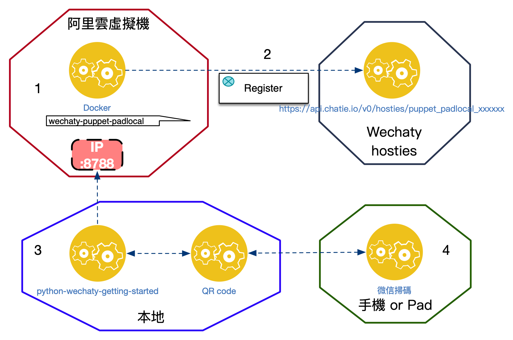
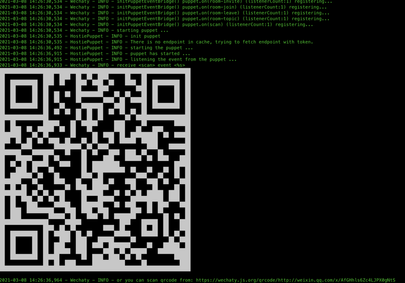

[](padlocal.md)

## How to buy(apply)

Go to [pad-local.com](http://pad-local.com/) to avail a **FREE** trail token for **7** days.

## Running wechaty-puppet-padlocal on cloud

### Precautions

1. Update cmd in step1 docker run.

### Test Date

- March 01, 2021
- March 16, 2021

### Environment

- Local mobile phone (iPad or mobile phone is fine)
- PC (Mac is used here)
- Virtual machine for puppet on Alibaba Cloud

## Architecture



### Steps

1. Run wechaty-puppet on a virtual machine
2. Verify that the API is successfully registered
3. Run local python-wechaty-getting-started
4. Scan code login

### Step 1 : wechaty-puppet-padlocal

You will need a domestic public network IP+Token (please register with the administrator) to make wechaty-puppet take effect in the virtual machine part. For the trial or free plan, you can choose Alibaba Cloud or Huawei Cloud or GCP. It is a pity that Google does not have a domestic IP. , or you can also play gcp's k8s by the way, suggest that you still use domestic resources.


Just register a ubuntu20.04, pay attention to the security group to release port 8788.
Run the following command in ubuntu cmdline.

```sh
apt update
apt install docker.io
docker pull wechaty/wechaty
export WECHATY_PUPPET_PADLOCAL_TOKEN=puppet_padlocal_xxxxxxxxxxxxxxxxxx
export WECHATY_PUPPET_SERVER_PORT=8788
export WECHATY_PUPPET=wechaty-puppet-padlocal
export WECHATY_LOG=verbose
docker run \
  --rm \
  -ti \
  -e WECHATY_LOG \
  -e WECHATY_PUPPET \
  -e WECHATY_PUPPET_PADLOCAL_TOKEN \
  -e WECHATY_PUPPET_SERVER_PORT \
  -e WECHATY_TOKEN="$WECHATY_PUPPET_PADLOCAL_TOKEN" \
  -p "$WECHATY_PUPPET_SERVER_PORT:$WECHATY_PUPPET_SERVER_PORT" \
  wechaty/wechaty
```

You can issue an instruction to check whether it is running normally, as shown in the figure :

```sh
netstat -ntlp
docker container ls
```


You can telnet the virtual machine IP: 8788, simple debugging will not work.
(Optional) You can change docker run to docker-compose by running, and the virtual machine can grow up automatically after it crashes.

### Step 2 : verify hostie token

Visit [this link](https://api.chatie.io/v0/hosties/puppet_padlocal_xxxxxxxx).
To check whether your token is successfully registered, if not, please go back to step 1 to check.

Good:
{"ip":"47.119.129.29","port":8788}

No Good:
{"ip":"0.0.0.0","port":0}

### Step 3 : Run python locally

python-wechaty-getting-started you need Python3.7+

Run the following cmd :

```sh
git clone https://github.com/wechaty/python-wechaty-getting-started
cd python-wechaty-getting-started
pip3 install -r requirements.txt
export WECHATY_PUPPET=wechaty-puppet-service
export WECHATY_PUPPET_SERVICE_TOKEN=your_token_at_here
python3 examples/ding-dong-bot.py
```

Just wait for the QR code to appear

### QRcode



### Step 4 : WeChat scan code

Currently using a new account registration will fail - Fixed
Log in after scanning.

Finally, invite friends or send ding to yourself (no spaces and all lowercase letters), and it will automatically return to dong!
There will be a lot of resources and applications on the official website in the follow-up, so please check it out when you have time.

## Blogs

- [Python-wechaty & wechaty-puppet-padlocal的初探, iivveess, Mar 8, 2021](https://wechaty.js.org/2021/03/08/python-wechaty-and-wechaty-puppet-padlocal/)
- [Python Wechaty如何使用PadLocal Puppet Service, Biofer, Feb, 3, 2021](https://wechaty.js.org/2021/02/03/python-wechaty-for-padlocal-puppet-service/)
- [.NET Wechaty如何使用PadLocal Puppet Service, Darren, Jan 28, 2021](https://wechaty.js.org/2021/01/28/csharp-wechaty-for-padlocal-puppet-service/)

Read more blogs with the `padlocal` tag at <https://wechaty.js.org/tags.html#padlocal>

## History

1. [Alpha Announcement: New Wechaty Puppet Service: PadLocal](https://wechaty.js.org/2020/10/12/puppet-padlocal-intro/)
1. Testing Progress
1. Beta Announcement
1. Release Announcement

## More Info

- Repo: <https://github.com/padlocal/wechaty-puppet-padlocal>
- Provider: [PadLocal](https://github.com/padlocal)
- Support & Feedback: <https://github.com/padlocal/wechaty-puppet-padlocal/issues>
- Term of Service (ToS): To-be-added
- Privacy Policy: To-be-added
- Service Level Agreement (SLA): To-be-added
