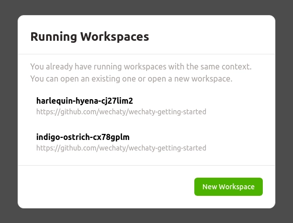
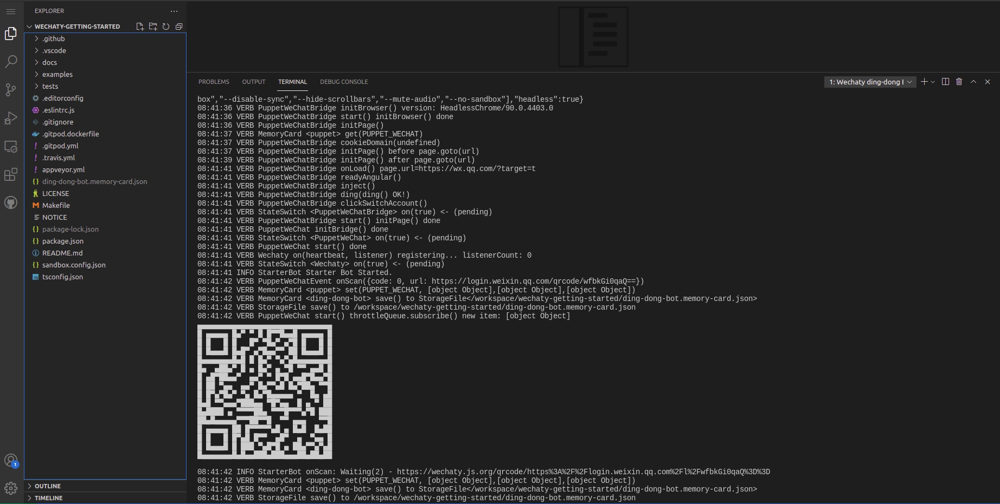
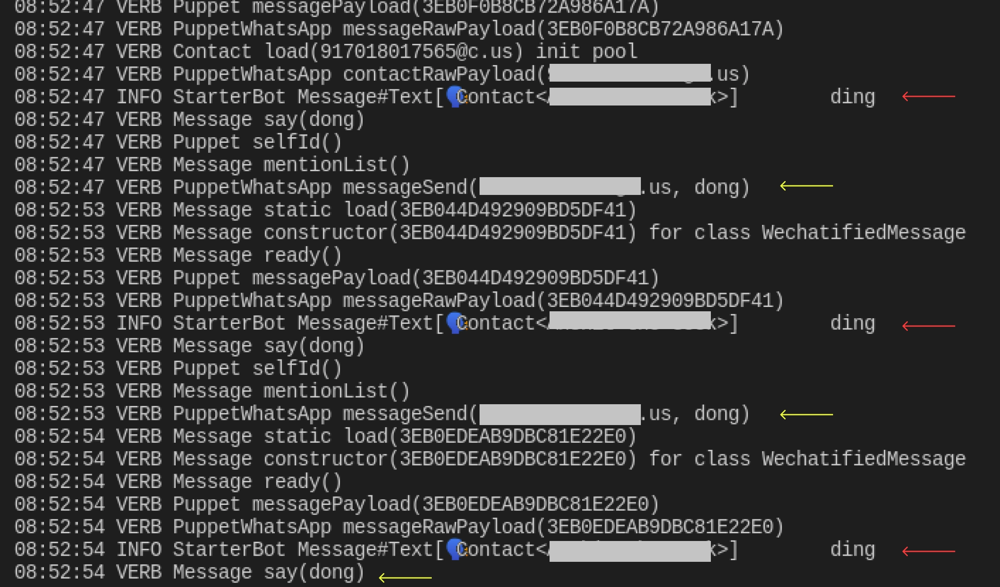

If you are total beginner to wechaty this tutorial will guide you how to run the [Ding Dong bot](https://github.com/wechaty/wechaty-getting-started/blob/master/examples/ding-dong-bot.ts) from the [Wechaty Getting Started](https://github.com/wechaty/wechaty-getting-started) GitHub repository directly on the browser using [Gitpod](https://gitpod.io/#https://github.com/wechaty/wechaty-getting-started).

Gitpod is an online and open source platform for automated and ready-to-code development environments.

Follow the steps below to get started:

1. **Click** the button below to access a complete setup of [Wechaty Getting Started](https://github.com/wechaty/wechaty-getting-started/blob/master/examples/ding-dong-bot.ts) **ding-dong BOT** project on gitpod.

  [![gitpod-link][gitpod_img]][gitpod_link]

  [gitpod_img]: https://img.shields.io/badge/Gitpod-Ready--to--Code-blue?logo=gitpod
  [gitpod_link]: https://gitpod.io/#https://github.com/wechaty/wechaty-getting-started

1. If you have never used gitpod before, you will be required to login using your gitHub account.

  

1. After logging in with your github account, you have to create a workspace by clicking on **New Workspace** button.

  

1. As the workspace loads, within no time it runs the ding dong bot.

  

1. Scan the generated QR code using **Wechat**.

1. For scanning the QR code with another puppet, quit the running code in terminal using `ctrl C` and run the command given below for using whatsapp.

  ```ts
  npm run start:whatsapp:web
  ```

1. Scan the generated QR code using **WhatsApp web** and test it with whatsapp. If it recieves a message ding, it replies with a dong as shown below.

  

1. The code for the ding-dong-bot is given inside `examples/ding-dong-bot.ts`. You can play more with the bot by editting `onMessage` function.
