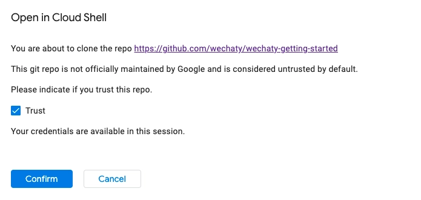
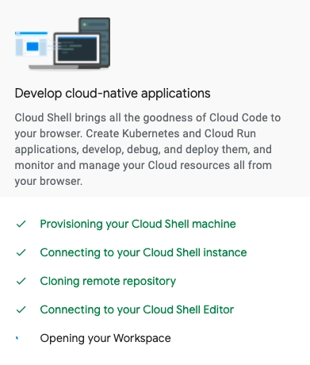
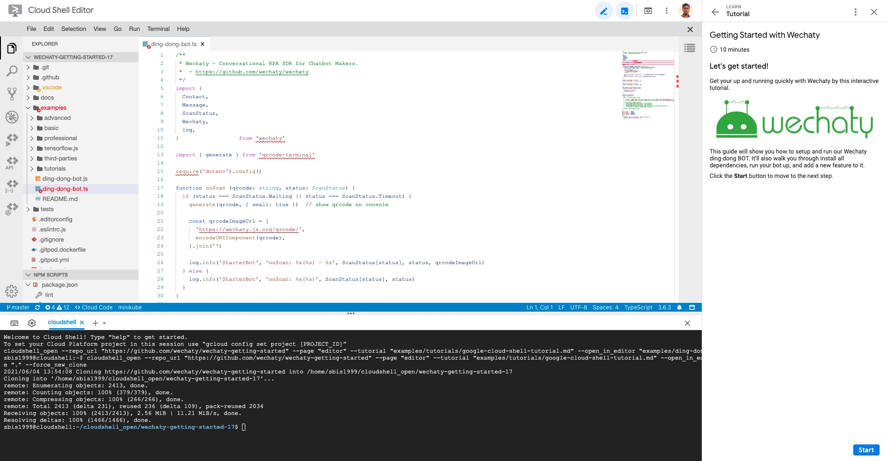

To get you started with Wechaty, this tutorial will guide you how to run the [Ding Dong bot](https://github.com/wechaty/wechaty-getting-started/blob/master/examples/ding-dong-bot.ts) from the [Wechaty Getting Started](https://github.com/wechaty/wechaty-getting-started) GitHub repository directly on the browser using **Google Cloud Shell** environment. It provides a step-by-step tutorial for running the bot along with an IDE.

You can follow the steps below to get started smoothly.

1. **Open** the Google Cloud Shell environment by clicking the button:

   [![Google Cloud Shell badge][shell_img]][shell_link]

   <!-- https://gstatic.com/cloudssh/images/open-btn.svg -->
   [shell_img]: https://img.shields.io/badge/%F0%9F%92%BB%20Google%20Cloud%20Shell-%3C%2F%3E-blue
   [shell_link]: https://ssh.cloud.google.com/cloudshell/editor?cloudshell_git_repo=https%3A%2F%2Fgithub.com%2Fwechaty%2Fwechaty-getting-started&cloudshell_open_in_editor=examples/ding-dong-bot.ts&cloudshell_workspace=.&cloudshell_tutorial=examples/tutorials/google-cloud-shell-tutorial.md

2. **Sign In** with a Google account. If already signed in then you will directly land on step 3.

3. **Trust** the git repository and click **Confirm**.

   

4. Wait for the cloud shell provisioning to complete.

   

5. After that you will see the **Cloud Shell Editor**, on the right panel is your step-by-step **guide**, and on the bottom you have the **terminal window**.

   

Now, you can follow the tutorial inside the cloud shell.

First it tells you about what Wechaty is, and then it guides you to run the Wechaty Ding Dong Bot and connect it with either **WeChat** or **WhatsApp**. It also has a section where you have to implement a new functionality in the bot and thereby giving you a better understanding how Wechaty bots work under the hood.

After completing this tutorial, you can continue and learn how to [run Wechaty locally](./../getting-started/running-locally.mdx) on your system.

> Learn more about Google Cloud Shell Tutorials for Wechaty from this [blog post](https://wechaty.js.org/2021/02/20/google-cloud-shell-tutorials/).
