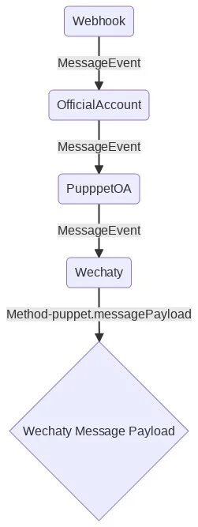

## What is Wechaty Puppet

The term `Puppet` in Wechaty is an Abstract Class for implementing protocol plugins. The plugins are the components that help the  Wechaty to control the IMs like WeChat.
The plugins are named `PuppetXXX`, like [PuppetPuppeteer](https://github.com/wechaty/wechaty-puppet-puppeteer) is using the [google puppeteer](https://github.com/GoogleChrome/puppeteer) to control the [WeChat Web API](https://wx.qq.com) via a chrome browser, [PuppetPadLocal](https://github.com/padlocal/wechaty-puppet-padlocal) is using the Pad Protocol to connect with WeChat Server.
For better understanding of the Puppet below are some links listed down:

- Puppet Providers Directory: <https://wechaty.js.org/docs/puppet-providers/>
- Puppet Compatibility Table: <https://wechaty.js.org/docs/puppet-services/compatibility/>
- Puppet Development Guide: <https://wechaty.js.org/docs/puppet-providers/diy>
- Puppet Related Links: <https://github.com/wechaty/wechaty-puppet/wiki/Links>
- Puppet Documentation: <https://wechaty.github.io/wechaty-puppet/typedoc/classes/puppet.html>

## Show me the code

For a deeper understanding of the Puppet in Wechaty, you can read its documentation from <https://wechaty.github.io/wechaty-puppet/typedoc/classes/puppet.html> and source code if you like at <https://github.com/wechaty/wechaty-puppet/blob/master/src/puppet.ts>
Below is an architectural diagram of Wechaty Puppet.


### Important Puppets

| Puppet Name     | Description                                                                                                                                                                                           |
|-----------------|------------------------------------------------------------------------------------------------------------------------------------------------------------------------------------------------------------------|
| PuppetPuppeteer | A web solution to connect WeChat, Wechaty init  is implemented by web WeChat, which injects JavaScript code into chrome.                                                                                         |
| PuppetMock      | A mock function to connect WeChat, not a real implementation, for testing other connectors to connect with Wechaty. This is used to further to connect other solutions, such as iPad, Xposed, iOS and windows client, |
| PuppetPadLocal  | An iPad solution to connect WeChat.                                                                                                                                                                            |
| PuppetService   | It is a gRPC solution.                                                                                                                                                                                  |

## Using Puppet with Wechaty Examples

1. Using [wechaty-puppet-mock](https://www.npmjs.com/package/wechaty-puppet-mock) to run [ding-dong-bot](https://github.com/wechaty/wechaty/blob/master/examples/ding-dong-bot.ts)

    ```sh
    WECHATY_PUPPET=wechaty-puppet-mock npm start
    ```

1. Using [wechaty-puppet-padpro](https://www.npmjs.com/package/wechaty-puppet-padpro) to run [ding-dong-bot](https://github.com/wechaty/wechaty/blob/master/examples/ding-dong-bot.ts)

    ```sh
    WECHATY_PUPPET=wechaty-puppet-padpro npm start
    ```

## Basic Rules

Here are some rules that a Wechaty Puppet should follow:

1. **Emit Self Messages**: when the bot says anything, the bot should receive a message said by itself. (and the `message.self()` will return true for this message)
2. **Perfect Logout**: `logout` method should clean all the user session data from the puppet service, and the status of the App on the phone should display correctly (not log in on any devices).
3. **State-less Session Management** (with MemoryCard support): the puppet service should save the user session data to the memory card, and can be restored from the memory card.
4. **MIME File Name Extension Convention**: FileBoxChunk.name must be able to convert to a MIME type and visa versa. The puppet needs to set the name with the right extension (.jpg, .pdf, etc) to the name of the file box. [See](https://github.com/wechaty/wechaty-puppet-hostie/discussions/115),
[See](https://github.com/wechaty/puppet-services/discussions/54)

## MemoryCard

When a Wechaty bot is logged in, it will have a authorized secret data to store logged-in session, for example, the device information (62 data for pad protocol), the cookie (if you are using the web protocol), and the user session secrets, etc.

The [memory card](https://github.com/huan/memory-card) is a module designed to store those data.

### Wechaty bot login with memory card module

1. wechaty start()
2. wechaty instanciates memory card (see [wechaty.ts:start()](https://github.com/wechaty/wechaty/blob/30c446b2b78c92166a1d613952e77d3e3fdbbe1f/src/wechaty.ts#L681))
3. wechaty set memory card to puppet (see [wechaty.ts:initPuppet()](https://github.com/wechaty/wechaty/blob/30c446b2b78c92166a1d613952e77d3e3fdbbe1f/src/wechaty.ts#L406))
    a. puppet start()
    b. puppet load session from memory card
    c. puppet logged in
        i. by loaded session, or
        ii. by scan qr code
    d. puppet save the session secret data to memory card
4. memory card will be saved to file or network storage for future reuse.

By saving the user login session secret data to memory card, the Wechaty system can save the state to local, so that it can make the puppet service provider stateless.
Currently neither of the Donut, WXWork, Rock, PadLocal have support for this stateless feature, nor the Wechaty system is ready for it.

## Event Order

The order of events before the bot starts is very important and this section explains it in a a detailed manner:

1. When you first start the bot, the `login` event is first  generated.
2. However, the Wechaty system needs to load the contact payload of the `userSelf` before it emits the `login` event because the login event of Wechaty needs to take a `userSelf` instance.So there will be some delay before the Wechaty emit the `login` event after it received the `login` event from its puppet.
3. Then the `ready-ed` event is generated.The event is generated just before the `ready` event.
4. Then lastly the `ready` event is generated.

For a more robust Wechaty system, we can consider saving the `ready` event if the `login` event is not emitted in Wechaty and when we emit the `login` event in Wechaty, we can check if the puppet has already `ready-ed`, and if so, it can emit the `ready` event right after the `login` event.[See](https://github.com/wechaty/puppet-services/issues/31)

## Event: `ready`

Need to fire `ready` event after the bot logined and all data has been synced.

> For example, after we re-installed the WeChat app on our phone, it has to load contacts/rooms from the server for a long time.
[check](https://github.com/wechaty/wechaty-puppet-service/issues/18)

## Payload Cache Management

1. If the low-level puppet wants to dirty a payload, emit a `dirty` event. The payload will be the `type` and the `id` of the paload
1. If the high-level puppet wants to dirty a payload, call `dirtyPayload(type, id)` method, what it does (and only does) is to make the low-level puppet emit a `dirty` event.
1. Each puppet should listen to the `dirty` event, and call `XXXPayloadDirty(id)` to purge the internal cache of the specific payload inside itself
Related issues:

- [Specification for dirty event, dirtyPayload(), and `XXXPayloadDirty() to puppet abstraction, puppet implementation, puppet server, and puppet client. wechaty/wechaty-puppet-service#164](https://github.com/wechaty/wechaty-puppet-service/issues/164)
- [No contactPayloadDirty method in puppet-implementation. wechaty/wechaty-puppet-service#43](https://github.com/wechaty/wechaty-puppet-service/issues/43)
- [add dirty rpc function definition for sync data wechaty/grpc#79](https://github.com/wechaty/grpc/pull/79)

## Event: `heartbeat`

Puppet must emit heartbeats to provide a health check signal.

### The `heartbeat` design

Here are the details:

1. Wechaty Puppet is designed to emit at least one event in 60 seconds. If we do not have any events to emit, then we need to emit a `heartbeat` event so that it can prove itself as alive and healthy. [See](https://github.com/wechaty/wechaty-puppet/blob/bab9e29c088c33fa8bc6e148d9bdadbd453fd138/src/puppet.ts#L253-L254)
2. It seems that the PadLocal does not have any `heartbeat` event to emit when there are no other events, so if your bot idle for more than 60 seconds, then the Wechaty Puppet system will think the puppet provider is dead, so it will call `reset` to try to recover the puppet.

A leaking of `heartbeat` example logs:

```sh
02:00:13 INFO StarterBot Message#Text[🗣Contact<OssChat>@👥Room<ChatOps - Heartbeat 💖>] [太阳]

02:01:13 WARN Puppet dogReset() reason: {"data":"onGrpcStreamEvent(EVENT_TYPE_MESSAGE)","timeout":60000}
02:01:13 VERB Puppet reset(onGrpcStreamEvent(EVENT_TYPE_MESSAGE))
02:01:13 VERB PuppetService stop()
02:01:13 VERB StateSwitch <PuppetService> off(pending) <- (false)
02:01:13 VERB PuppetService stopGrpcStream()
02:01:13 VERB PuppetService stopGrpcClient()
02:01:13 VERB Puppet selfId()
02:01:13 VERB StateSwitch <PuppetService> off(true) <- (pending)
02:01:13 INFO StarterBot Contact<Mike (李卓桓)> logout
02:01:13 VERB PuppetService start()
02:01:13 VERB StateSwitch <PuppetService> on(pending) <- (false)
02:01:13 VERB PuppetService startGrpcClient()
02:01:13 VERB PuppetService discoverServiceIp(e49007b7-7523-4a80-bfdb-1be0de3844b9)
02:01:14 VERB PuppetService startGrpcStream()
02:01:14 VERB StateSwitch <PuppetService> on(true) <- (pending)
02:01:14 VERB PuppetService onGrpcStreamEvent({type:EVENT_TYPE_LOGIN(25), payload:"{"contactId":"wxid_a8d806dzznm822"}"})
02:01:14 INFO StarterBot Contact<Mike (李卓桓)> login
02:01:15 VERB PuppetService onGrpcStreamEvent({type:EVENT_TYPE_READY(23), payload:"{"data":"ready"}"})
02:01:15 VERB StateSwitch <WechatyReady> on(true) <- (true)
02:01:20 VERB PuppetService onGrpcStreamEvent({type:EVENT_TYPE_READY(23), payload:"{"data":"ready"}"})
02:01:20 VERB StateSwitch <WechatyReady> on(true) <- (true)
```

### `heartbeat` Example

Here's an [example](https://github.com/wechaty/wechaty-puppet-puppeteer/blob/07f6260b3784c65bcee24bd003aac5d2968a9efc/src/wechaty-bro.js#L103-L112) from our puppeteer puppet, which emits heartbeats in the browser, so if the browser dead, we will get to know because the heartbeat will be lost.Also check out the docs on [Heartbeat Plugin](https://wechaty.js.org/docs/using-plugin-with-wechaty/heartbeat).

[Check the link](https://github.com/wechaty/puppet-services/issues/85#issuecomment-769967606).

### Important Links

Please refer to the below links for more information on different methods of Message class:

- [message material in official-account](https://developers.weixin.qq.com/doc/offiaccount/Asset_Management/New_temporary_materials.html)
- [sendFile method](https://github.com/wechaty/wechaty-puppet-official-account/blob/master/src/official-account/official-account.ts#L299)
- [messageSend method](https://github.com/wechaty/wechaty-puppet-official-account/blob/master/src/puppet-oa.ts#L495)

Wechaty now support very limited Message types for more information [check here](https://github.com/wechaty/wechaty-puppet-official-account/blob/381ffb820fcc63e4b89a99c433b696e790e06b7a/src/official-account/webhook.ts#L241-L244)
In order to support receiving more message types, like audio, [look here](https://github.com/wechaty/wechaty-puppet-official-account/blob/381ffb820fcc63e4b89a99c433b696e790e06b7a/src/official-account/webhook.ts#L247-L252)
> Also note that **Video** type Message is not supported right now by Wechaty.

### Wechaty Puppet Message Processing Flow

1. The Webhook gets called by the Tencent Server.
2. The message **event** will be propagated from the `Webhook` class to the `OfficialAccount` class:

    <https://github.com/wechaty/wechaty-puppet-official-account/blob/381ffb820fcc63e4b89a99c433b696e790e06b7a/src/official-account/official-account.ts#L116-L119>

3. The message **event** will be propagated from the `OfficialAccount` class to the `PuppetOA` class:

    <https://github.com/wechaty/wechaty-puppet-official-account/blob/381ffb820fcc63e4b89a99c433b696e790e06b7a/src/puppet-oa.ts#L188-L189>

4. After message **event** be propagated from the PuppetOA to Wechaty, then the [puppet.messagePayload()](https://github.com/wechaty/wechaty-puppet/blob/763e94194fd1104007fccad4ba4994365890cde8/src/puppet.ts#L834) will be called to get the [Wechaty Message Payload](https://github.com/wechaty/wechaty-puppet/blob/763e94194fd1104007fccad4ba4994365890cde8/src/schemas/message.ts#L103).  Here is the most important part: we need to construct a Wechaty Message Payload from the Raw Message Payload (source code at [here](https://github.com/wechaty/wechaty-puppet/blob/763e94194fd1104007fccad4ba4994365890cde8/src/puppet.ts#L854-L855)):

 ```ts
    const rawPayload = await this.messageRawPayload(messageId)
    const payload    = await this.messageRawPayloadParser(rawPayload)
 ````


### Future Enhancements

 Futute enhancements can be to  add more types of Message that Wechaty can support by implementing the `messageRawPayload` methods, which can be [found here](https://github.com/wechaty/wechaty-puppet-official-account/blob/381ffb820fcc63e4b89a99c433b696e790e06b7a/src/puppet-oa.ts#L456-L478) and also check out this [link](https://github.com/wechaty/wechaty-puppet-official-account/issues/19) for more information.

### Wechaty Puppet Uses

#### `Ding`/`Dong` Protocol

Ding dong protocol is a rule built using the Puppet which has a API named `ding(data: string): void`, and the Puppet has the following functionality:

1. emit a `dong` event when the `ding()` method has been called
2. the payload of the `dong` event might contains a `data` key with the value exactly match the `data` when calling the `ding()` method.

For further information about the  uses Ding dong protocol check out [Ding Dong Bot](https://wechaty.js.org/docs/examples/basic/ding-dong-bot)

### Learn More

- Puppet Related Links: [https://github.com/wechaty/wechaty-puppet/wiki/Links](https://github.com/wechaty/wechaty-puppet/wiki/Links)

## Important Tips

- [ ] `wechaty-puppet` is not a dependency. It should be put in devDependencies and peerDependencies
- [ ] `wechaty` is not a dependency. It should be put in devDependencies and peerDependencies
- [ ] must exist `examples/ding-dong-bot.ts` to implement the ding/dong logic, use puppet API only.
