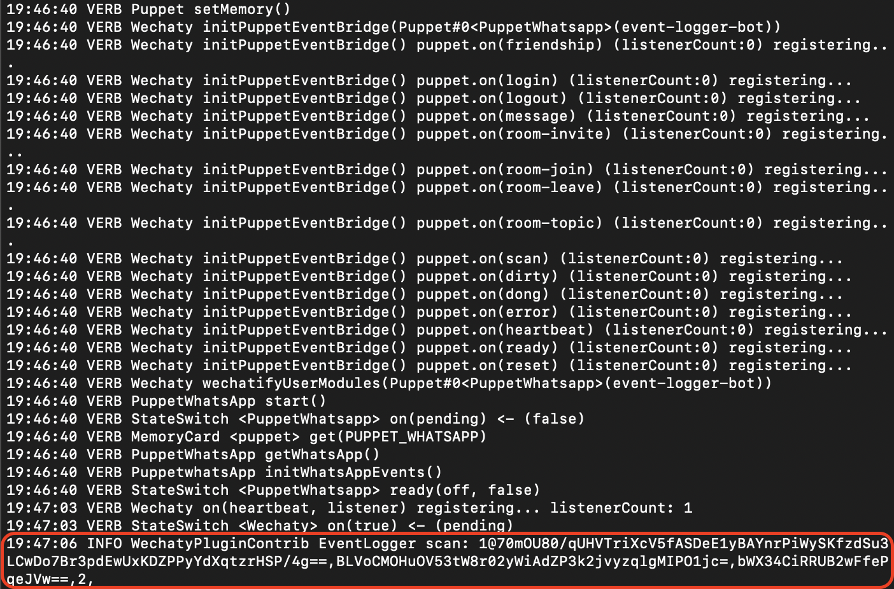

The `EventLogger` plugin helps in logging Wechaty events with just one line of code. In this tutorial, you will build a simple Wechaty bot and learn how to add the `EventLogger` plugin to it.

## Requirements

1. [Node.js](https://nodejs.org/en/download) v12+
2. [Wechaty](https://www.npmjs.com/package/wechaty) v0.40+
3. [Wechaty Plugin Contrib](https://www.npmjs.com/package/wechaty-plugin-contrib)

## Getting started

You will require `Node.js` version **12.0** or greater in order to follow this tutorial. You can verify whether `Node.js` is installed on your system or whether you have the correct version using the command:

```sh
node -v
```

If you do not have `Node.js` installed or your version is below requirement, get the latest version of `Node.js` by following the links below:

:::note Node.js installation docs

* [Windows](https://nodejs.org/en/download/package-manager/#windows)
* [Linux\(Debian/Ubuntu\)](https://nodejs.org/en/download/package-manager/#debian-and-ubuntu-based-linux-distributions)
* [macOS](https://nodejs.org/en/download/package-manager/#macos)

> Installation guide for `Node.js` on other platforms can be found [here](https://nodejs.org/en/download/package-manager/).

:::

## Creating a simple bot

We will create a simple Wechaty bot for demonstrating how to add the plugin to it. Follow the steps below:

### 1. Initialize project

Create a new folder called `event-logger-bot` and move into the directory:

```sh
mkdir event-logger-bot
cd event-logger-bot
```

Use the following command to initialize a NPM project:

```sh
npm init -y
```

This will generate a `package.json` file containing these:

```json
{
  "name": "event-logger-bot",
  "version": "1.0.0",
  "description": "",
  "main": "index.js",
  "scripts": {
    "test": "echo \"Error: no test specified\" && exit 1"
  },
  "keywords": [],
  "author": "",
  "license": "ISC"
}
```

### 2. Add dependencies

First of all, add the `wechaty` dependency to the `package.json` file:

```json
"dependencies": {
  "wechaty": "^0.62.3"
}
```

For integrating the bot with any instant messaging (IM) systems (such as WeChat, WhatsApp, and Gitter), you have to add the respective [Wechaty Puppet](https://wechaty.js.org/docs/puppet-providers/) under `devDependencies`:

```
"devDependencies": {
  "wechaty-puppet-mock": "^0.28.2",
  "wechaty-puppet-wechat": "^0.28",
  "wechaty-puppet-wechat4u": "^0.18",
  "wechaty-puppet-whatsapp": "0.2.3"
}
```

> You can add only the puppets that you need for using the bot.

At this point the `package.json` file will look like this (a few more required dependencies are added):

```json
{
  "name": "event-logger-bot",
  "version": "1.0.0",
  "description": "",
  "main": "index.js",
  "scripts": {
    "start": "ts-node event-logger-bot.ts"
  },
  "keywords": [],
  "author": "",
  "license": "ISC",
  "dependencies": {
    "wechaty": "^0.62.3"
  },
  "devDependencies": {
    "@chatie/eslint-config": "^0.12.4",
    "@chatie/git-scripts": "^0.6.2",
    "@chatie/tsconfig": "^0.17.1",
    "check-node-version": "^4.1.0",
    "ts-node": "^10.0.0",
    "wechaty-puppet-whatsapp": "0.2.3"
  }
}
```

### 3. Install dependencies

Before proceeding further, you should install the dependencies that we just specified in the `package.json` file. Run the following command from the root directory:

```sh
npm install
```

This will generate a `node_modules` directory containing all the installed dependencies, and a `package-lock.json` file.

### 4. Writing code for bot

Create a new file called `event-logger-bot.ts` in the root project directory. Add the following to the file:

```ts
// Importing the Wechaty npm package
import { Wechaty } from 'wechaty'

// Initializing the bot
const bot = new Wechaty({
    name: 'event-logger-bot',
})

// Starting the bot
bot.start()
```

### 5. Running the bot

Before you can run the bot, you have to update the `scripts` present in the `package.json` file. You have to specify the `start` key with the command to run the TypeScript file, like this:

```json
"scripts": {
  "start": "ts-node event-logger-bot.ts"
},
```

In order to run the bot, first you have to **export/set** an environment variable with the type of puppet to use and then run the bot:

#### Linux/macOS

```bash
export WECHATY_LOG=verbose
export WECHATY_PUPPET=wechaty-puppet-wechat
# If you want to use WhatsApp
# export WECHATY_PUPPET=wechaty-puppet-whatsapp
npm start
```

#### Windows

```bash
set WECHATY_LOG=verbose
set WECHATY_PUPPET=wechaty-puppet-wechat
# If you want to use WhatsApp
# set WECHATY_PUPPET=wechaty-puppet-whatsapp
npm start
```

## Using EventLogger plugin

Now, we will add the `EventLogger` plugin to the Wechaty bot that we just created. Follow the steps below:

### 1. Add dependency

As the `EventLogger` plugin is present in the `wechaty-plugin-contrib` NPM package, you have to first add it to the dependencies. It can be installed using the following command:

```sh
npm i wechaty-plugin-contrib
```

### 2. Integrating the plugin

Inside the `event-logger-bot.ts` file, import the plugin:

```ts
import { EventLogger } from 'wechaty-plugin-contrib'
```

Now, just before starting the bot, you can use this plugin:

```ts
// Add the following line to use the plugin
bot.use(EventLogger())
bot.start()
```

Congratulations, You have successfully integrated the `EventLogger` plugin to your Wechaty bot. If you run the bot it will start logging the events:



## Conclusion

You can apply a similar concept to add the `EventLogger` plugin to any of your Wechaty bots. You can learn more about this plugin [here](https://github.com/wechaty/wechaty-plugin-contrib#2-eventlogger).

Learn how to integrate [QR Code Terminal Plugin](./qr-code-terminal) to your Wechaty bot in the next tutorial.

## References

* [GitHub repository of Wechaty Plugin Contrib](https://github.com/wechaty/wechaty-plugin-contrib)
* [NPM package of Wechaty Plugin Contrib](https://www.npmjs.com/package/wechaty-plugin-contrib)
