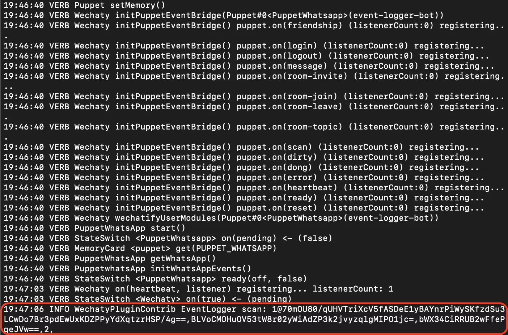

<!-- MDX import -->
import Tabs     from '@theme/Tabs'
import TabItem  from '@theme/TabItem'

import ShortestChatbots from '../polyglot/transclusions/shortest-chatbots.mdx'


The `EventLogger` plugin helps in logging Wechaty events with just one line of code. In this tutorial, you will learn how to add the `EventLogger` plugin to a Wechaty bot.

## Requirements

1. [Node.js](https://nodejs.org/en/download) v12+
2. [Wechaty](https://www.npmjs.com/package/wechaty) v0.40+
3. [Wechaty Plugin Contrib](https://www.npmjs.com/package/wechaty-plugin-contrib)

## Getting started

You will require `Node.js` version **12.0** or greater in order to follow this tutorial. You can verify whether `Node.js` is installed on your system or whether you have the correct version using the command:

```sh
node -v
```

If you do not have `Node.js` installed or your version is below requirement, get the latest version of `Node.js` by following the links below:

:::note Node.js installation docs

* [Windows](https://nodejs.org/en/download/package-manager/#windows)
* [Linux\(Debian/Ubuntu\)](https://nodejs.org/en/download/package-manager/#debian-and-ubuntu-based-linux-distributions)
* [macOS](https://nodejs.org/en/download/package-manager/#macos)

> Installation guide for `Node.js` on other platforms can be found [here](https://nodejs.org/en/download/package-manager/).

:::

## Adding Event Logger plugin

For the demonstration of adding this plugin, we will use the **Starter Bot** and show you how to add the `EventLogger` plugin to it. Follow the steps below:

### 1. Create a starter bot

Follow the instructions on the **[Starter Bot](../examples/basic/starter-bot)** page to create the foundation of a Wechaty bot.

### 2. Install dependency

As the `EventLogger` plugin is present in the `wechaty-plugin-contrib` NPM package, you have to first add it to the dependencies. It can be installed using the following command:

```sh
npm i wechaty-plugin-contrib
```

### 3. Integrate the plugin

Inside the `event-logger-bot.ts` file, import the plugin:

```ts
import { EventLogger } from 'wechaty-plugin-contrib'
```

Now, just before starting the bot, you can use this plugin:

```ts
// Add the following line to use the plugin
bot.use(EventLogger())
bot.start()
```

### 4. Run the bot

In order to run the bot, first you have to **export/set** an environment variable with the type of puppet to use, and then start the bot:

<Tabs
  groupId="operating-systems"
  defaultValue="linux"
  values={[
    { label: 'Linux',   value: 'linux', },
    { label: 'macOS',   value: 'mac', },
    { label: 'Windows', value: 'windows', },
  ]
}>

<TabItem value="linux">

```bash
export WECHATY_LOG=verbose
export WECHATY_PUPPET=wechaty-puppet-wechat
make bot
# the above is equals to the below command:
# npm start
#   or, npx ts-node examples/ding-dong-bot.ts
```

</TabItem>
<TabItem value="mac">

```bash
export WECHATY_LOG=verbose
export WECHATY_PUPPET=wechaty-puppet-wechat
make bot
# the above is equals to the below command:
# npm start
#   or, npx ts-node examples/ding-dong-bot.ts
```

</TabItem>
<TabItem value="windows">

```bash
set WECHATY_LOG=verbose
set WECHATY_PUPPET=wechaty-puppet-wechat
make bot
# the above is equals to the below command:
# npm start
#   or, npx ts-node examples/ding-dong-bot.ts
```

</TabItem>
</Tabs>



Congratulations! You have successfully integrated the `EventLogger` plugin to your Wechaty bot. You will see after running the bot, it starts logging the Wechaty events.

## Conclusion

You can apply a similar concept to add the `EventLogger` plugin to any of your Wechaty bots. You can learn more about this plugin [here](https://github.com/wechaty/wechaty-plugin-contrib#2-eventlogger).

Learn how to integrate [QR Code Terminal Plugin](./qr-code-terminal) to your Wechaty bot in the next tutorial.

## References

* [GitHub repository of Wechaty Plugin Contrib](https://github.com/wechaty/wechaty-plugin-contrib)
* [NPM package of Wechaty Plugin Contrib](https://www.npmjs.com/package/wechaty-plugin-contrib)
* [Wechaty plugin launch video](https://www.youtube.com/watch?v=tfGZXoe_aA4)
