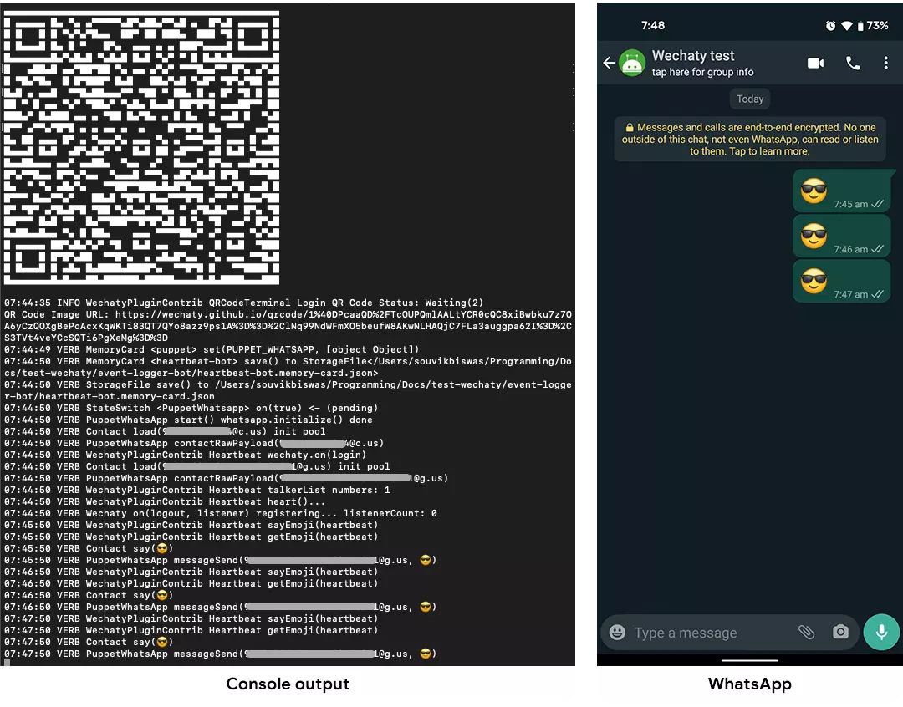

<!-- MDX import -->
import Tabs     from '@theme/Tabs'
import TabItem  from '@theme/TabItem'

import ShortestChatbots from '../polyglot/transclusions/shortest-chatbots.mdx'

[](https://github.com/Wechaty/wechaty)
[](https://github.com/wechaty/wechaty-plugin-contrib)
[](https://www.typescriptlang.org/)

The `Heartbeat` plugin helps to send emojis to a specified contact or group periodically. In this tutorial, you will learn how to add the `Heartbeat` plugin to a Wechaty bot.

## Requirements

1. [Node.js](https://nodejs.org/en/download) v12+
2. [Wechaty](https://www.npmjs.com/package/wechaty) v0.40+
3. [Wechaty Plugin Contrib](https://www.npmjs.com/package/wechaty-plugin-contrib)

## Getting started

You will require `Node.js` version **12.0** or greater in order to follow this tutorial. You can verify whether `Node.js` is installed on your system or whether you have the correct version using the command:

```sh
node -v
```

If you do not have `Node.js` installed or your version is below requirement, get the latest version of `Node.js` by following the links below:

:::note Node.js installation docs

* [Windows](https://nodejs.org/en/download/package-manager/#windows)
* [Linux\(Debian/Ubuntu\)](https://nodejs.org/en/download/package-manager/#debian-and-ubuntu-based-linux-distributions)
* [macOS](https://nodejs.org/en/download/package-manager/#macos)

> Installation guide for `Node.js` on other platforms can be found [here](https://nodejs.org/en/download/package-manager/).

:::

## Adding Heartbeat plugin

For the demonstration of adding this plugin, we will use the **Starter Bot** and show you how to add the `Heartbeat` plugin to it. Follow the steps below:

### 1. Create a starter bot

Follow the instructions on the **[Starter Bot](../examples/basic/starter-bot)** page to create the foundation of a Wechaty bot.

### 2. Install dependency

In order to use the `Heartbeat` plugin, you have to first add it to the dependencies. As it is present in the `wechaty-plugin-contrib` NPM package, you can install it using the following command.

```sh
npm i wechaty-plugin-contrib
```

### 3. Integrate the plugin

Import the plugin inside the `starter-bot.ts` file:

```ts
import { Heartbeat } from 'wechaty-plugin-contrib'
```

Define a variable called `config` where you can specify:

* `contact`: The contact of the person whom you want to send the emoji (default: **filehelper**)
* `emoji`: Define under `heartbeat`, the emoji to send [爱心] - Heartbeat emoji
* `intervalSeconds`: The time interval before sending an emoji (default: **1 hour**)

```ts
const config = {
    contact: 'filehelper', // contact who will receive the emoji
    emoji: {
        heartbeat: '😎', // the emoji to send
    },
    intervalSeconds: 60, // sends the emoji after an interval of 60 seconds
}
```

Now, just before starting the bot, you can use this plugin:

```ts
bot.use(
    Heartbeat(config),
)
bot.start()
```

### 4. Connect with app

You have to connect with **WeChat** or **WhatsApp** for sending the emojis to any contact. For that, you have to first generate a QR code.

Import the `QRCodeTerminal` plugin:

```ts
import { Heartbeat, QRCodeTerminal } from 'wechaty-plugin-contrib'
```

Use the plugin like this:

```ts
bot.use(
    Heartbeat(config),
    QRCodeTerminal({small: true}),
)
```

> You will get more information regarding the `QRCodeTerminal` plugin in the tutorial [here](./qr-code-terminal).

### 5. Run the bot

To run the bot, first you have to **export/set** an environment variable with the type of puppet to use, and then start the bot:

<Tabs
  groupId="operating-systems"
  defaultValue="linux"
  values={[
    { label: 'Linux',   value: 'linux', },
    { label: 'macOS',   value: 'mac', },
    { label: 'Windows', value: 'windows', },
  ]
}>

<TabItem value="linux">

```bash
export WECHATY_LOG=verbose
export WECHATY_PUPPET=wechaty-puppet-wechat
make bot
# the above is equals to the below command:
# npm start
#   or, npx ts-node examples/ding-dong-bot.ts
```

</TabItem>
<TabItem value="mac">

```bash
export WECHATY_LOG=verbose
export WECHATY_PUPPET=wechaty-puppet-wechat
make bot
# the above is equals to the below command:
# npm start
#   or, npx ts-node examples/ding-dong-bot.ts
```

</TabItem>
<TabItem value="windows">

```bash
set WECHATY_LOG=verbose
set WECHATY_PUPPET=wechaty-puppet-wechat
make bot
# the above is equals to the below command:
# npm start
#   or, npx ts-node examples/ding-dong-bot.ts
```

</TabItem>
</Tabs>

After running the bot, it will generate a QR code for **WeChat** or **WhatsApp** (as per the puppet you have used), scan it with the appropriate app, and the bot will now be connected to the app. You will notice that the bot sends the emoji to the specified contact periodically.



Congratulations! You have successfully integrated the `Heartbeat` plugin to your Wechaty bot.

## Conclusion

You can apply a similar concept to add the `Heartbeat` plugin to any of your Wechaty bots. You can learn more about this plugin [here](https://github.com/wechaty/wechaty-plugin-contrib#4-heartbeat).

## References

* [GitHub repository of Wechaty Plugin Contrib](https://github.com/wechaty/wechaty-plugin-contrib)
* [NPM package of Wechaty Plugin Contrib](https://www.npmjs.com/package/wechaty-plugin-contrib)
* [Wechaty plugin launch video](https://www.youtube.com/watch?v=tfGZXoe_aA4)
