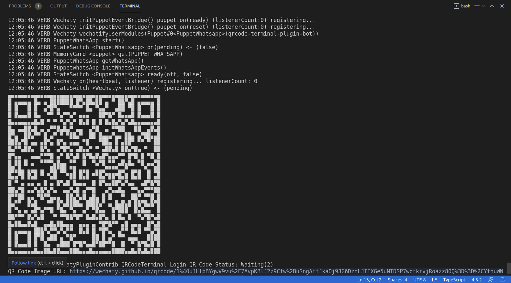

[](https://github.com/Wechaty/wechaty)
[](https://github.com/wechaty/wechaty-plugin-contrib)
[](https://www.typescriptlang.org/)

<!-- MDX import -->
import Tabs     from '@theme/Tabs'
import TabItem  from '@theme/TabItem'

`QR code terminal` plugin shows QR Code for scanning in terminal. In this tutorial you will learn how to integrate this plugin with a Wechaty bot.

## Requirements

1. [Node.js](https://nodejs.org/en/download) v12+
1. [Wechaty](https://www.npmjs.com/package/wechaty) v0.40+
1. [Wechaty Plugin Contrib](https://www.npmjs.com/package/wechaty-plugin-contrib)

## Getting started

You will require `Node.js` version **12.0** or greater in order to follow this tutorial. You can verify whether `Node.js` is installed on your system or whether you have the correct version using the command:

```sh
node -v
```

If you do not have `Node.js` installed or your version is below requirement, get the latest version of `Node.js` by following the links below:

:::note Node.js installation docs

- [Windows](https://nodejs.org/en/download/package-manager/#windows)
- [Linux\(Debian/Ubuntu\)](https://nodejs.org/en/download/package-manager/#debian-and-ubuntu-based-linux-distributions)
- [macOS](https://nodejs.org/en/download/package-manager/#macos)

> Installation guide for `Node.js` on other platforms can be found [here](https://nodejs.org/en/download/package-manager/).

:::

## Adding QR code terminal plugin

For adding this plugin, refer to **Starter Bot** for building a basic bot and then to add the `QR code terminal` plugin to it follow the steps below:

### 1. Create a starter bot

Follow the instructions on the **[Starter Bot](../examples/basic/starter-bot)** page to create the foundation of a Wechaty bot.

### 2. Add dependency

For using any plugin, you have to add `wechaty-plugin-contrib` NPM package to the dependencies using the following command:

```ts
npm i wechaty-plugin-contrib
```

### 3. Integrate the plugin

Inside `bot.ts` file, import the plugin:

```ts
import { QRCodeTerminal } from 'wechaty-plugin-contrib'
```

Define a `config` variable which can be used while starting the bot to make the QR code printed on terminal small.

```ts
const config = {
  small: true,   // default: false - the size of the printed QR Code in terminal
}
```

Now, before starting the bot, you can use this plugin:

```ts
bot.use(QRCodeTerminal(config))
bot.start()
```

### 4. Run the bot

Now, you are done with the integration of `QR code terminal plugin` with your bot. For running the bot you have to **export/set** an environment variable with the type of puppet to use and then run the bot.

<Tabs
  groupId="operating-systems"
  defaultValue="linux"
  values={[
    { label: 'Linux',   value: 'linux', },
    { label: 'macOS',   value: 'mac', },
    { label: 'Windows', value: 'windows', },
  ]
}>

<TabItem value="linux">

```bash
export WECHATY_LOG=verbose
export WECHATY_PUPPET=wechaty-puppet-wechat
# If you want to use WhatsApp
# export WECHATY_PUPPET=wechaty-puppet-whatsapp
npm start
```
</TabItem>
<TabItem value="mac">

```bash
export WECHATY_LOG=verbose
export WECHATY_PUPPET=wechaty-puppet-wechat
# If you want to use WhatsApp
# export WECHATY_PUPPET=wechaty-puppet-whatsapp
npm start
```
</TabItem>
<TabItem value="windows">

```bash
set WECHATY_LOG=verbose
set WECHATY_PUPPET=wechaty-puppet-wechat
# If you want to use WhatsApp
# set WECHATY_PUPPET=wechaty-puppet-whatsapp
npm start
```

</TabItem>
</Tabs>

Congratulations! you have successfully added `QR code terminal` plugin to your bot. On running the bot it will show a QR code on terminal.



## Conclusion

You can use this `QR code terminal` plugin for building the bots where you have to connect to a device. You can refer to [Ding Dong bot](../getting-started/running-locally.mdx). In ding dong bot you have to scan the generated QR code to connect to **Whatsapp/Wechat**.

## References

- [GitHub repository of Wechaty Plugin Contrib](https://github.com/wechaty/wechaty-plugin-contrib)
- [NPM package of Wechaty Plugin Contrib](https://www.npmjs.com/package/wechaty-plugin-contrib)
- [Wechaty Plugin Video Tutorial](https://youtu.be/tfGZXoe_aA4)
