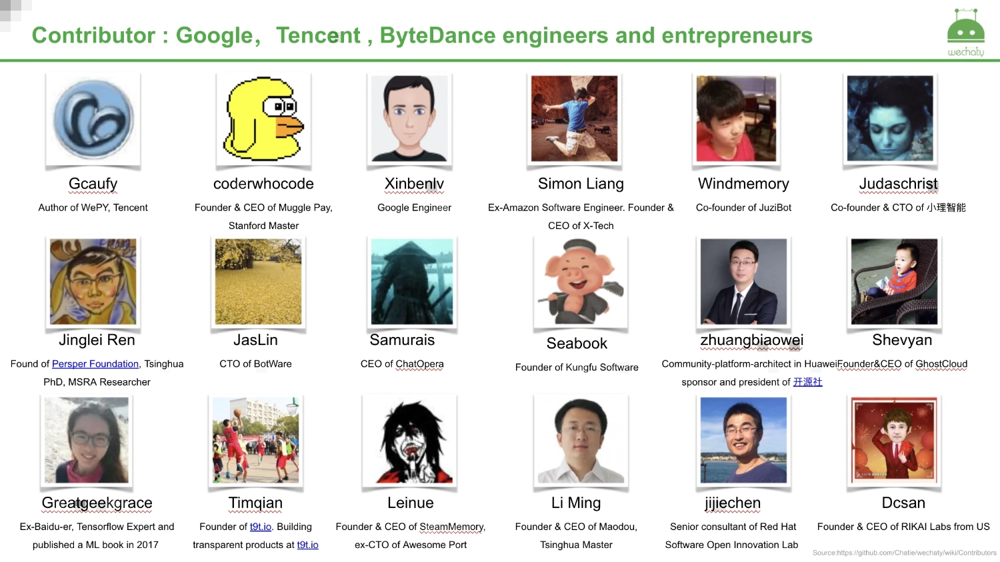

## Users of Wechaty

We have a diverse community of Wechaty contributors and users. The Wechaty users in our community mainly comprise of:

- Conversational AI developers
- Machine learning researchers
- Freelancers who are building chatbots for their clients
- Companies that are building commercial services on top of conversational automation

## Companies using Wechaty

Some of the companies that are currently using Wechaty include:

- **[Wechat](https://www.wechat.com/en/)** - is China's top free messaging and calling app that serves as a mobile internet
- **[BAIDU](http://www.baidu.com/)** - a Chinese multinational technology company specializing in Internet-related services, products, and artificial intelligence
- **[VIP.COM](https://www.vip.com/)** and **[JD.COM](https://global.jd.com/)** - famous online shops in China selling lifestyle goods
- **[Tencent](https://www.tencent.com/en-us/)** - a multinational technology conglomerate holding company, which also owns the widely used Wechat app
- **[Aliyun](https://eu.alibabacloud.com/en)** - is China's leading cloud provider, also known as Alibaba Cloud
- **[Meituan](https://www.meituan.com/)** - is a group-discount website which sells vouchers from merchants for deals and generates most of its revenue from mobile application services
- **[L'Oréal](https://www.loreal.com/en/)** - is a leading personal care and cosmetics company
- **[Xueersi](https://www.xueersi.com/)** - a Beijing-based educational training site focused on primary and middle school students
- **[58 Tongcheng](https://by.58.com/)** - is China's leading life service platform which provides different types of services such as recruitment, domestic, and rental services
- **[Plug And Play](https://www.plugandplaytechcenter.com/)** - is the world's largest early-stage investor, accelerator, and corporate innovation platform
- **[Y Combinator](https://www.ycombinator.com/)** - is a venture capitalist that provides seed funding for startups
- **Google，Tencent, ByteDance engineers and entrepreneurs**
  

## Voice of developers

> "Wechaty is a great solution, I believe there would be much more users recognize it." [link](https://github.com/Wechaty/wechaty/pull/310#issuecomment-285574472)  
> &mdash; <cite>@Gcaufy, Tencent Engineer, Author of [WePY](https://github.com/Tencent/wepy)</cite>
>
> "太好用，好用的想哭"  
> &mdash; <cite>@xinbenlv, Google Engineer, Founder of HaoShiYou.org</cite>
>
> "最好的微信开发库" [link](http://weibo.com/3296245513/Ec4iNp9Ld?type=comment)  
> &mdash; <cite>@Jarvis, Baidu Engineer</cite>
>
> "Wechaty 让运营人员更多的时间思考如何进行活动策划、留存用户，商业变现" [link](http://mp.weixin.qq.com/s/dWHAj8XtiKG-1fIS5Og79g)  
> &mdash; <cite>@lijiarui, Founder & CEO of Juzi.BOT.</cite>
>
> "If you know js ... try Wechaty, it's easy to use."  
> &mdash; <cite>@Urinx Uri Lee, Author of [WeixinBot(Python)](https://github.com/Urinx/WeixinBot)</cite>
>
> "Wechaty is a good project, I hope it can continue! Therefore, I became a contributors in open collective."  
> &mdash; <cite>[@Simple](https://github.com/mrwhh)</cite>

See more at [Wiki:Voice Of Developer](https://github.com/Wechaty/wechaty/wiki/Voice%20Of%20Developer)

If you are interested in using Wechaty, you are welcome to join our [community](https://gitter.im/wechaty/wechaty) of users and [developers](https://wechaty.js.org/contributors/). We are an inclusive and welcoming community.
If you are still not sure whether Wechaty can solve your problem or challenge, take a look at [what you can do with Wechaty](#link) section. Wechaty is evolving very fast. New Wechaty [puppets](puppet-services/overview.mdx) and [plugins](using-plugin-with-wechaty/overview.mdx) are being added by our dedicated community of developers. Feel free to ask. We shall be happy to help you.
