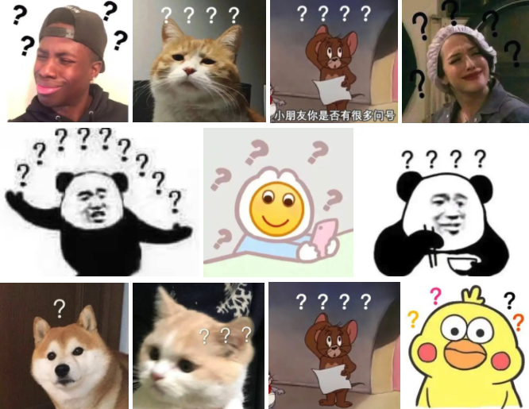

# 对话故事生成，创造自己的无限世界


如果可以，你最想穿越到哪部电影，小说里？

这次利用 paddlenlp 中提供的 GPT2 和 wechaty 库展开对话故事续写，与 AI 互动共同创造剧情

预先设置你想交互的世界场景，比如面对三体人的进攻，发挥你的脑洞输入你想到的任何动作或者剧情大纲，模型的续写保证让你赞(hei)不(ren)绝(wen)口(hao)



## 项目介绍
### 灵感来源

1. 无限恐怖
2. [AI Dungeon](https://play.aidungeon.io/main/home): 在地牢2中，玩家将接触到一个完全自由的虚拟世界。整个游戏世界，都将围绕着玩家的输入展开与续写，可谓真正的 Everything is in my hands 。
### 效果展示

* [AIStudio链接](https://aistudio.baidu.com/aistudio/projectdetail/2235967)

* [B站链接](https://www.bilibili.com/video/BV1Kg411E7PH)

 

## 安装依赖

```sh
pip install --upgrade paddlepaddle -i https://mirror.baidu.com/pypi/simple
pip install --upgrade paddlehub -i https://mirror.baidu.com/pypi/simple
pip install paddlenlp=2.0.7
pip install sentencepiece=0.1.92
```

### 注意事项
本 github 中代码直接使用了 `paddlenlp` 提供的预训练模型 `gpt-cpm-small-cn-distill `

在 AI Studio 中按照教安装 `paddlenlp==2.0.0rc14` 然后引入  `gpt2-base-cn` 可以体验更好的生成效果。

注：在新版本的 `paddlenlp 2.0.7` 中已经找不到 `gpt2-base-cn` 模型，本地运行还是推荐使用代码中的 `gpt-cpm-small-cn-distill`（阿巴阿巴），只有400M，加载迅速适合体验学习。

## 测试对话系统

只运行`world.py`，可以用命令行测试对话效果


```sh
python world.py
```

## wechaty网关

如果 token 是 padlocal 模式， 请先安装 docker 再按如下步骤启动网关

```sh
# docker下载 wechaty/wechaty 镜像
docker pull wechaty/wechaty

# 确保gateway.sh中是自己的token， 服务器对外开放相关端口
sudo ./gateway.sh
```
如果 token 是其他类型， 可以直接跳过上面步骤， 访问此链接返回ip地址和端口，确认启动成功

https://api.chatie.io/v0/hosties/xxx你的token

## 启动wechaty

网关启动成功并扫码登录之后，运行自己写的逻辑代码，监听聊天消息

请先把 `main.py` 中的 `msg.talker().name` 改成自己的微信昵称，不然收到任何消息都可能被模型回复

```sh
# 安装wachaty
pip install wechaty

# 确认main.py中环境变量替换成了自己的token，并且修改了发送者的用户昵称，然后启动
python main.py
```

enjoy it ！

## 关于我们

**欢迎对我们的研究方向感兴趣的同学加入我们的天津大学灵媒研究小组（LMc, Language and Mind computing)，一起用智能技术探寻语言和心灵的奥秘！**

**主页：** http://cic.tju.edu.cn/faculty/wangbo/index.htm

**研究方向：**

+ 智能对话与心理计算（人机对话基础技术，聊天机器人在心理测量与干预、个性化推荐和智能客服等领域的应用；基于计算方法的人物及群体性格与心理画像及干预）

+ 个性化推荐（面向信息、人物和对象的多类型个性化推荐技术研究与应用）

+ 自然语言处理（社会场景下的语义与观点自动化分析，基于语言的心理及社会关系自动化分析）


