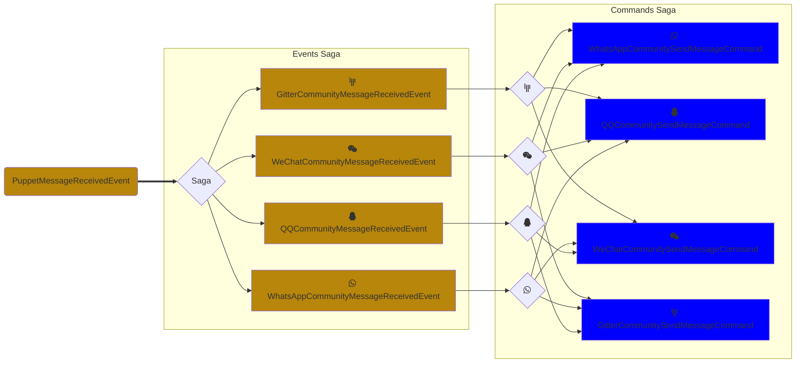
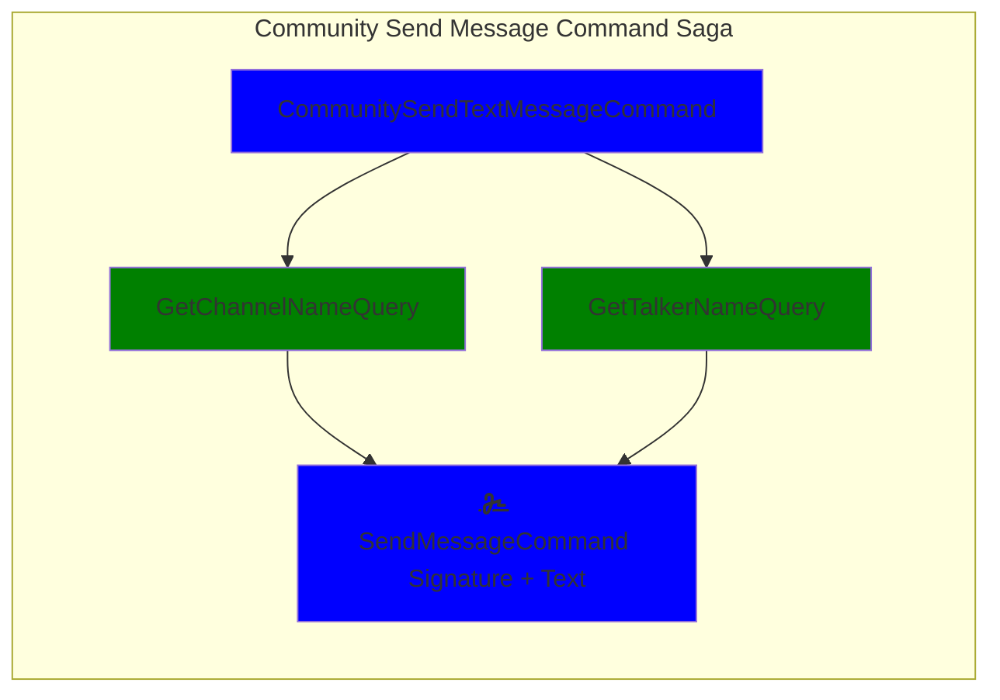
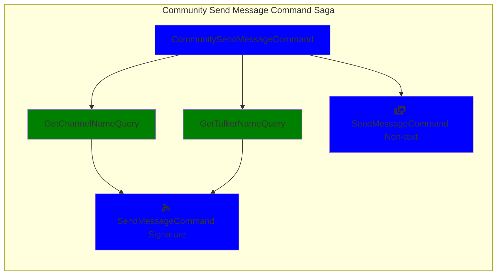
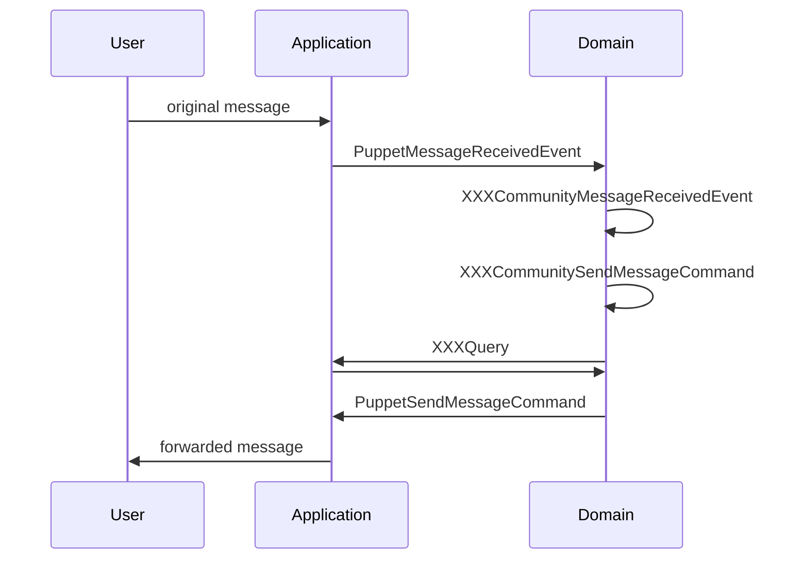

Friday BOT has been refactored to using [NestJS](https://nestjs.com/) framework, by following the [Domain-driven Design](https://medium.com/raa-labs/part-1-domain-driven-design-like-a-pro-f9e78d081f10) (DDD) and the [Command Query Responsibility Segregation](https://www.sderosiaux.com/articles/2019/08/29/cqrs-why-and-all-the-things-to-consider/) (CQRS) this week, by merging this HUGE(307 files changed) [Pull Request](https://github.com/wechaty/friday/pull/112):

## Background

For a long time, I'm planning to build Wechaty bot with an Event-Driven Architecture (EDA). The first EDA cloud service for Wechaty I have designed is the Wechaty token discovery service 5 years ago, it helps Wechaty instances to discover each other by their token, and make remote calls to each other by JSON-RPC payload, via a center WebSocket server provided by the community.

The most beautiful part of the EDA is that it can decouple the sub-systems, and make the system more flexible and scalable. In the past 5 years, I've built a lot of EDA services, like [@chatie/io server](https://github.com/Chatie/io) and [wechaty/io-client](https://github.com/wechaty/wechaty/blob/main/src/io.ts), I've learned a lot of things from them.

Besides the EDA, we are doing our best to make the Wechaty API to be concise and easy to be understand and use, by using the most intuitive names for all the APIs. We built a plugin layer based on the basic APIs, and the plugin layer successfully helps the Wechaty to be more flexible and scalable.

## The Friday BOT

[Friday BOT](https://github.com/wechaty/friday) is a Wechaty bot, which is in charge of help us to manage the community. It has lots of features, for example, the most basic features are automatically accept new friend requests, sending them a welcome message, and sending them a invitation to join the community chat room.

Some of more advanced features are:

1. Forward messages across the 20+ different chat rooms on multiple Instant Messaging (IM) platforms, current includes 10+ WeChat groups, one [Gitter channel](https://gitter.im/wechaty/wechaty), one QQ group, one WhatsApp group, with 3600+ developers.
1. Recognize the message with different languages like English and Chinese, and forward the message to the right chat room.
1. Help the [BOT5 Club](https://bot5.ml) to organize the seminar and meetup, in the WeChat room, with the power of the [bot5-assistant](https://github.com/wechaty/bot5-assistant) plugin.
1. Answer the FAQ in the chat room, with the power of the Azure Congnitive Service [QnAMaker plugin](https://github.com/wechaty/plugin-qnamaker).
1. Update the [chatie statuspage](https://chatie.statuspage.io/) to record the the community status.
1. Provide a [Math Master Game](https://github.com/wechaty/vorpal-contrib#4-mathmaster) powered by the [Wechaty Vorpal pugin](https://github.com/wechaty/vorpal)
1. Connect the Freshdesk & Intercom tickets to the Wechaty, with the power of the [Freshdesk plugin](https://github.com/wechaty/plugin-freshdesk) and [Intercom plugin](https://github.com/wechaty/plugin-intercom).
1. Provide a [Voting to Kickout plugin](https://github.com/gcaufy/wechaty-voteout) to kickout the bad guys in the community, by counting the thumb-down votes from the community.
1. and more ...

With Friday BOT get more and more features, the code base is growing, and the community is growing.

## Domain-driven Design (DDD)

> Image source: [DOMAIN-DRIVEN DESIGN: STRUCTURED MODELING OF COMPLEX SOFTWARE SYSTEMS IN BANKING](https://www.knowis.com/blog/domain-driven-design-structured-modeling-of-complex-software-systems-in-banking)

Domain Driven Design (DDD) is about mapping business domain concepts into software artifacts.

> &mdash; [InfoQ](https://www.infoq.com/articles/ddd-in-practice/)

In my understanding, the soul of DDD is a bridge to connect the business people with the software engineers, and make sure they are in the same page and talking about the same things, efficiently.

Some useful resources:

- [Design a DDD-oriented microservice](https://docs.microsoft.com/en-us/dotnet/architecture/microservices/microservice-ddd-cqrs-patterns/ddd-oriented-microservice)
- [Domain-Driven Design Starter Modelling Process](https://github.com/ddd-crew/ddd-starter-modelling-process)
- [Better Software Design with Application Layer Use Cases](https://khalilstemmler.com/articles/enterprise-typescript-nodejs/application-layer-use-cases/)
- [关于Akka在事件溯源的若干思考](http://galudisu.info/2018/12/21/pattern/ddd/event-sourcing-feedback/)

## Event Storming

> Source: [EventStorming Glossary & Cheat sheet](https://virtualddd.com/learning-ddd/ddd-crew-eventstorming-glossary-cheat-sheet)

[Event Storming](https://en.wikipedia.org/wiki/Event_storming) is a sprint workshop for a group of both business and engineer people who, together, to analyze the business domain by drawning events flows.

## Command Query Responsibility Segregation (CQRS)

> Source: [Introduction to CQRS and Event Sourcing](https://smartlabsblog.wordpress.com/2015/09/06/introduction-to-cqrs-and-event-sourcing-part-1/)

[Command Query Responsibility Segregation (CQRS)](https://martinfowler.com/bliki/CQRS.html) is a software architecture pattern that separates the command(write) and query(read) layers.

## NestJS

> Nest ([NestJS](https://nestjs.com/)) is a framework for building efficient, scalable Node.js server-side applications. It uses progressive TypeScript and combines elements of OOP (Object Oriented Programming), FP (Functional Programming), and FRP (Functional Reactive Programming).
>
> Nest provides an out-of-the-box application architecture which allows developers and teams to create highly testable, scalable, loosely coupled, and easily maintainable applications. The architecture is heavily inspired by Angular.

It has [Controlers](https://docs.nestjs.com/controllers) to handle the HTTP requests, [Providers](https://docs.nestjs.com/providers) to be injected as dependency (Inversify of Control, IOC), and [CQRS](https://docs.nestjs.com/recipes/cqrs) which works out-of-the-box.

## The New Architecture of Friday BOT

With Friday BOT version 1.13+ and the new architecture, we have modulized the system into a few modules, and we have a lot of features to support the new architecture.

### DDD Perspective

1. Repository: provide the `WeChat`, `WhatsApp`, `QQ`, `Gitter`, `OfficialAccount`, and `WXWork` Wechaty instances.
1. Model/AggregateRoot: each Wechaty instance is treated as a model/aggregate root.
1. Commands & Queries & Events: they are defined to support the business logic, and they are the core of the system.

#### Domain Saga: Event to Command

#### Text Message

#### Non-text Message

#### Application & Domain

### NestJS Perspective

> [Devopedia. 2022. "Dependency Injection." Version 5, February 15. Accessed 2022-02-15.](https://devopedia.org/dependency-injection)

1. Controller: The controller is the entry point of the HTTP sub-system.
1. Application: 3rd party APIs.
1. Core: business logics, such as `statuspage` and `sync-community-rooms`
1. Infrastructure: low-level supporting services, such as `EnvVar`, `finis`, etc.
1. WechatyEvents: the Event-driven architecture of Wechaty, such as `PuppetMessageReceivedEvent`, `PuppetMessageSentEvent`, etc.
1. WechatyRepository: provide the Wechaty instances.
1. WechatySettings: provide the settings from pre-defined properties and environment variables.
1. FridayModule: main module of Friday BOT, where the whole system is assembled.
1. Sagas: using RxJS to convert `Event` to `Command`s
1. Unit test: using `marble` to test the event streaming system

All the above modules are in the `src/` folder, they are working under the Inverse of Control (IOC) pattern powered by NestJS.

## Source Code

The source code of Friday BOT is available on [GitHub](https://github.com/wechaty/friday)

You can [join our Gitter](https://gitter.im/wechaty/wechaty) network if you aren’t already a member.
