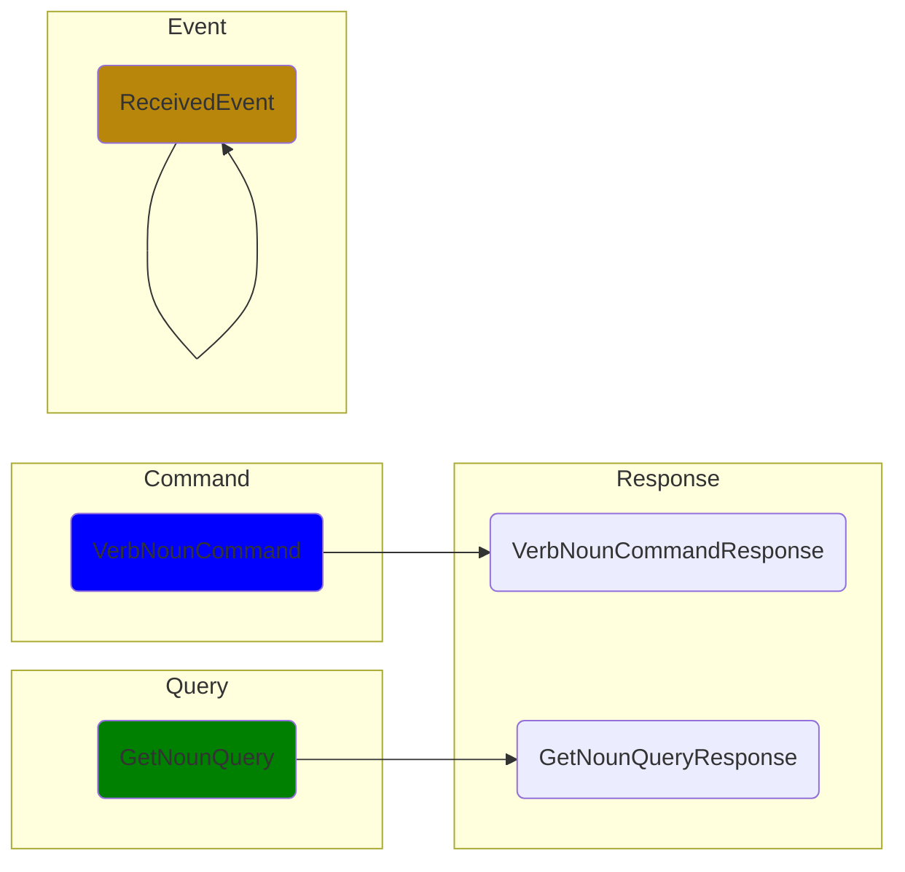
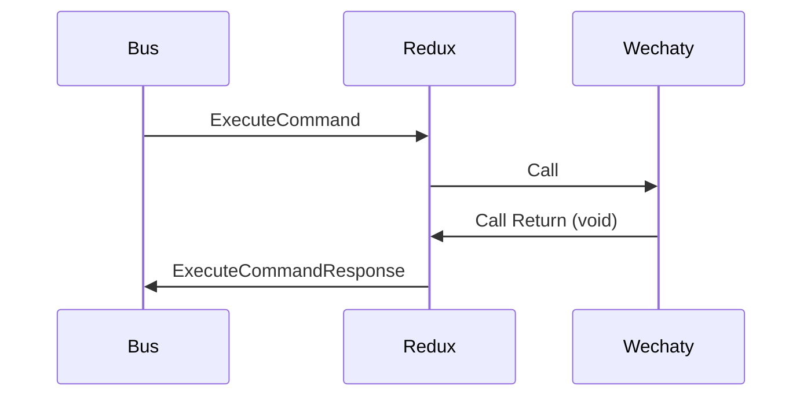
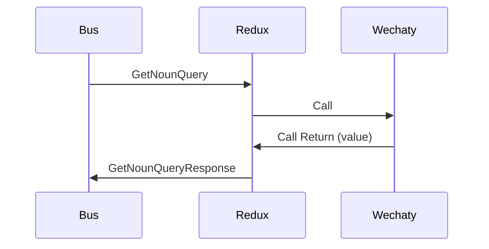
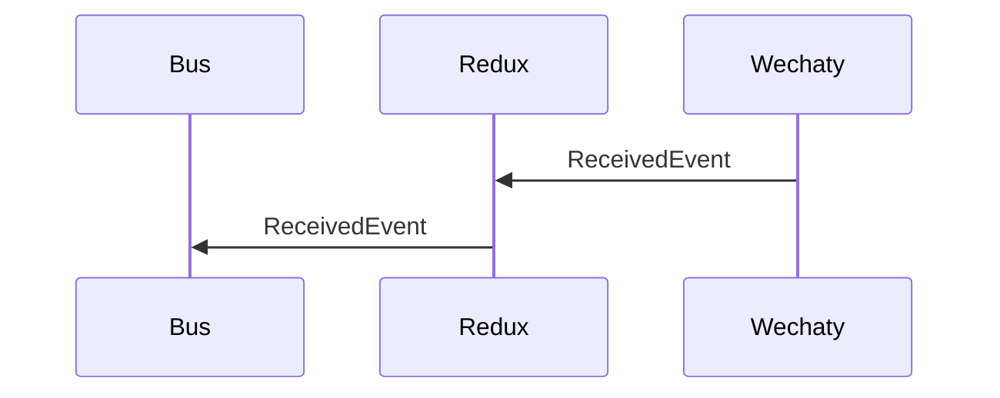

> Command Query Responsibility Segregation (CQRS) is a software architecture pattern that separates the command(write) and query(read) layers.  
> &mdash; [CQRS, Martin Fowler, 14 July 2011](https://martinfowler.com/bliki/CQRS.html)


> Image source: [CQRS (command query responsibility segregation)](https://www.techtarget.com/searchapparchitecture/definition/CQRS-command-query-responsibility-segregation)

## Wechaty CQRS

After we have refactored the Friday BOT to DDD/CQRS with NestJS (learn more from [this blog post](https://wechaty.js.org/2022/02/27/refactoring-friday-bot-with-nestjs-ddd-cqrs/)), we believe that the Wechaty ecosystem should support the CQRS pattern better.

So this is why we published the [wechaty-cqrs](https://npmjs.com/package/wechaty-cqrs) NPM module. ([GitHub Repo](https://github.com/wechaty/cqrs) & [API Reference](https://paka.dev/npm/wechaty-cqrs))

## Motivation

Can we use Wechaty by only sending / receiving the [Plain Old JavaScript Object (POJO)](https://masteringjs.io/tutorials/fundamentals/pojo)?

That's an Event-driven way, which will give us the following benifites:

1. Better integration with Domain-driven Design (DDD)
1. Decouple the sub-systems with the Wechaty instance completely
1. Enable using Wechaty with Microservices
1. Make it possible for providing an API endpoint with JSON request/responses
1. etc.

So we decided to support the  Event-driven Architecture
by enabling the Event-driven Programming with Wechaty
by publishing the [wechaty-cqrs](https://npmjs.com/package/wechaty-cqrs) NPM module.

## Features

1. Convert Wechaty instance to a messaging `bus$` with the `from()` function.
1. Well-defined `commands`, `queries`, `responses`, and `events` payload creators.
1. A great `execute$()` helper function for sending the events to the bus and get back the response.
1. Well-defined `events$` for the Wechaty events
1. Well-defined `sayables` for build all the message contents
1. Static typing with TypeScript with all events & streams
1. Working perfect with the powerful RxJS

## Usage

### Install

```sh
npm install wechaty-cqrs wechaty
```

### Quick start

Here's the CQRS version of the Wechaty ding/dong bot:

```ts
import * as CQRS    from 'wechaty-cqrs'
import * as WECHATY from 'wechaty'
import { filter, map, mergeMap }  from 'rxjs/operators'

const wechaty = WECHATY.WechatyBuilder.build()
await wechaty.init()

const bus$ = CQRS.from(wechaty)

bus$.pipe(
  filter(CQRS.isActionOf(CQRS.actions.messageReceivedEvent)),
  // MessageReceivedEvent -> Sayable
  map(messageId => CQRS.duck.actions.getSayablePayloadQuery(
    messageReceivedEvent.meta.puppetId,
    messageId,
  )),
  mergeMap(CQRS.execute$(bus$)(CQRS.duck.actions.getSayablePayloadQueryResponse)),
  // Log `sayable` to console
).subscribe(sayable =>
  console.info('Sayable:', sayable),
)

bus$.next(CQRS.duck.actions.startCommand(wechaty.puppet.id))
```

## Getting Started

Here's a video introduction for CQRS Wechaty with live demo, presented by Huan:

[](https://youtu.be/kauxyPVa0jo)

> YouTube: <https://youtu.be/kauxyPVa0jo>

The getting started [ding-dong-bot.ts](https://github.com/wechaty/getting-started/blob/main/examples/cqrs/ding-dong-bot.ts)
in the video: <https://github.com/wechaty/getting-started/blob/main/examples/cqrs/ding-dong-bot.ts>

## Diagrams




### Command



### Query



### Event



## API Reference

Read CQRS Wechaty API Reference at: <https://paka.dev/npm/wechaty-cqrs>

## Blogs

- [Refactoring Friday BOT with NestJS, Domain-driven Design (DDD), and CQRS, @huan, Feb 27, 2022](https://wechaty.js.org/2022/02/27/refactoring-friday-bot-with-nestjs-ddd-cqrs/)

## Resources

- [Layers in DDD microservices](https://docs.microsoft.com/en-us/dotnet/architecture/microservices/microservice-ddd-cqrs-patterns/ddd-oriented-microservice#layers-in-ddd-microservices)
- Effective Aggregate Design
  - [Part I: Modeling a Single Aggregate](https://www.dddcommunity.org/wp-content/uploads/files/pdf_articles/Vernon_2011_1.pdf)
  - [Part II: Making Aggregates Work Together](https://www.dddcommunity.org/wp-content/uploads/files/pdf_articles/Vernon_2011_2.pdf)
  - [Part III: Gining Insight Through Discovery](https://www.dddcommunity.org/wp-content/uploads/files/pdf_articles/Vernon_2011_3.pdf)
- [Domain-Application-Infrastructure Services pattern](https://badia-kharroubi.gitbooks.io/microservices-architecture/content/patterns/tactical-patterns/domain-application-infrastructure-services-pattern.html)
